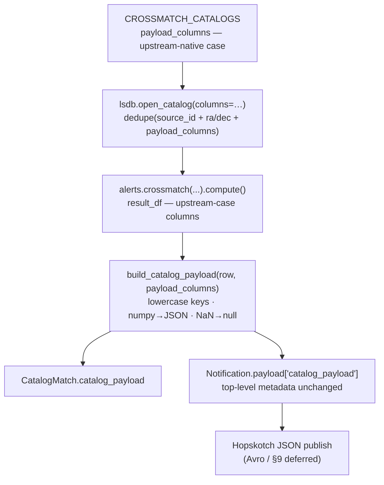

# feat: Catalog-specific payload columns (JSON)

## Summary

Make the per-match crossmatch payload carry a catalog-specific core column set
(the §8 columns from the origin brainstorm) for all four catalogs — Gaia DR3,
DES Y6 Gold, DELVE DR3 Gold, SkyMapper DR4 — loaded from HATS via LSDB,
lowercase-normalized, and nested under a `catalog_payload` key in both the
persisted `CatalogMatch` record and the published `Notification` payload. The
publish path stays JSON; the brainstorm's §9 Avro/float32 work is a separate
follow-up.

---

## Problem Frame

Today the published payload is effectively empty of catalog science data. The
crossmatch loop in `crossmatch/tasks/crossmatch.py` loads only
`source_id`, `ra`, `dec` from each catalog and emits a six-field JSON dict
(`diaObjectId`, `ra`, `dec`, `catalog_name`, `catalog_source_id`,
`separation_arcsec`). Downstream subscribers receive a match notification but
none of the brightness / location / shape / photo-z / classification / quality
information the origin brainstorm settled on.

The origin brainstorm (`docs/brainstorms/2026-05-11-crossmatch-payload-columns-community-draft.md`)
fixed *which* columns to publish per catalog (§8) and the naming convention
(§4, lowercase). This plan implements that selection over the existing JSON
publish path. The brainstorm also specifies an Avro wire format with float32
downcasting (§9) — but the service currently publishes JSON (hop-client wraps
the bare dict as a `JSONBlob`), and realizing §9 is net-new work that pulls in
schema authoring, message-framing, and nullability decisions. Per the scoping
decision, §9 is deferred to a follow-up plan; in JSON the float32/double
distinction is meaningless (a `JSONField` stores 64-bit floats), so deferring it
loses nothing here.

---

## Requirements

**Column selection and loading**

- R1. Catalog columns are loaded from HATS via LSDB by extending each entry in
  `CROSSMATCH_CATALOGS`; only the declared columns are loaded (the load gate
  stays a bounded column list, not a full-table read).
- R2. The loaded column set per catalog is the §8 core set from the origin
  brainstorm, declared in upstream-native case (e.g. `WAVG_MAG_PSF_G` for DES,
  `ra` for Gaia, `raj2000` for SkyMapper).

**Payload content and shape**

- R3. The published payload carries the §8 core columns for the matched
  catalog, nested under a `catalog_payload` key, in addition to the existing
  top-level match metadata, which is unchanged.
- R4. The same normalized column dict is persisted to
  `CatalogMatch.catalog_payload`.
- R5. Payload column names are lowercased relative to upstream
  (`WAVG_MAG_PSF_G` → `wavg_mag_psf_g`); catalog-native semantics are preserved,
  including SkyMapper's `raj2000` / `dej2000` J2000 suffix.
- R6. Each catalog's `catalog_payload` has a stable key set: an absent or NaN
  per-row value is emitted as JSON `null`, not omitted.
- R7. All payload values are JSON-native scalars (no numpy types); existing
  top-level metadata and the JSON-over-Hopskotch publish behavior are preserved.

**Robustness**

- R8. The per-catalog failure isolation in the crossmatch loop is preserved —
  one catalog's load or build error logs and continues without aborting the
  batch.

---

## Key Technical Decisions

- KTD1 — Config is the single source of truth for catalog columns. A
  `payload_columns` list (upstream-native case) is added to each
  `CROSSMATCH_CATALOGS` entry; the LSDB loader requests the deduplicated union
  of `source_id_column`, `ra_column`, `dec_column`, and `payload_columns`. This
  keeps the load gate and the published payload in sync and follows the existing
  add-a-catalog config pattern (URL env var + dict entry + loaded columns).

- KTD2 — Lowercasing is a mechanical `.lower()` applied to result column keys at
  payload-build time, never at load time. The load request must use
  upstream-native case (that is how DES/DELVE columns physically exist in the
  catalog); the lowercase payload names are derived afterward. `"raj2000".lower()`
  is unchanged, so the J2000 suffix survives without special-casing.

- KTD3 — Catalog columns are nested under a `catalog_payload` key in
  `Notification.payload`, not flat-merged. A flat merge would collide the
  catalog's own `ra`/`dec` with the existing top-level metadata `ra`/`dec` and
  force silent renames. Nesting is backward-compatible (top-level fields
  unchanged) and mirrors the `CatalogMatch.catalog_payload` column. The minor
  duplication (catalog `ra`/`dec` also appears at top level) is accepted to keep
  the contract additive.

- KTD4 — Missing per-row values emit JSON `null` with the full declared key set
  retained, rather than omitting keys. This gives each catalog a stable,
  self-describing payload shape and resolves the open question the earlier
  brainstorm draft left unclosed. Reversible later if §9 nullability work
  revisits it.

- KTD5 — numpy→JSON-native coercion is required and explicit: `np.int64` → `int`,
  `np.float64` → `float`, `np.bool_` → `bool`, pandas `NaN`/`NaT` → `None`,
  object/string → `str`. A Django `JSONField` cannot serialize numpy scalars —
  the existing loop already casts with `int()`/`float()` for exactly this reason.
  No float32 downcast is applied (that is §9, deferred).

- KTD6 — The JSON publish path is unchanged. `impl_hopskotch.py` keeps calling
  `producer.write(notif.payload)` with a plain dict. Switching to `AvroBlob`
  with an authored schema (§9 types, float32, message framing, nullability) is
  explicitly out of scope here — see Scope Boundaries.

- KTD7 — No database migration. `CatalogMatch.catalog_payload`
  (`crossmatch/core/models.py:98`) and `Notification.payload`
  (`crossmatch/core/models.py:172`) already exist as `JSONField`s. This plan
  changes only what is written into them.

---

## High-Level Technical Design

Column lifecycle — where the casing flips, where the payload nests, and where
the deferred Avro work sits:

The upstream→lowercase flip happens only at `build_catalog_payload`; everything
load-side (config, `columns=` request, `result_df`) stays in upstream-native
case so LSDB and `itertuples`/column access keep working against the real
catalog names.

---

## Implementation Units

### U1. Declare per-catalog payload columns in config

- **Goal:** Add a `payload_columns` list (upstream-native case) to each of the
  four `CROSSMATCH_CATALOGS` entries, holding the §8 core columns for that
  catalog.
- **Requirements:** R1, R2
- **Dependencies:** none
- **Files:**
  - `crossmatch/project/settings.py` (modify `CROSSMATCH_CATALOGS`, lines 29-58)
- **Approach:** For each catalog dict, add `'payload_columns': [...]` listing the
  §8 columns. Use the catalog's upstream-native case — Gaia and SkyMapper are
  lowercase; DES and DELVE are UPPERCASE. The §8 lists in the origin brainstorm
  are written in *lowercased payload* form, so map them back to upstream case
  using `docs/references/{gaia_dr3,des_y6_gold,delve_dr3_gold,skymapper_dr4}-columns.md`
  as the authority for exact spelling and case. Include `ra`/`dec` where §8 lists
  them under `location` — the loader (U2) dedups against `ra_column`/`dec_column`,
  and keeping them in `payload_columns` makes the payload match §8 exactly. The
  per-catalog sets (payload/lowercased names; declare in upstream case):
  - `gaia_dr3`: `phot_g_mean_mag`, `phot_bp_mean_mag`, `phot_rp_mean_mag`,
    `phot_g_mean_flux_over_error`, `phot_bp_mean_flux_over_error`,
    `phot_rp_mean_flux_over_error`, `ra`, `dec`, `ra_error`, `dec_error`,
    `parallax`, `parallax_error`, `pmra`, `pmra_error`, `pmdec`, `pmdec_error`,
    `ref_epoch`, `classprob_dsc_combmod_star`, `classprob_dsc_combmod_galaxy`,
    `classprob_dsc_combmod_quasar`, `ruwe`, `astrometric_excess_noise`,
    `astrometric_excess_noise_sig`
  - `des_y6_gold` (declare in upstream UPPERCASE): `WAVG_MAG_PSF_{G,R,I,Z,Y}`,
    `WAVG_MAGERR_PSF_{G,R,I,Z,Y}`, `RA`, `DEC`, `BDF_T`, `BDF_G_1`, `BDF_G_2`,
    `BDF_FRACDEV`, `DNF_Z`, `DNF_ZSIGMA`, `EXT_MASH`, `FLAGS_GOLD`,
    `FLAGS_FOREGROUND`, `FLAGS_FOOTPRINT`, `BDF_FLAGS`. `RA`/`DEC` must be the
    UPPERCASE form so they match `ra_column`/`dec_column` and U2's dedup collapses
    them rather than requesting a non-existent lowercase `ra`/`dec`.
  - `delve_dr3_gold` (declare in upstream UPPERCASE): same as DES minus the `y`
    band — `WAVG_MAG_PSF_{G,R,I,Z}`, `WAVG_MAGERR_PSF_{G,R,I,Z}`, plus the shared
    `RA`, `DEC`, `BDF_T`, `BDF_G_1`, `BDF_G_2`, `BDF_FRACDEV`, `DNF_Z`,
    `DNF_ZSIGMA`, `EXT_MASH`, `FLAGS_GOLD`, `FLAGS_FOREGROUND`, `FLAGS_FOOTPRINT`,
    `BDF_FLAGS`. `RA`/`DEC` must match `ra_column`/`dec_column`.
  - `skymapper_dr4`: `u_psf`, `v_psf`, `g_psf`, `r_psf`, `i_psf`, `z_psf`,
    `e_u_psf`, `e_v_psf`, `e_g_psf`, `e_r_psf`, `e_i_psf`, `e_z_psf`, `raj2000`,
    `dej2000`, `e_raj2000`, `e_dej2000`, `class_star`, `flags`, `nimaflags`,
    `ngood`
- **Patterns to follow:** the existing `CROSSMATCH_CATALOGS` dict shape and the
  add-a-catalog convention used by the DES/DELVE/SkyMapper plans.
- **Test scenarios:** `Test expectation: none -- pure declarative config, no
  behavioral logic.` Correctness is exercised through U2/U4 verification.
- **Verification:** Each catalog dict has a `payload_columns` list whose entries
  match the exact column name and case in the corresponding
  `docs/references/*-columns.md` file — verify every entry, not a sample, since a
  single wrong name or case fails the entire catalog load at runtime rather than
  skipping one column (see U2).

### U2. Drive LSDB column loading from config

- **Goal:** Load the full declared column set per catalog instead of the
  hardcoded `source_id`/`ra`/`dec` triple.
- **Requirements:** R1, R8
- **Dependencies:** U1
- **Files:**
  - `crossmatch/matching/catalog.py` — modify `_get_catalog` (lines 14-26) to
    build the column union, add the collision guard, and validate requested
    columns against the loaded schema; update the comment block at lines 44-46
    and the `crossmatch_alerts` docstring (lines 29-54) to note the wider loaded
    column set
- **Approach:** In `_get_catalog`, build the `columns=` argument as the
  order-preserving deduplicated union of `[source_id_column, ra_column,
  dec_column]` and `catalog_config.get('payload_columns', [])`. Missing
  `payload_columns` (back-compat) falls back to the current triple. Update the
  comment block at lines 44-46 to note that the loaded set is now wide, and add
  an assertion or guard that no requested column collides with the alert-catalog
  column names (`uuid`, `lsst_diaObject_diaObjectId`, `ra_deg`, `dec_deg`) — a
  collision would trigger a `_catalog` suffix under
  `suffix_method='overlapping_columns'` and silently break key mapping in U4.
  Today none of the §8 columns collide (catalog `ra`/`dec` ≠ alert
  `ra_deg`/`dec_deg`), so the guard is a tripwire for future column additions,
  not a current fix. Separately, a wrong name or case in `payload_columns` does
  not degrade gracefully: it raises inside `open_catalog`/`.compute()`, is caught
  by the crossmatch loop's existing `except Exception: continue`, and silently
  drops every match for that catalog (logged only as a generic
  "Crossmatch failed for catalog"). To make this attributable, validate the
  requested columns against the loaded catalog's `.columns` in `_get_catalog` and
  raise naming the offending column(s), so the failure names the bad column in
  logs rather than surfacing as a cryptic parquet error.
- **Patterns to follow:** existing `_get_catalog` caching and `structlog`
  logging style (`logger.info('Loading HATS catalog', catalog=name, ...)`).
- **Test scenarios:**
  - Config with `payload_columns` → `lsdb.open_catalog` receives a deduped union
    with no repeated `ra`/`dec`/`source_id` (mock `lsdb.open_catalog`, assert the
    `columns=` kwarg).
  - Config without `payload_columns` → loads exactly the three original columns
    (back-compat).
  - A `payload_columns` entry equal to an alert column name (`uuid`) → the guard
    raises/logs rather than silently proceeding.
- **Verification:** With mocked `open_catalog`, the requested column list matches
  expectation for each catalog; the module still imports and the cache behavior
  is unchanged. (No automated runner exists in-repo — see Risks; run these as a
  scripted `python -c` / mock check or a throwaway under `scripts/`.)

### U3. Catalog-payload normalization + coercion helper

- **Goal:** A pure function that turns one matched row's raw catalog values into
  a JSON-native, lowercase-keyed dict with a stable key set.
- **Requirements:** R5, R6, R7
- **Dependencies:** U1
- **Files:**
  - `crossmatch/matching/payload.py` (new)
- **Approach:** Implement `build_catalog_payload(values, payload_columns)` where
  `values` is a mapping of upstream-column-name → raw value (the caller in U4
  extracts these from the row) and `payload_columns` is the ordered
  upstream-case list from config. For each declared column: lowercase the key,
  coerce the value to a JSON-native scalar per KTD5 (NaN/NaT/None → `None`,
  numpy integer → `int`, numpy floating → `float`, numpy bool → `bool`,
  otherwise `str` or pass-through for native types). Always include every
  declared key (emit `None` when absent/NaN). In normal operation U2 loads
  exactly the declared columns, so every key is present and the live missing
  path is NaN/NaT → `None`; the absent-key handling is defense-in-depth, not the
  primary case. Keep the function free of LSDB / Django imports so it is
  trivially testable.
- **Execution note:** Implement test-first — this is the unit with real logic and
  the clearest input/output contract.
- **Patterns to follow:** the explicit `int()`/`float()` casts already in
  `crossmatch/tasks/crossmatch.py` (lines 107-112) for the rationale; mirror the
  module-docstring style of `crossmatch/matching/catalog.py`.
- **Test scenarios:**
  - Happy path: upstream-case numeric inputs → lowercased keys, native
    `float`/`int` values (e.g. `WAVG_MAG_PSF_G=21.3` → `{'wavg_mag_psf_g': 21.3}`).
  - Case flip: all-UPPERCASE DES keys lowercase correctly; already-lowercase
    SkyMapper `raj2000` is preserved unchanged (suffix intact).
  - NaN handling: `np.nan` value → `None`, with the key still present.
  - numpy coercion: `np.int64`/`np.float64`/`np.bool_` inputs become Python
    `int`/`float`/`bool` (assert `type(...)`, not just equality — `np.float64`
    compares equal to `float` but is not JSON-serializable).
  - Stable key set: a column absent from `values` still appears as `None`.
  - Empty `payload_columns` → `{}`.
  - Integer-flag column (`bdf_flags` as `np.int64`) stays an `int`, not coerced
    to float.
- **Verification:** The scenarios above pass when run directly (`python -c` or a
  scripted check); output is `json.dumps`-able without error.

### U4. Wire the helper into the crossmatch loop and persist

- **Goal:** Populate `CatalogMatch.catalog_payload` and nest the catalog columns
  under `Notification.payload['catalog_payload']`, preserving existing metadata
  and failure isolation.
- **Requirements:** R3, R4, R6, R7, R8
- **Dependencies:** U2, U3
- **Files:**
  - `crossmatch/tasks/crossmatch.py` (modify the `itertuples` build loop,
    lines 84-121)
- **Approach:** Inside the per-row loop, extract the configured
  `payload_columns` values for the row (via `getattr(row, col)` per column, or a
  vectorized `result_df[cols].to_dict('records')` pass before the loop — the
  helper accepts a plain mapping either way), call
  `build_catalog_payload(...)`, and:
  - set `CatalogMatch(..., catalog_payload=<dict>)`;
  - add `'catalog_payload': <dict>` to the existing `Notification.payload` dict,
    leaving the six top-level fields exactly as they are.
  Keep everything inside the existing per-catalog `try/except` so a build error
  for one catalog logs and continues (R8). Note: `result_df` columns are in
  upstream-native case at this point (no suffix applied), so `getattr`/column
  selection uses the upstream names from `payload_columns`.
- **Patterns to follow:** the existing `matches_to_create` / `bulk_create`
  structure and per-catalog `try/except` isolation in
  `crossmatch/tasks/crossmatch.py`.
- **Test scenarios:**
  - Integration: a fixture `result_df` for one catalog → one `CatalogMatch` with
    a populated `catalog_payload` and one `Notification` whose
    `payload['catalog_payload']` has the lowercased keys.
  - Top-level metadata (`diaObjectId`, `ra`, `dec`, `catalog_name`,
    `catalog_source_id`, `separation_arcsec`) is byte-for-byte unchanged from
    current behavior.
  - A row with a NaN science column → that key is `null` in the persisted
    payload, other keys present.
  - A catalog whose §8 set omits a keyword (Gaia: no shape/photo-z) →
    `catalog_payload` simply lacks those columns; no error, no synthesized keys.
  - Failure isolation: a forced build error for one catalog leaves prior
    catalogs' matches written and the batch still transitions to `MATCHED`.
- **Verification:** Run a crossmatch batch against a small alert set (or fixture
  DataFrame); inspect a resulting `catalog_matches` row and `notifications` row
  in Postgres and confirm `catalog_payload` content, lowercase keys, null
  handling, and unchanged top-level metadata. Confirm the published message is
  still JSON (`_format: json`) — no behavioral change to the publish path.

---

## Scope Boundaries

### Deferred to Follow-Up Work

- **§9 Avro serialization.** The whole §9 surface — Avro wire format, float32
  downcasting, an authored per-catalog schema, the per-record-vs-batched message
  framing decision (hop-client embeds the full writer schema in every Avro
  message, so per-record framing can cost more than float32 saves), and the
  nullable-union convention — is a separate plan. This plan keeps JSON.
- **`Notification.catalog_match` FK linkage.** The task currently leaves
  `Notification.catalog_match` unset (`crossmatch/core/models.py:165-170`).
  Linking it is related data-integrity work but orthogonal to payload columns;
  not addressed here.
- **lsdb version reconciliation.** Installed `lsdb` 0.9.0 vs pinned 0.8.1 (see
  Risks) — reconciling the pin is its own change.

### Outside this product's identity (per origin §10)

- Optional / extended payload tier beyond the core set.
- New catalogs or companion tables (Gaia BP/RP spectra, QSO/galaxy candidates,
  DES Y6 metacal).
- Additional photometry families (AUTO/BDF) beyond the single chosen mode.
- Reddening (`ebv_sfd98`) and any position-derived dust values.

---

## System-Wide Impact

- **Consumer contract (additive).** Subscribers gain a new `catalog_payload`
  object inside the JSON message; the six existing top-level fields are
  unchanged, so existing parsers keep working. The format header stays
  `_format: json`. This is the community-facing payload the brainstorm
  circulated, now with science columns attached.
- **Storage growth.** `catalog_matches.catalog_payload` and
  `notifications.payload` now carry ~20 columns per match instead of being empty
  / six fields. Per alert with multiple catalog matches this multiplies. No
  schema change (existing `JSONField`s), but row sizes and table growth increase.
- **Remote Dask cluster.** Column loading and `crossmatch(...).compute()` run on
  the version-locked remote cluster; the wider `columns=` request changes what is
  read from HATS but not where compute happens. The normalization/coercion helper
  runs client-side in the Celery worker, not on Dask.

---

## Risks & Dependencies

- **lsdb version drift (0.9.0 installed vs 0.8.1 pinned).** `open_catalog`
  column-selection and `crossmatch` suffix behavior could differ between
  versions, and the remote Dask cluster is version-locked. Verify the widened
  `columns=` load behaves identically on the pinned/cluster version before
  relying on it; reconcile the pin if behavior diverges.
- **`suffix_method='overlapping_columns'` collisions.** Widening the loaded set
  raises the (currently zero) chance a catalog column collides with an alert
  column (`uuid`, `lsst_diaObject_diaObjectId`, `ra_deg`, `dec_deg`) and gets a
  `_catalog` suffix, breaking U4's key mapping. The U2 guard makes this loud
  rather than silent. None of the §8 columns collide today.
- **`itertuples` identifier constraint.** Column access in the loop assumes
  valid Python identifiers (true for all §8 columns). A future column with a
  non-identifier name would need positional handling — note for later catalog
  additions.
- **No automated test runner in-repo.** `docs/developer.md`'s test command is
  dead and there is no working test suite. Verification for every unit is manual
  or via throwaway scripts (consistent with `scripts/dump_catalog_columns.py`).
  Test scenarios above define the checks; "the suite is green" is not an
  available signal here.

---

## Sources / Research

- Origin brainstorm: `docs/brainstorms/2026-05-11-crossmatch-payload-columns-community-draft.md`
  (§4 naming, §8 per-catalog columns, §9 deferred Avro types, §10 scope).
- Verified column names + Arrow dtypes:
  `docs/references/{gaia_dr3,des_y6_gold,delve_dr3_gold,skymapper_dr4}-columns.md`
  (authority for exact upstream casing in U1).
- Payload build seam: `crossmatch/tasks/crossmatch.py:84-121`.
- Load gate: `crossmatch/matching/catalog.py:14-26`.
- Catalog config: `crossmatch/project/settings.py:29-58`.
- Target fields: `crossmatch/core/models.py:98` (`CatalogMatch.catalog_payload`),
  `crossmatch/core/models.py:172` (`Notification.payload`).
- Publish path (unchanged): `crossmatch/notifier/impl_hopskotch.py:32`
  (`producer.write(notif.payload)` → hop-client `JSONBlob`).
- Column reference regenerator: `scripts/dump_catalog_columns.py`.
