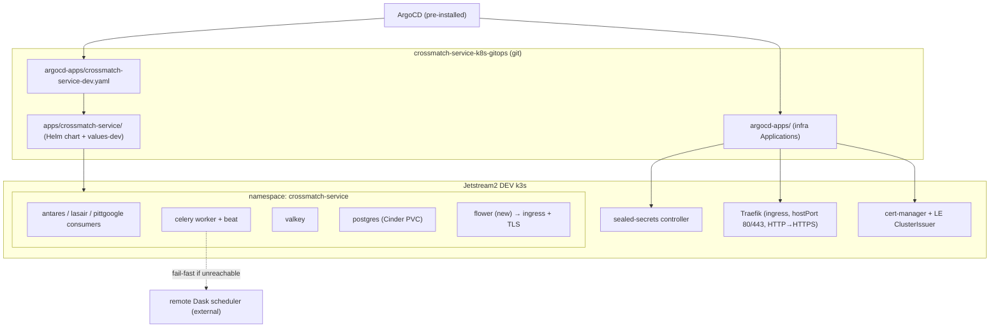
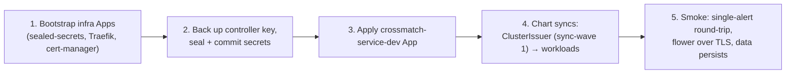

# feat: Crossmatch-service Kubernetes GitOps (DEV)

**Target repos:** the work creates a new repo **`crossmatch-service-k8s-gitops`** (paths below are repo-relative to it unless prefixed) and makes a small number of changes in the existing **`crossmatch-service`** application repo (prefixed `crossmatch-service:`). This plan document lives in the application repo.

---

## Summary

Stand up the `crossmatch-service-k8s-gitops` repository (astrodash-modeled) and deploy crossmatch-service to the existing Jetstream2 DEV cluster via ArgoCD: bootstrap the cluster infra that isn't present yet (sealed-secrets, Traefik, cert-manager), relocate the existing Helm chart in as the single source of truth, adapt it from its AWS-EKS heritage to Jetstream2 (GitLab registry, SealedSecrets, Cinder, persistent Postgres), author a flower workload behind ingress + TLS, and add a Tier-2 env-var drift guardrail. DEV-only, structured so test/prod slot in later.

---

## Problem Frame

crossmatch-service already carries a Helm chart (`crossmatch-service:kubernetes/charts/crossmatch-service/`), but it is an AWS-EKS-specific simplification — ECR images, `gp2` storage, ephemeral `emptyDir` Postgres, plain `kubectl create secret` flow — not a Jetstream2 deployment artifact. The target operating model mirrors astrodash: a separate GitOps repo so a non-Kubernetes developer runs locally with Docker Compose and never opens a manifest, while ArgoCD reconciles the cluster from git. The known cost of the repo split is config drift between the app and its manifests — drift that already bit this project once (the `2026-03-16-helm-chart-env-gaps` brainstorm) — so the plan adopts the split **and** a contract-based guardrail.

The DEV cluster currently has **only ArgoCD** installed; everything else this repo relies on must be bootstrapped as additional ArgoCD Applications. The repo has **no working Python test runner**, so verification is render/lint/sync/smoke-based, and the celery workers **fail-fast if the remote Dask scheduler is unreachable or version-misaligned** — both shape the plan's verification and risk posture.

---

## Requirements

Traced to the origin requirements doc (see origin: `docs/brainstorms/2026-06-01-crossmatch-service-k8s-gitops-requirements.md`). R-IDs are reorganized by concern; two requirements are new to the plan (R16 broker-filter delivery, R17 flower workload). The per-requirement `(origin R#)` annotations carry traceability back to the origin numbering.

**Repository structure and split**
- R1. New repo and top-level directory `crossmatch-service-k8s-gitops` follows the astrodash layout: `apps/<service>/`, `argocd-apps/`, `infrastructure/`, `docs/` (origin R1).
- R2. The chart relocates from `crossmatch-service:kubernetes/charts/crossmatch-service/` into `apps/crossmatch-service/` as the single source of truth; the app repo's `kubernetes/` scaffolding is removed only after relocation is verified and after confirming the test/prod team does not deploy from it (origin R2).
- R3. The app repo retains only local-dev tooling (`crossmatch-service:docker/docker-compose.yaml`); a developer runs locally with Compose alone (origin R3).
- R4. Config splits into shared `apps/crossmatch-service/values.yaml` + `values-dev.yaml`, structured so `values-test.yaml`/`values-prod.yaml` slot in later (origin R4).

**Infrastructure bootstrap (ArgoCD-only cluster)**
- R5. `argocd-apps/` defines ArgoCD Applications bootstrapping sealed-secrets, Traefik, and cert-manager; ArgoCD itself is already installed and not managed here (origin R5).
- R6. A bootstrap doc captures order of operations and includes exporting/backing up the sealed-secrets controller key before sealing (origin R6).
- R7. cert-manager issues TLS via a Let's Encrypt production ClusterIssuer; Traefik is the ingress class and enforces an HTTP→HTTPS redirect (origin R7).

**Application chart adaptation (EKS → Jetstream2)**
- R8. Images move from ECR to the GitLab Container Registry, pulled via a `read_registry`-scoped, long-lived deploy-token credential stored as a committed `dockerconfigjson` SealedSecret; expiry/rotation documented (origin R8).
- R9. Persistent storage uses the Jetstream2 Cinder storage class, replacing `gp2` (origin R9).
- R10. Postgres runs on a persistent Cinder PVC, replacing `emptyDir` (origin R10).
- R11. All existing workloads carry over with no change to their container spec or run commands — antares/lasair/pittgoogle consumers, celery worker and beat, valkey subchart, postgres — except Postgres storage (R10) and the newly-authored flower workload (R17) (origin R11).
- R12. Ingress + TLS is a first-class, values-gated capability, defaulting to an IP-allowlist / network-policy restriction until an auth layer is in front (origin R12).

**Secrets**
- R13. Secrets are Bitnami SealedSecrets committed to git, replacing the kubectl flow, for `django`, `database`, `antares`, `hopskotch`, `gcp-pittgoogle`, conditionally rendered per environment (origin R13).
- R14a. A documented `kubeseal` workflow exists with a secret-ingestion procedure (source from a secret store, seal locally, commit only the SealedSecret YAML); `seal_secrets.py` is reconciled with it (origin R14).
- R14b. `seal_secrets.py` is either relocated into the gitops repo or deleted and superseded by the documented workflow; the choice is made in U5 and the app-repo script is removed in U11.

**Application correctness fixes (chart adaptation)**
- R15. Resolve the env-var name mismatches so configured values actually take effect. These mismatches degrade *silently* rather than failing fast — `settings.py` reads `DJANGO_SECRET_KEY` (default `django-dummy-secret`) and `CELERY_TASK_TIME_LIMIT`/`CELERY_TASK_SOFT_TIME_LIMIT` (defaults), while the chart emits `SECRET_KEY`/`TASK_TIME_LIMIT`/`TASK_SOFT_TIME_LIMIT`, so pods come up Healthy on dummy/default config. Align chart-emitted names to what the app reads, pinning one name end-to-end (SealedSecret key, `secretKeyRef.key`, emitted env) (origin R17).
- R16. Deliver the broker-filter env (`MIN_DIASOURCE_RELIABILITY`) to the pittgoogle consumer only — it is the sole code consumer (builds the SMT UDF). antares does not read it and lasair's reliability cut is enforced upstream by topic selection; broker-agnostic filtering for those consumers is unbuilt application work, out of scope here.
- R17. Author a flower Deployment + Service so flower is a real, deployable workload (the chart currently has only an unused `flower.env` helper).

**Drift guardrail (Tier 2)**
- R18. A machine-readable env-var contract lives in the app repo, derived from the full consumer surface (`crossmatch-service:crossmatch/project/settings.py` plus entrypoint scripts and Celery config), each var tagged secret-or-plain and by component (origin R15).
- R19. The gitops CI renders the chart and fails if a required plain var is undelivered, a required secret lacks a SealedSecret, or a secret-tagged var is delivered as a plain value; the contract is consumed at a pinned ref (origin R16).

**Deployment**
- R20. A `crossmatch-service-dev` ArgoCD Application targets the DEV cluster at `apps/crossmatch-service`, layering `values.yaml` + `values-dev.yaml`, with automated sync/prune/self-heal and `CreateNamespace=true` (origin R18).

---

## Key Technical Decisions

- **Separate GitOps repo + Tier-2 guardrail** — astrodash split for the compose-only local-dev story, with a contract-based render-diff check to cover the cross-repo drift cost (origin Key Decisions).
- **Relocate the existing chart as source of truth** — reuse the working consumer/celery/valkey wiring; adapt in place rather than re-authoring astrodash-style (origin Key Decisions).
- **Dedicated DEV cluster, infra bootstrapped in-repo** — the cluster has only ArgoCD, so sealed-secrets/Traefik/cert-manager are not pre-existing; this repo owns them as ArgoCD Applications. (If a second service later shares the cluster, singleton ownership moves to a shared bootstrap repo — see Open Questions.)
- **ClusterIssuer ships inside the app chart with an ArgoCD sync-wave** — mirrors astrodash (`apps/astrodash/templates/clusterissuer.yaml`, `argocd.argoproj.io/sync-wave: "1"`), so the issuer applies only after cert-manager CRDs exist; otherwise first sync fails on a missing CRD.
- **SealedSecrets with controller-key backup** — committed encrypted secrets, but the bootstrap doc backs up the controller private key first, since committed SealedSecrets are unrecoverable once plaintext originals are removed (origin R6/R13).
- **GitLab registry + `read_registry` deploy token** — off ECR (12h token expiry is painful off-AWS); long-lived `dockerconfigjson` SealedSecret, astrodash's `gitlab-registry` pattern (origin R8).
- **Persistent Postgres on Cinder** — `emptyDir` → PVC so DEV data survives restarts (origin R10).
- **Ingress defaults to IP-allowlist until auth** — flower exposes Celery internals; the ingress is gated by allowlist/network-policy until oauth2-proxy lands (origin R12, doc-review).
- **Verification is render/lint/sync/smoke, not unit tests** — the repo has no working test runner; acceptance gates are `helm lint`/`helm template` assertions, ArgoCD sync health, and a single-alert end-to-end smoke run (learnings: `crossmatch-service:docs/solutions/conventions/dependency-pin-upgrade-pattern-2026-05-12.md`).
- **Guardrail CI is its own late unit** — the contract file and name-fixes land with chart adaptation, but the cross-repo render-diff CI job is sequenced last so DEV bring-up isn't blocked on CI plumbing.

---

## High-Level Technical Design

**Component topology (DEV cluster).** ArgoCD (already present) reconciles two layers from the new repo: cluster infra and the app chart.



**Deploy/sync ordering (sequence).** Order matters: secrets can't decrypt without the controller; the app chart's ClusterIssuer needs cert-manager CRDs first.



---

## Output Structure

Expected layout of the new repo (scope declaration; per-unit `Files` are authoritative):

```text
crossmatch-service-k8s-gitops/
├── README.md
├── LICENSE
├── apps/
│   └── crossmatch-service/
│       ├── Chart.yaml
│       ├── Chart.lock
│       ├── values.yaml
│       ├── values-dev.yaml
│       ├── charts/                 # valkey subchart dependency
│       └── templates/
│           ├── _helpers.yaml
│           ├── statefulset.yaml    # consumers, celery worker/beat
│           ├── database.yaml       # postgres Deployment/StatefulSet + PVC
│           ├── deployment-flower.yaml   # new
│           ├── service-flower.yaml      # new
│           ├── ingress.yaml             # new (values-gated, allowlist)
│           ├── clusterissuer.yaml       # sync-wave 1
│           ├── sealedsecret-dev.yaml
│           └── sealedsecret-registry-dev.yaml
├── argocd-apps/
│   ├── crossmatch-service-dev.yaml
│   ├── sealed-secrets.yaml
│   ├── traefik.yaml
│   └── cert-manager.yaml
├── infrastructure/
│   └── argocd/                     # notes/values if ArgoCD config is captured
└── docs/
    ├── dev-bootstrap-steps.md
    └── kubeseal-workflow.md
```

---

## Implementation Units

Grouped into three phases. U-IDs are stable.

### Phase A — Repo scaffold and cluster infrastructure

### U1. Scaffold the GitOps repository
- **Goal:** Create the repo skeleton in the astrodash layout.
- **Requirements:** R1, R4 (seam only)
- **Dependencies:** none
- **Files (gitops repo):** `README.md`, `LICENSE`, `apps/crossmatch-service/.gitkeep` (placeholder until U3), `argocd-apps/.gitkeep`, `infrastructure/`, `docs/`
- **Approach:** Mirror `astrodash-k8s-gitops` top-level structure. README documents environments table (DEV only for now), repo structure, and architecture note (ArgoCD-only cluster; infra bootstrapped here).
- **Patterns to follow:** `astrodash-k8s-gitops:README.md`, top-level directory layout.
- **Test scenarios:** Test expectation: none — scaffolding only; verified by U8 render/sync.
- **Verification:** Directory tree matches Output Structure; README renders.

### U2. Bootstrap infra ArgoCD Applications + bootstrap doc
- **Goal:** Bring sealed-secrets, Traefik, and cert-manager onto the cluster via ArgoCD, and document bring-up.
- **Requirements:** R5, R6, R7
- **Dependencies:** U1
- **Files (gitops repo):** `argocd-apps/sealed-secrets.yaml`, `argocd-apps/traefik.yaml`, `argocd-apps/cert-manager.yaml`, `docs/dev-bootstrap-steps.md`
- **Approach:** Copy astrodash's three infra Applications (pinned chart versions). Traefik as DaemonSet on hostPort 80/443 with HTTP→HTTPS redirect enabled. cert-manager with CRDs enabled. Bootstrap doc captures: register repo with ArgoCD → apply infra Apps → **export/back up the sealed-secrets controller private key to a separate secret store** → seal+commit secrets → apply app Application. Note re-seal requirement on controller key rotation/reinstall. Gate the app Application on cert-manager reporting Synced/Healthy first, and carry a manual ClusterIssuer-apply fallback (mirror astrodash bootstrap Step 13) for when sync-wave ordering does not issue the cert on first sync. Constraint: each environment (DEV/test/prod) uses its own sealed-secrets controller and key pair — DEV-sealed secrets are never committed to a test/prod overlay. Document the expected ArgoCD access model (who holds admin; whether an AppProject restricting source repos/destination namespaces is needed), since the infra Applications have cluster-wide blast radius.
- **Patterns to follow:** `astrodash-k8s-gitops:argocd-apps/{sealed-secrets,traefik,cert-manager}.yaml`, `astrodash-k8s-gitops:docs/prod-bootstrap-steps.md`.
- **Test scenarios:**
  - `helm template`/`kubectl apply --dry-run=server` of each infra Application manifest is schema-valid.
  - Covers AE-deploy: after apply, `kubectl get pods -n kube-system` shows the sealed-secrets controller Running; Traefik DaemonSet Ready; cert-manager pods Running.
  - HTTP→HTTPS: a plain `http://` request to any host returns a 301/308 to `https://`.
- **Verification:** All three infra ArgoCD Apps report Synced/Healthy; controller key backup step is in the doc.

### Phase B — Chart relocation and Jetstream2 adaptation

### U3. Relocate chart and split values
- **Goal:** Move the existing chart into the gitops repo and introduce the shared/dev values split.
- **Requirements:** R2 (relocation only — deletion is U11), R4
- **Dependencies:** U1
- **Files (gitops repo):** `apps/crossmatch-service/{Chart.yaml,Chart.lock,values.yaml,charts/,templates/*}`, `apps/crossmatch-service/values-dev.yaml`
- **Approach:** Copy `crossmatch-service:kubernetes/charts/crossmatch-service/` verbatim, then factor environment-specific values (image tag/pullPolicy, hostnames, DEV resource sizing, DEV consumer group ids, topic overrides) into `values-dev.yaml`, leaving shared defaults in `values.yaml`. Reconcile the prod-weight defaults and prod topic/group names currently in the chart (`lasair group_id: scimma-crossmatch-prod`) so DEV uses DEV-appropriate values.
- **Patterns to follow:** astrodash `values.yaml` + `values-dev.yaml` layering; existing `crossmatch-service:kubernetes/dev-overrides.yaml.example` for which keys are environment-specific.
- **Test scenarios:**
  - `helm lint apps/crossmatch-service` passes.
  - `helm template apps/crossmatch-service -f values.yaml -f values-dev.yaml` renders without error and produces the same workload set as the source chart (diff against a render of the original chart). This equivalence diff is a one-time baseline captured against the pre-adaptation source chart; U4/U6 intentionally diverge (PVC, GitLab refs, Cinder, renamed env keys), so it is not re-run after them.
  - DEV overrides present: rendered consumer group ids and resource requests reflect DEV values, not the prod defaults.
- **Verification:** Rendered manifests equivalent to source chart plus DEV overrides; lint clean.

### U4. Registry and storage adaptation
- **Goal:** Replace AWS assumptions with Jetstream2 equivalents.
- **Requirements:** R8, R9, R10
- **Dependencies:** U3
- **Files (gitops repo):** `apps/crossmatch-service/values.yaml`, `values-dev.yaml`, `templates/database.yaml`, `templates/sealedsecret-registry-dev.yaml`
- **Approach:** Point `common.image.repo` at the GitLab registry path; add the `gitlab-registry` `dockerconfigjson` SealedSecret and `imagePullSecrets` on each workload. Replace `gp2` with the Jetstream2 Cinder storage class. Convert Postgres from `emptyDir` to a PVC (pin mount path / `PGDATA` to avoid the `lost+found` interaction noted in review).
- **Patterns to follow:** `astrodash-k8s-gitops:apps/astrodash/templates/sealedsecret-registry-dev.yaml`; astrodash Cinder PVC usage.
- **Test scenarios:**
  - `helm template` shows every workload carries `imagePullSecrets: gitlab-registry` and GitLab image refs (no `dkr.ecr` strings remain).
  - Rendered Postgres uses a `PersistentVolumeClaim` with the Cinder storage class; no `emptyDir` for postgres data.
  - Covers AE3: after deploy, deleting the Postgres pod and rescheduling preserves previously ingested DEV rows.
- **Verification:** Render shows GitLab refs + pull secret + Cinder PVC; smoke confirms data persistence.

### U5. Migrate secrets to SealedSecrets + kubeseal workflow
- **Goal:** Replace the kubectl-secret flow with committed SealedSecrets and document sealing.
- **Requirements:** R13, R14a
- **Dependencies:** U2 (controller must exist), U3
- **Files (gitops repo):** `apps/crossmatch-service/templates/sealedsecret-dev.yaml`, `docs/kubeseal-workflow.md`; reconcile/relocate `crossmatch-service:kubernetes/scripts/secret_generator/seal_secrets.py`
- **Approach:** Author SealedSecret resources (env-conditional like astrodash) for `django`, `database`, `antares`, `hopskotch`, `gcp-pittgoogle` (the last is the file-based `key.json`). Document the ingestion procedure: source plaintext from a secret store (never `dev-overrides.yaml`), run `kubeseal` locally, commit only the sealed YAML. Pin the kubeseal target to the bootstrapped controller (`--controller-name sealed-secrets --controller-namespace kube-system`, `namespace-wide` scope) consistently across the script, the workflow doc, and the SealedSecret annotations — the existing script's `sealedsecrets-sealed-secrets` / `sealed-secrets` / `cluster-wide` target will not match. For `gcp-pittgoogle`, document the minimum IAM scope (Pub/Sub Subscriber on the specific subscription only), rotation cadence, and revoke-plus-re-seal procedure, parallel to R8's deploy-token treatment. Pin one secret-key name end-to-end for the Django secret (the `encryptedData` key, the `secretKeyRef.key`, and U6's emitted env all `DJANGO_SECRET_KEY`) so U5 and U6 cannot diverge. Decide `seal_secrets.py` disposition (relocate into the gitops repo or supersede with the doc) per R14b.
- **Patterns to follow:** `astrodash-k8s-gitops:apps/astrodash/templates/sealedsecret-dev.yaml`; existing secret consumers in `crossmatch-service:kubernetes/charts/crossmatch-service/templates/_helpers.yaml` (`secretKeyRef` names).
- **Execution note:** Seal against the DEV controller key only after U2's key-backup step is done.
- **Test scenarios:**
  - `helm template` renders one SealedSecret per consumer with the expected `encryptedData` keys (`DJANGO_SECRET_KEY` matching U6, `password`, `ANTARES_API_KEY`/`SECRET`, `HOPSKOTCH_USERNAME`/`PASSWORD`, `key.json`, `GOOGLE_CLOUD_PROJECT`).
  - Covers AE2: with a secret intentionally omitted, the U10 guardrail (or a manual render check) flags the missing SealedSecret rather than rendering a crash-looping workload.
  - After deploy, the controller produces the expected `Secret` objects and pods mount them (no `CreateContainerConfigError`).
- **Verification:** SealedSecrets decrypt to working Secrets on the cluster; pods start with credentials.

### U6. Env-var correctness fixes
- **Goal:** Ensure configured env values actually take effect. The name mismatches degrade silently — the app falls back to dummy/default values while pods report Healthy — so the risk is silent misconfiguration, not startup failure; also scope broker-filter delivery to its real consumer.
- **Requirements:** R15, R16
- **Dependencies:** U3
- **Files (gitops repo):** `apps/crossmatch-service/templates/_helpers.yaml`, `templates/statefulset.yaml`
- **Approach:** Align chart-emitted env names to what `settings.py` actually reads — `DJANGO_SECRET_KEY` and `CELERY_TASK_TIME_LIMIT`/`CELERY_TASK_SOFT_TIME_LIMIT` — pinning the Django secret key name end-to-end with U5. Leave `broker_filter.env` on the pittgoogle consumer only (the sole reader); do not add it to antares/lasair, where it has no effect (per R16).
- **Patterns to follow:** the existing `broker_filter.env` include on the pittgoogle StatefulSet; `crossmatch-service:crossmatch/project/settings.py` for authoritative names.
- **Execution note:** Cross-check each name against `settings.py` and the entrypoint scripts before changing — some vars are consumed outside `settings.py`.
- **Test scenarios:**
  - Rendered env keys match the names `settings.py` reads — `DJANGO_SECRET_KEY`, `CELERY_TASK_TIME_LIMIT`/`CELERY_TASK_SOFT_TIME_LIMIT` — with no `SECRET_KEY`/`TASK_TIME_LIMIT` divergence, and the Django secret key name matches U5's SealedSecret.
  - Effective-value check (Healthy status won't catch silent fallback): after deploy, confirm Django is not running on the `django-dummy-secret` default and Celery's task time limits reflect the configured `values`, not the code defaults.
  - `broker_filter.env` renders only on the pittgoogle consumer, not antares/lasair.
  - Smoke: each consumer pod starts without `ImproperlyConfigured` at import.
- **Verification:** All consumers start; rendered env names match consumer surface.

### U7. Author flower workload + ingress
- **Goal:** Make flower a real deployable workload and expose it over ingress + TLS, allowlist-gated.
- **Requirements:** R11, R12, R17
- **Dependencies:** U3, U4 (image), U6 (env)
- **Files (gitops repo):** `apps/crossmatch-service/templates/deployment-flower.yaml`, `templates/service-flower.yaml`, `templates/ingress.yaml`, `templates/clusterissuer.yaml`, `values.yaml`, `values-dev.yaml`
- **Approach:** Add a flower Deployment (running the flower entrypoint, env from `flower.env` + db/valkey/celery includes) and a ClusterIP Service. Add a values-gated `ingress.yaml` (Traefik class, cert-manager annotation, TLS) defaulting to an IP-allowlist via a Traefik middleware/network policy until auth lands. ClusterIssuer template carries `argocd.argoproj.io/sync-wave: "1"`.
- **Patterns to follow:** `astrodash-k8s-gitops:apps/astrodash/templates/{ingress.yaml,clusterissuer.yaml,service-flower.yaml}`; the chart's existing `flower.env` helper and `flower.ingress` values. Note: astrodash's flower deployment is a **shape reference only** — it wires env via `envFrom: configMapRef/secretRef` against fullname-templated objects, an idiom this chart lacks. Compose flower's env from this chart's own `_helpers.yaml` includes (`common.env`, `django.env`, `db.env`, `valkey.env`, `celery.env`, `flower.env`); `run_flower.sh` imports `settings.py` and blocks on `wait-for-it` against DATABASE_HOST/VALKEY_SERVICE, so missing those includes hangs the pod.
- **Test scenarios:**
  - Covers AE4: `helm template` renders a flower Deployment, Service, and Ingress; after deploy the flower pod is Running.
  - Ingress renders with the allowlist middleware/network-policy by default; disabling the allowlist requires an explicit values override.
  - Smoke: flower UI reachable at the DEV host over HTTPS with a valid LE cert; reachable only from allowlisted source.
- **Verification:** Flower Running and reachable over TLS; allowlist enforced by default — confirmed by requesting flower from *outside* the allowlisted CIDR and getting 403/deny, not 200. If Jetstream2's network topology SNATs the source IP and defeats the Traefik middleware, fall back to a Kubernetes NetworkPolicy restricting ingress to the Traefik pod (or a node firewall rule) before DEV go-live.

### Phase C — Deployment, guardrail, and cutover

### U8. crossmatch-service-dev ArgoCD Application + first deploy
- **Goal:** Deploy the chart to DEV via ArgoCD and validate end to end.
- **Requirements:** R20, R11
- **Dependencies:** U2, U4, U5, U6, U7
- **Files (gitops repo):** `argocd-apps/crossmatch-service-dev.yaml`
- **Approach:** Author the Application (path `apps/crossmatch-service`, valueFiles `values.yaml` + `values-dev.yaml`, automated sync/prune/self-heal, `CreateNamespace=true`, ignoreDifferences on Ingress `/status`). Apply and drive to Healthy.
- **Patterns to follow:** `astrodash-k8s-gitops:argocd-apps/astrodash-dev.yaml`.
- **Test scenarios:**
  - Application reaches Synced/Healthy; all workloads (3 consumers, worker, beat, valkey, postgres, flower) reach Running.
  - Covers AE4: flower reachable over TLS post-sync.
  - End-to-end smoke: a single alert flows through a consumer → crossmatch → published result (the meaningful gate, since there is no unit-test suite). Note: requires the Dask scheduler to be reachable (see Open Questions / Risks).
- **Verification:** Full acceptance is the single-alert round-trip succeeding (requires the DEV Dask endpoint resolved and version-aligned). When Dask is not yet available, provisional acceptance is: ArgoCD Synced/Healthy + flower reachable over TLS + the U6 effective-value checks pass (so "Healthy" is not mistaken for "correctly configured"). U8 is fully done only once the round-trip runs.

### U9. Env-var contract file (app repo)
- **Goal:** Establish the consumer-spec contract the guardrail will check.
- **Requirements:** R18
- **Dependencies:** U6 (names settled)
- **Files (app repo):** `crossmatch-service:` a machine-readable contract (e.g., `deploy-contract.yaml`) plus a short README near it.
- **Approach:** Enumerate every env var the service consumes from the full surface — `crossmatch/project/settings.py`, `crossmatch/entrypoints/*`, and Celery config — each tagged secret/plain and by component. Include the entrypoint-only vars (`FLOWER_LOG_LEVEL`, `FLOWER_PORT`, `FLOWER_URL_PREFIX`, `CELERY_LOG_LEVEL`, `CELERY_CONCURRENCY`, `MAKE_MIGRATIONS`, `DEV_MODE`).
- **Patterns to follow:** existing env organization in the chart `_helpers.yaml` blocks as a cross-check.
- **Test scenarios:**
  - The contract lists every var emitted by the chart's `_helpers.yaml` and every var read in `settings.py`/entrypoints; a manual diff finds no gaps.
  - Each var has a `secret|plain` tag and a component attribution.
- **Verification:** Contract is complete against both providers and the consumer surface.

### U10. Cross-repo render-diff CI guardrail
- **Goal:** Enforce the contract automatically in gitops CI. Sequenced last so DEV bring-up isn't blocked on CI plumbing.
- **Requirements:** R19
- **Dependencies:** U3, U9
- **Files (gitops repo):** CI config (e.g., `.gitlab-ci.yml` or `.github/workflows/render-diff.yml`) + a small render/extract script
- **Approach:** CI runs `helm template` with `values-dev.yaml`, extracts env keys delivered to **the app's own workloads** (consumers, celery worker/beat, flower, postgres) — explicitly excluding the third-party valkey subchart pods, whose env is not part of the app consumer surface the contract governs — and compares against the app-repo contract fetched at a pinned ref. Fail on: required plain var undelivered; required secret with no SealedSecret; secret-tagged var delivered as a plain `value:`. Cross-repo read auth uses a GitLab deploy token scoped `read_repository` on the app repo only, stored as a masked CI variable and never echoed in logs. Decide pinned-ref mechanism (submodule vs pinned raw fetch).
- **Patterns to follow:** none local (new capability — astrodash is pull-only); document the approach in the gitops `docs/`.
- **Test scenarios:**
  - Covers AE1: a contract var removed from the chart fails CI with the missing key named.
  - Covers AE2: a secret with no SealedSecret fails CI.
  - A secret-tagged var wired as a plain `value:` fails CI.
  - A correct render passes CI.
- **Verification:** CI green on a correct chart; red on each injected drift case above.

### U11. Gated removal of the app-repo chart
- **Goal:** Complete the single-source-of-truth move by removing the app-repo chart — only once safe.
- **Requirements:** R2, R3
- **Dependencies:** U8 (gitops deploy validated), Open Question (test/prod-team confirmation)
- **Files (app repo):** remove `crossmatch-service:kubernetes/charts/`, `kubernetes/dev-overrides.yaml*`, `kubernetes/scripts/secret_generator/` (after reconciling per U5); retain `docker/` and the U9 contract.
- **Approach:** Confirm with the test/prod-operating team that they do not deploy from the app-repo chart; then delete the `kubernetes/` scaffolding. App repo retains Compose-based local dev and the contract file.
- **Test scenarios:** Test expectation: none — deletion; verified by absence + the gitops deploy remaining Healthy.
- **Verification:** App repo has no chart; `docker compose up` local dev still works; gitops DEV deploy unaffected.

---

## Acceptance Examples

- AE1. **Covers R19.** A required plain var present in the contract but undelivered by the chart fails the gitops render-diff CI with the missing key named.
- AE2. **Covers R19, R13.** A secret in the contract with no corresponding SealedSecret fails the check rather than rendering a crash-looping workload.
- AE3. **Covers R10.** Deleting and rescheduling the Postgres pod preserves previously ingested DEV data.
- AE4. **Covers R20, R11, R17.** After ArgoCD syncs the `crossmatch-service-dev` Application, all workloads reach Running and flower is reachable over ingress with a valid TLS certificate.

---

## Scope Boundaries

**Deferred for later** (origin)
- test and prod clusters and their value overlays — another team, devops not yet defined.
- Monitoring/REST API surfaces beyond flower, and auth (oauth2-proxy) in front of exposed services — ingress wired and allowlist-gated; surfaces land later.
- Automated image-tag promotion (Argo Image Updater) — DEV bumps are a manual `values-dev.yaml` edit.
- Tier-3 codegen guardrail and the optional app-repo compose-vs-contract check.

**Outside this effort** (origin)
- Deploying the remote Dask cluster — external dependency reached via service discovery.
- Building the application container image and app-side CI — gitops repo is pull-only.

**Deferred to Follow-Up Work** (plan-local)
- Singleton-infrastructure ownership refactor (move sealed-secrets/Traefik/cert-manager to a shared bootstrap repo) — only needed when a second service joins the cluster.

---

## Open Questions

**Resolve before / during implementation**
- Confirm the DEV cluster is dedicated (not astrodash-dev) with no pre-installed sealed-secrets/Traefik/cert-manager controllers, before U2 runs — if it is shared, U2 would collide with astrodash's singletons and must instead cross-reference existing infra.
- The exact DEV hostname(s) for ingress/TLS and which service is exposed first (flower assumed).
- The GitLab project path/namespace for the new repo and the registry image location.
- Confirmation that the test/prod team does not deploy from the app-repo chart (gates U11).
- The Dask scheduler Service name/namespace on Jetstream2 DEV and how `DASK_SCHEDULER_ADDRESS` (or the `HOPDEVEL_*_SERVICE_HOST` discovery vars) is populated — the celery worker fail-fasts after ~300s if unreachable, so the U8 smoke run depends on this.

**Deferred to implementation**
- Cinder storage class name and PVC sizes (Postgres; valkey if persisted).
- The application namespace name on the DEV cluster.
- Pinned-ref mechanism for the contract (submodule vs pinned raw fetch) and cross-repo CI read auth (U10).
- `seal_secrets.py` final disposition (relocate vs supersede) — settle in U5 (owned by R14b).

### From 2026-06-02 review

- ClusterIssuer placement: keep it inside the app chart with the sync-wave + manual fallback (U2/U8), or move it into the cert-manager infra Application to avoid multi-instance conflicts. Decide alongside the cluster-identity confirmation above — the app-chart placement is fine for a single dedicated DEV instance; the infra-app placement matters once a second instance shares the cluster.

---

## Risks & Dependencies

- **Dask version alignment / reachability** — client and scheduler Python/library versions must match exactly or distributed (de)serialization breaks silently; the worker fail-fasts if the scheduler is unreachable. The U8 smoke run is not meaningful until the DEV Dask endpoint is resolved and version-aligned (learnings: `crossmatch-service:docs/solutions/conventions/dependency-pin-upgrade-pattern-2026-05-12.md`, `crossmatch-service:crossmatch/core/dask.py`).
- **HTTP-01 reachability** — Let's Encrypt issuance needs the DEV host publicly resolvable and port 80 reachable; if the cluster is campus/VPN-gated, TLS (R7/R12) can't complete even though the wiring lands.
- **SealedSecrets key custody** — losing the controller key after plaintext removal makes all secrets unrecoverable; mitigated by the U2 backup step.
- **No working test runner** — `manage.py test` finds zero tests; do not treat a green test step as deploy signal. The single-alert smoke run is the gate.
- **Cross-repo CI coupling (U10)** — the gitops CI must authenticate to and fetch the app-repo contract at a pinned ref; pin bumps are a manual, reviewed event (a slow-drift window by design).

---

## Assumptions

- The DEV Jetstream2 cluster is dedicated/fresh for crossmatch with only ArgoCD installed (inferred from "only ArgoCD is present"); sealed-secrets/Traefik/cert-manager are absent and bootstrapped here.
- A Cinder storage class is available on the cluster.
- A GitLab project + Container Registry + `read_registry` deploy token are available under the relevant SCiMMA / `ncsa-caps-rse` org.
- DNS for a DEV hostname can be pointed at the cluster for HTTP-01.

---

## Sources / Research

- Reference repo (layout, infra Applications, SealedSecret + GitLab registry + ClusterIssuer sync-wave patterns): `astrodash-k8s-gitops` (`apps/astrodash/`, `argocd-apps/`, `docs/prod-bootstrap-steps.md`).
- Existing chart being relocated/adapted: `crossmatch-service:kubernetes/charts/crossmatch-service/` (`Chart.yaml`, `values.yaml`, `templates/{_helpers.yaml,statefulset.yaml,database.yaml}`).
- Consumer env surface: `crossmatch-service:crossmatch/project/settings.py`, `crossmatch-service:crossmatch/entrypoints/`.
- Component inventory: `crossmatch-service:docker/docker-compose.yaml`.
- Dask invariant + no-test-runner signal: `crossmatch-service:docs/solutions/conventions/dependency-pin-upgrade-pattern-2026-05-12.md`, `crossmatch-service:crossmatch/core/dask.py`.
- Origin requirements: `docs/brainstorms/2026-06-01-crossmatch-service-k8s-gitops-requirements.md`.
