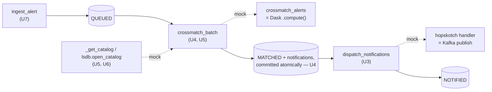

# feat: Test foundation for crossmatch-service

## Summary

Stand up a pytest-django + factory_boy test foundation for `crossmatch-service`, then add
high-value logic tests across the crossmatch→notify pipeline (notification state machine,
the MATCHED/notify commit ordering, payload coercion, catalog validation, ingest
idempotency, batch dispatch), one production behavior change so catalog-open errors fail
loud instead of being swallowed, CI gating that blocks merges on failures, and a
pip-compile dependency lock that governs both CI and the image build. Phased: harness →
logic coverage → automation & dependency safety.

## Problem Frame

Three silent production bugs shipped in one session, all in the crossmatch→notify path,
none caught by tests because the suite is effectively one file (`crossmatch/brokers/
pittgoogle/tests.py`) run by hand and gated by nothing. This plan builds the missing floor:
a real harness, regression tests that would have caught the logic bugs, a guard for the
dependency-skew class, and CI that actually runs them. See `origin:` for the full
requirements and the three bug write-ups.

## Requirements Trace

- R1, R3 → U1 (harness, isolation)
- R2 → U2 (factories)
- R4 (AE1) → U3; R5 (AE2) → U4; R12 (AE4) → U5; R6, R7 → U6; R8 (AE3) → U7; R9 → U8
- R10 → U10 (CI gating); R11 → U9 (lockfile + drift)

## Key Technical Decisions

- **pytest-django + factory_boy.** Carried from origin. Additive — the existing
  `unittest.TestCase` is collected unchanged.
- **Real commit semantics for ordering/dispatch tests.** Tests for the commit-ordering race
  (U4) and the dispatch thresholds/recovery (U8) run under `django_db(transaction=True)`
  with `captureOnCommitCallbacks`, against the Postgres test DB. The default per-test
  rollback collapses commit boundaries and would not honor `select_for_update(skip_locked)`
  or `transaction.on_commit`, so it would pass without exercising the behavior.
- **Mock seams.** External systems are mocked at three clean, already-isolated boundaries:
  `matching.catalog.crossmatch_alerts` (the lone Dask `.compute()`), the `hopskotch` entry
  in `notifier.dispatch.DESTINATION_HANDLERS` (Kafka publish), and `lsdb.open_catalog`
  (HATS reads).
- **R12 fail-loud policy.** In `crossmatch_batch`, a catalog *open/compute* error stops being
  swallowed: it raises, which the existing handler already reverts to `INGESTED` for retry,
  rather than completing the batch as `MATCHED` with zero matches. "Catalogs do not overlap"
  and empty results stay normal skips. (See Risks — this changes retry behavior on a flaky
  catalog.)
- **Lockfile = pip-compile.** `pip-tools` compiles `crossmatch/requirements.base.txt` to a
  fully-pinned lock that is the single source of truth for both CI and the image build;
  fits the existing pip workflow without a uv migration. Aligns with
  `docs/solutions/conventions/dependency-pin-upgrade-pattern-2026-05-12.md`.

## High-Level Technical Design

The pipeline and the three seams the tests cut at:

Prose is authoritative; the diagram orients where each unit's tests inject mocks.

---

## Implementation Units

### Phase A — Harness

### U1. Stand up pytest-django + factory_boy

- **Goal:** A working pytest harness that runs in-container against the Postgres test DB; the existing test still passes.
- **Requirements:** R1, R3.
- **Dependencies:** none.
- **Files:** `crossmatch/requirements.dev.txt` (new: pytest, pytest-django, factory_boy), `pyproject.toml` or `pytest.ini` (new: `DJANGO_SETTINGS_MODULE`, `python_files`, `testpaths`), `crossmatch/conftest.py` (new), `docs/developer.md` (update the Testing section).
- **Approach:** Configure pytest-django to load the existing Django settings; default tests to the Postgres test DB. Confirm `crossmatch/brokers/pittgoogle/tests.py` is collected and green under pytest-django.
- **Patterns to follow:** `crossmatch/brokers/pittgoogle/tests.py`; `crossmatch/project/settings.py` DATABASES.
- **Test scenarios:** `Test expectation: harness bring-up.` Verify `pytest` collects and runs the existing pittgoogle test green; one trivial DB-touching smoke test passes.
- **Verification:** `pytest` runs clean in-container; existing test passes.

### U2. Domain factories and fixtures

- **Goal:** factory_boy factories for `Alert`, `CatalogMatch`, `Notification`, plus a helper to build an alert at any status with N notifications in chosen states.
- **Requirements:** R2.
- **Dependencies:** U1.
- **Files:** `crossmatch/tests/__init__.py`, `crossmatch/tests/factories.py` (new), `crossmatch/conftest.py` (fixtures).
- **Approach:** `DjangoModelFactory` per model. Wire `CatalogMatch.alert` / `Notification.alert` through the `to_field='lsst_diaObject_diaObjectId'` FK (not the uuid pk) so relations resolve — the exact nuance behind two of the bugs. Provide a builder, e.g. `make_alert(status, notifications=[("hopskotch","sent"), ...])`.
- **Patterns to follow:** `crossmatch/core/models.py`; factory_boy `DjangoModelFactory`.
- **Test scenarios:** `Test expectation: exercised by later units;` add 1–2 sanity asserts that a built "MATCHED with all-sent notifications" alert reads back correctly.
- **Verification:** factories import and persist valid graphs; later units consume them.

### Phase B — Logic coverage

### U3. Notification transition tests

- **Goal:** `dispatch_notifications` advances `MATCHED→NOTIFIED` iff every notification for the alert is sent.
- **Requirements:** R4. Covers AE1.
- **Dependencies:** U2.
- **Files:** `crossmatch/tests/test_dispatch_notifications.py` (new).
- **Approach:** Mock the `hopskotch` handler so "send" marks `SENT` without Kafka. Build alerts via U2 and run `dispatch_notifications`.
- **Patterns to follow:** `crossmatch/tasks/schedule.py` (`dispatch_notifications`).
- **Test scenarios:** Covers AE1. all-sent → `NOTIFIED`; any-unsent → stays `MATCHED`; multi-notification all-sent → `NOTIFIED`. Regression: assert an alert transitions by `lsst_diaObject_diaObjectId`, not pk — a case that fails against the old pk-filter code.
- **Verification:** transition fires only when all notifications are sent.

### U4. MATCHED/notify ordering and atomicity tests

- **Goal:** Notifications and `MATCHED` commit atomically; a single-match alert reaches `NOTIFIED` even if the dispatcher runs while the alert is still `QUEUED`.
- **Requirements:** R5. Covers AE2.
- **Dependencies:** U2.
- **Files:** `crossmatch/tests/test_crossmatch_notify_ordering.py` (new).
- **Approach:** Mock `crossmatch_alerts` to return a controlled one-match result and mock the publish handler. Assert no notification is visible while its alert is `QUEUED`, and that a dispatch firing mid-window does not strand the alert.
- **Execution note:** Must run under real commit semantics (`django_db(transaction=True)` + `captureOnCommitCallbacks`); the default rollback hides the race.
- **Test scenarios:** Covers AE2. single-match alert → `NOTIFIED` even with dispatch firing during the `QUEUED` window; notification not committed-visible before `MATCHED`; a reproduction of the pre-fix per-catalog-commit ordering fails (guarding the regression).
- **Verification:** exercised against committed state, not rollback isolation.

### U5. Fail-loud on catalog open/compute errors (behavior change)

- **Goal:** A catalog open/compute error surfaces (batch fails and reverts to `INGESTED`) instead of being swallowed into a silent zero-match; add the regression test.
- **Requirements:** R12. Covers AE4.
- **Dependencies:** U2.
- **Files:** `crossmatch/tasks/crossmatch.py` (modify the per-catalog `except`), `crossmatch/tests/test_crossmatch_fail_loud.py` (new).
- **Approach:** Per the fail-loud KTD, stop the generic per-catalog `except Exception: log; continue` from absorbing open/compute failures; let them raise into the existing batch-level revert-to-`INGESTED` path. Preserve "Catalogs do not overlap" and empty-result as normal skips.
- **Execution note:** Characterization-first — write the raising-mock test and watch it expose the silent swallow before changing the `except`.
- **Test scenarios:** Covers AE4. a raising mock at the catalog-open/compute seam → the batch does not mark alerts `MATCHED` with zero matches (error surfaces / alerts revert to `INGESTED`); "no spatial overlap" still treated as a normal skip; a genuinely empty (no-match) result still completes as `MATCHED`.
- **Verification:** an injected catalog-open exception no longer yields a silent zero-match.

### U6. Payload coercion and catalog-column validation tests

- **Goal:** Cover `build_catalog_payload` JSON coercion and `_get_catalog` column validation.
- **Requirements:** R6, R7.
- **Dependencies:** U1.
- **Files:** `crossmatch/tests/test_payload.py`, `crossmatch/tests/test_catalog_validation.py` (new).
- **Approach:** R6 tests the pure coercion helper (no Django). R7 mocks `lsdb.open_catalog` to return a controlled schema and resets the module-level `_catalog_cache` between cases so validation actually runs each time.
- **Patterns to follow:** `crossmatch/matching/payload.py`, `crossmatch/matching/catalog.py`; `scripts/check_payload.py`.
- **Test scenarios:** R6 — numpy int/float scalars, `np.bool_`, and `None`/`NaN`/`NaT`/`pd.NA` coerce to JSON-native; `json.dumps` succeeds; no `NaN` token. R7 — unknown column → `ValueError`; column colliding with an alert column → `ValueError`; valid columns pass; cache reset between cases.
- **Verification:** coercion and validation paths covered.

### U7. Ingest idempotency tests

- **Goal:** `ingest_alert` is idempotent per broker.
- **Requirements:** R8. Covers AE3.
- **Dependencies:** U2.
- **Files:** `crossmatch/tests/test_ingest.py` (new).
- **Approach:** Drive `ingest_alert` directly.
- **Patterns to follow:** `crossmatch/brokers/__init__.py` (`ingest_alert`).
- **Test scenarios:** Covers AE3. same alert+broker twice → one alert row, one delivery, returns False on the second; same alert via a second broker → a delivery per broker; a new alert → created, returns True.
- **Verification:** no duplicates; per-broker delivery recorded once.

### U8. Batch dispatch and stuck-QUEUED recovery tests

- **Goal:** `dispatch_crossmatch_batch` dispatches only on threshold and auto-recovers stuck `QUEUED` alerts.
- **Requirements:** R9.
- **Dependencies:** U2.
- **Files:** `crossmatch/tests/test_dispatch_crossmatch_batch.py` (new).
- **Approach:** Override `CROSSMATCH_BATCH_MAX_SIZE` / `CROSSMATCH_BATCH_MAX_WAIT_SECONDS` / `CELERY_TASK_TIME_LIMIT` to small values; mock `crossmatch_batch.delay` to capture enqueues.
- **Execution note:** `django_db(transaction=True)` + `captureOnCommitCallbacks` (dispatch enqueues via `transaction.on_commit` and uses `select_for_update(skip_locked=True)`).
- **Test scenarios:** below threshold + young → no dispatch; count ≥ max-size → dispatch; oldest age ≥ max-wait → dispatch; an existing young `QUEUED` batch → skip (concurrency guard); a `QUEUED` alert older than `CELERY_TASK_TIME_LIMIT * 2` → reverted to `INGESTED`.
- **Verification:** thresholds and recovery match the existing logic.

### Phase C — Automation & dependency safety

### U9. Dependency lockfile and drift detection

- **Goal:** A pip-compile lock as the single source of truth for CI and the image build, with a CI check that fails on drift.
- **Requirements:** R11.
- **Dependencies:** none.
- **Files:** `crossmatch/requirements.lock` (new, compiled from `requirements.base.txt`), `docker/Dockerfile` (install from the lock), `.github/workflows/` (drift check), `docs/developer.md`.
- **Approach:** Compile `requirements.base.txt` → fully-pinned lock (pins `hats==0.9.0` transitively). Image build and CI both install from the lock. Drift check: a CI step asserts re-compiling produces no diff, and/or that the built image's resolved deps match the lock.
- **Test scenarios:** `Test expectation: none — tooling/CI.`
- **Verification:** CI fails if the lock is stale or the image's resolved deps diverge from it.

### U10. CI test gating

- **Goal:** The suite runs automatically on every change and a failure blocks merge.
- **Requirements:** R10.
- **Dependencies:** U1 (harness); lands meaningfully once U3–U8 exist.
- **Files:** `.github/workflows/test.yml` (new), `docs/developer.md`.
- **Approach:** A workflow on pull_request/push with a Postgres service, deps installed from the U9 lock (or via the built image), running `pytest`. Make it a required check (branch-protection setting noted as an out-of-code step). Account for the heavy lsdb/dask/hats install (build/use the image or cache wheels).
- **Test scenarios:** `Test expectation: none — CI config.`
- **Verification:** a failing test fails the job; the job is required on PRs.

---

## Scope Boundaries

**In scope:** R1–R12 (harness, the six logic-coverage areas + the fail-loud behavior change, CI gating, dependency lock + drift).

### Deferred to Follow-Up Work

- A class-level silent-failure guard (end-to-end alerts-in vs notified-out reconciliation, or a runtime invariant) — per the origin's Outstanding Question; this plan guards the known recurring instances.
- Broad coverage of the broker consumers, Flower, and deployment/infra.
- Deploy/startup smoke checks.

**Out of scope:** the gitops repo's `env-contract` CI guardrail (already exists).

---

## Risks & Dependencies

- **U5 changes production behavior.** Failing loud on catalog open/compute errors means a flaky/unreachable catalog now reverts the batch to `INGESTED` (retry) instead of silently completing. Mitigation: scope fail-loud to open/compute errors only; keep no-overlap and empty-result as normal; watch retry volume after rollout.
- **Transactional tests need Postgres.** U4/U8 won't behave on the sqlite settings alias (no `skip_locked`); the test DB must be Postgres.
- **pytest-django / Django 6 pin** is unconfirmed (not installed in the current venv) — confirm during U1.
- **CI install time:** the lsdb/dask/hats stack is heavy; U10 should build/use the image or cache wheels to keep the gate fast.

---

## Open Questions (deferred to implementation)

- U5 fail-loud granularity: fail the whole batch vs. mark only the affected alerts failed — settle against operational tolerance when touching the code.
- U10: install deps directly in the CI job vs. run inside the built image — an install-time/perf tradeoff resolved when wiring the workflow.
- Branch-protection / required-check configuration is a repo-settings action outside the codebase.

## Sources & Research

- Origin: `docs/brainstorms/2026-06-29-test-foundation-requirements.md`.
- Bug write-ups (in the `crossmatch-service-k8s-gitops` repo): `docs/solutions/runtime-errors/lsdb-hats-original-schema-version-skew.md`, `docs/solutions/logic-errors/single-match-alerts-stuck-matched-notify-before-matched-race.md`, and the NOTIFIED pk-fix commit `e7e4886`.
- App-repo conventions: `docs/solutions/conventions/dependency-pin-upgrade-pattern-2026-05-12.md`, `docs/solutions/design-patterns/coerce-numpy-pandas-scalars-to-json.md`.
- Code under test: `crossmatch/tasks/crossmatch.py`, `crossmatch/tasks/schedule.py`, `crossmatch/brokers/__init__.py`, `crossmatch/matching/catalog.py`, `crossmatch/matching/payload.py`, `crossmatch/core/models.py`, `crossmatch/project/settings.py`; existing test `crossmatch/brokers/pittgoogle/tests.py`.
