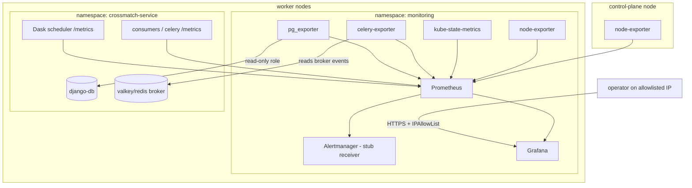

# feat: Monitoring spine for the SCiMMA crossmatch service

**Target repos:** this plan spans two. It lives in the app repo `crossmatch-service` (this
repo). Phase 1 lands in the GitOps repo `crossmatch-service-k8s-gitops`; its units are marked
**[gitops repo]** and all `apps/…`, `argocd-apps/…`, and marked `docs/…` paths are relative to
that repo's root. Phase 2 lands in this repo; unmarked paths are relative to this repo. U8
spans both and labels its paths per repo.

## Summary

Stand up a self-hosted observability spine on the DEV k3s cluster as a new ArgoCD app: an
`apps/monitoring/` umbrella Helm chart wrapping `kube-prometheus-stack` (Prometheus + Alertmanager
+ Grafana + node-exporter + kube-state-metrics) as a dependency, plus our own templates for the
Celery/Postgres exporters, the Dask scrape, alert rules, Grafana access, and dashboards. Symptom
alerts cover the incident classes that have bitten us. Phase 2 instruments the app with
`prometheus_client` for golden-signal metrics. Loki and formal SLOs are out of scope (deferred to
later increments); the alert receiver ships as a documented stub.

## Problem Frame

The service runs on DEV with only Flower, the Django admin, and ad-hoc `kubectl` for visibility.
Two incidents (a full `django-db` PVC that crash-looped Postgres; recurring control-plane
DiskPressure that evicted pods) went undetected until manual triage — the signals existed but
nothing watched them. This plan makes those signals visible and alertable. The recursive risk —
the stack runs on the same constrained cluster it monitors — is a first-class constraint: every
component is scheduled onto workers with bounded storage and memory, except node-exporter, which
must run on the control-plane to watch the node that actually failed.

## Key Technical Decisions

- **KTD1 — Umbrella chart, `kube-prometheus-stack` as a Helm dependency.** `apps/monitoring/` is a
  wrapper chart declaring `kube-prometheus-stack` in `Chart.yaml` dependencies, with our exporters,
  ingress, middleware, `PrometheusRule`, and dashboard `ConfigMap`s as first-class templates
  beside it. Mirrors the existing `apps/<name>` + `argocd-apps/<name>-dev.yaml` pattern
  (see origin: the ArgoCD app pattern). Chosen over a bare external-chart Application (traefik-style
  inlined values) plus sidecar Applications, because the custom resources (rules, exporters,
  Grafana ingress) live naturally in one synced unit.
- **KTD2 — Scheduling is per-subcomponent, not a shared helper.** Helm cannot `include` the
  `crossmatch-service.scheduling` named template into the dependency chart. Anti-control-plane
  affinity + topology-spread is set via each `kube-prometheus-stack` subcomponent's own
  `affinity`/`tolerations` values keys, exactly as the valkey subchart already does. node-exporter
  is the sole exception: it carries the control-plane toleration so it runs cluster-wide (see
  origin: R16, R17).
- **KTD3 — Bounded footprint on disk *and* memory.** Prometheus retention and PVC size carry
  conservative, values-configurable defaults; every stack component carries resource
  requests/limits, sized against worker-node RAM headroom (workers already run Dask at 8Gi and
  Celery at 4Gi limits) so Prometheus cannot trigger the memory-pressure evictions it exists to
  detect (see origin: R18, and the review's memory-budget finding).
- **KTD4 — Grafana behind the existing ingress pattern, with its own middleware.** Grafana reuses
  the Traefik ingress + cert-manager + IPAllowList *pattern*, but the `IPAllowList` middleware is a
  namespaced CR — a new one is created in the `monitoring` namespace (Traefik cross-namespace
  middleware refs are disabled by default). Grafana admin credentials come from a SealedSecret;
  chart defaults must not persist (see origin: R15, R19).
- **KTD5 — Stubbed alert receiver.** Alertmanager and rules ship; the receiver is a documented
  stub. This increment delivers triage speed, not delivered lead-time alerting — a live receiver is
  the explicit next increment (see origin: R14, Problem Frame).
- **KTD6 — App metrics exposed per-process via a `prometheus_client` HTTP server.** The long-running
  broker consumers (`run_*_ingest.py`) each start an HTTP metrics server; Celery workers/beat use
  `prometheus_client` multiprocess mode (prefork forks child processes — a single in-process
  registry would report only one child). Approach confirmed at U6 (see origin: Outstanding
  Questions).

## High-Level Technical Design



Prose is authoritative where it disagrees with the diagram.

## Output Structure

New directory in the GitOps repo (Phase 1):

```
apps/monitoring/
  Chart.yaml            # declares kube-prometheus-stack dependency
  values.yaml           # base values: scheduling, retention, resource limits, exporters
  values-dev.yaml       # DEV overrides: Grafana host, allowlist ranges, PVC size
  templates/
    ingress.yaml            # Grafana ingress (cert-manager + middleware annotation)
    middleware-allowlist.yaml  # IPAllowList CR in the monitoring namespace
    servicemonitor-dask.yaml   # scrape the Dask scheduler /metrics
    servicemonitor-app.yaml    # scrape the app /metrics endpoints (Phase 2)
    prometheusrule-symptom.yaml  # symptom alert rules
    exporter-celery.yaml    # grafana/celery-exporter Deployment + Service + ServiceMonitor
    exporter-postgres.yaml  # pg_exporter Deployment + Service + ServiceMonitor
    sealedsecret-dev.yaml   # Grafana admin + pg_exporter role creds
    dashboards-configmap.yaml  # provisioned Grafana dashboards
argocd-apps/monitoring-dev.yaml  # ArgoCD Application for the monitoring app
```

Per-unit `Files:` lists remain authoritative; the implementer may adjust layout.

## Requirements Trace

| Requirement | Unit(s) |
|---|---|
| R1–R3 (deploy as ArgoCD app, kube-prometheus-stack, own namespace) | U1 |
| R4 (node-exporter, kube-state-metrics) | U1 |
| R5 (celery-exporter) | U3, U7 |
| R6 (Dask scrape) | U3 |
| R7, R20 (pg_exporter + read-only role/SealedSecret) | U3 |
| R8 (Grafana dashboards) | U5 |
| R9–R11 (app instrumentation + scrape) | U6, U8 |
| R12–R14 (alert rules, configurable thresholds, stub receiver) | U4 |
| R15, R19 (Grafana access + admin SealedSecret) | U2 |
| R16–R18 (worker scheduling, node-exporter exception, bounded disk+memory) | U1 |
| AE1 (control-plane disk alert) | U1, U4 |
| AE2 (components on workers) | U1 |
| AE3 (stub receiver, no external send) | U4 |
| AE4 (exporters up) | U3 |
| AE5 (app /metrics golden signals) | U6, U8 |

---

## Implementation Units

### Phase 1 — GitOps infra spine (gitops repo `crossmatch-service-k8s-gitops`)

Self-contained; closes both motivating incidents with no app-repo changes.

### U1. Scaffold the monitoring umbrella chart and ArgoCD app [gitops repo]

- **Goal:** A synced `monitoring` namespace running a tuned kube-prometheus-stack (Prometheus,
  Alertmanager, Grafana, node-exporter, kube-state-metrics) that stays within the cluster's disk
  and memory budget and off the control-plane (except node-exporter).
- **Requirements:** R1, R2, R3, R4, R16, R17, R18.
- **Dependencies:** none.
- **Files:** `apps/monitoring/Chart.yaml`, `apps/monitoring/Chart.lock`,
  `apps/monitoring/charts/kube-prometheus-stack-*.tgz` (vendored), `apps/monitoring/values.yaml`,
  `apps/monitoring/values-dev.yaml`, `argocd-apps/monitoring-dev.yaml`.
- **Approach:** `Chart.yaml` declares the `kube-prometheus-stack` dependency pinned to a specific
  version. `values.yaml` disables bundled pieces not used (e.g. the stack's own etcd/kubelet
  scrape jobs that don't apply on k3s where relevant), sets per-subcomponent
  `affinity`/`topologySpreadConstraints` (control-plane `DoesNotExist`, worker spread) and resource
  requests/limits, sets node-exporter's DaemonSet toleration for the control-plane, and bounds
  Prometheus retention (time + size) and PVC size with configurable defaults. Model the affinity
  blocks on the valkey subchart values in `apps/crossmatch-service/values.yaml`. Also in
  `values.yaml`, set `prometheus.prometheusSpec.serviceMonitorSelectorNilUsesHelmValues: false` and
  `ruleSelectorNilUsesHelmValues: false` — the chart defaults these to `true`, which selects only
  resources carrying the `release:` label and would silently ignore the hand-authored ServiceMonitors
  (U3, U8) and PrometheusRule (U4). Vendor the dependency: run `helm dependency build apps/monitoring`
  and commit both `Chart.lock` and `charts/kube-prometheus-stack-*.tgz` — ArgoCD renders in-repo
  charts from git and cannot fetch dependencies at render time (mirrors the committed
  `apps/crossmatch-service/Chart.lock` + `charts/valkey-2.1.8.tgz`). The Application manifest mirrors
  `argocd-apps/crossmatch-service-dev.yaml` (automated sync, prune, selfHeal, CreateNamespace) plus
  `syncOptions: [ServerSideApply=true]` — kube-prometheus-stack's CRDs exceed the 262KB
  client-side-apply annotation limit, so the first sync fails without it (confirm whether the ArgoCD
  install already applies server-side globally, which would make this redundant).
- **Patterns to follow:** `argocd-apps/traefik.yaml` (external-chart Application),
  `argocd-apps/crossmatch-service-dev.yaml` (in-repo app + automated sync), the valkey affinity
  block in `apps/crossmatch-service/values.yaml`.
- **Test scenarios / verification:** Covers AE2. ArgoCD reports the app Synced + Healthy;
  `kubectl -n monitoring get pods -o wide` shows Prometheus, Grafana, Alertmanager, and
  kube-state-metrics on worker nodes only; node-exporter runs on all nodes including the
  control-plane; Prometheus PVC is bound on a worker and retention/size limits are set in the
  running config. The first sync completes without the CRD-annotation-too-long error (confirms
  ServerSideApply). `Test expectation: none — Helm/values change, verified by cluster state, not a
  unit-test harness.`

### U2. Grafana access: ingress, allowlist middleware, admin credentials [gitops repo]

- **Goal:** Grafana reachable over HTTPS at a DEV host, gated by IPAllowList, with a non-default
  admin password from a SealedSecret.
- **Requirements:** R15, R19.
- **Dependencies:** U1.
- **Files:** `apps/monitoring/templates/ingress.yaml`,
  `apps/monitoring/templates/middleware-allowlist.yaml`,
  `apps/monitoring/templates/sealedsecret-dev.yaml`, `apps/monitoring/values-dev.yaml`.
- **Approach:** Create a Grafana `Ingress` with the cert-manager cluster-issuer annotation and the
  Traefik middleware annotation, mirroring `apps/crossmatch-service/templates/ingress.yaml`. Create
  a new `IPAllowList` middleware CR in the `monitoring` namespace (do not reference the
  crossmatch-service one — cross-namespace refs are off). Point the stack's `grafana.admin*` values
  at a SealedSecret key; ensure chart default credentials are overridden. Reuse the same source
  ranges as `apps/crossmatch-service/values-dev.yaml` `allowlistSourceRanges`.
- **Patterns to follow:** `apps/crossmatch-service/templates/{ingress,middleware-allowlist,sealedsecret-dev}.yaml`,
  the kubeseal workflow in `docs/kubeseal-workflow.md` [gitops repo].
- **Test scenarios / verification:** Grafana loads over HTTPS from an allowlisted IP and returns
  403 from outside the range; login with the chart default password fails; login with the sealed
  admin password succeeds. `Test expectation: none — deployment config, verified by cluster state.`

### U3. Exporters: Celery, Postgres, Dask scrape [gitops repo]

- **Goal:** Celery, Postgres, and Dask metrics flow into Prometheus.
- **Requirements:** R5, R6, R7, R20.
- **Dependencies:** U1.
- **Files:** `apps/monitoring/templates/exporter-celery.yaml`,
  `apps/monitoring/templates/exporter-postgres.yaml`,
  `apps/monitoring/templates/servicemonitor-dask.yaml`,
  `apps/monitoring/templates/sealedsecret-dev.yaml` (pg role creds), `apps/monitoring/values.yaml`.
- **Approach:** Deploy `grafana/celery-exporter` pointed at the DEV broker (Valkey/Redis) with a
  `ServiceMonitor`. Deploy `pg_exporter` as a standalone Deployment authenticating to `django-db`
  with a dedicated read-only monitoring role. Grant minimal privilege — `GRANT pg_monitor TO <role>`
  plus `CONNECT` on the database and `USAGE` on the schema; do NOT grant `SELECT ON ALL TABLES`
  (that would expose every catalog and credential row; `pg_monitor` covers the `pg_stat_*` views
  pg_exporter needs). Create the role via an idempotent mechanism that survives a cluster rebuild —
  a pre-sync Kubernetes Job running the `CREATE ROLE`/`GRANT` SQL, or a documented kubeseal + psql
  runbook step run before pg_exporter deploys — not a one-off manual command. Store the role
  password as a SealedSecret; never in values/git. Note: `sealedsecret-dev.yaml` is shared with U2
  (Grafana admin) — U2 and U3 are otherwise independent, so assemble both units' secrets into the
  one multi-document file and seal them together in a single pass (as
  `apps/crossmatch-service/templates/sealedsecret-dev.yaml` does with five secrets), rather than one
  unit overwriting the other's sealed blob. Add a `ServiceMonitor` scraping the Dask scheduler's
  native `/metrics` on its dashboard port (`apps/dask/values.yaml` `scheduler.dashboardPort: 8787`).
  Note broker-auth posture in values (DEV broker is unauthenticated — accepted).
- **Patterns to follow:** `apps/dask` service/labels for the Dask scrape target; existing
  SealedSecret usage in `apps/crossmatch-service/templates/sealedsecret-dev.yaml`.
- **Test scenarios / verification:** Covers AE4. All three exporters show `up` in the Prometheus
  targets list; `pg_up` and Dask scheduler series are queryable; the celery-exporter reports broker
  queue length (task-outcome metrics complete after U7). `Test expectation: none — deployment
  config, verified by Prometheus targets/queries.`

### U4. Symptom alert rules + stubbed Alertmanager receiver [gitops repo]

- **Goal:** Alert rules fire for the incident classes that have bitten us; alerts are visible in
  the Alertmanager UI with no external delivery.
- **Requirements:** R12, R13, R14.
- **Dependencies:** U1 (rules), U3 (rules referencing exporter metrics).
- **Files:** `apps/monitoring/templates/prometheusrule-symptom.yaml`, `apps/monitoring/values.yaml`
  (Alertmanager stub receiver + configurable thresholds).
- **Approach:** A `PrometheusRule` with alerts for: node disk usage incl. the control-plane root
  filesystem, `django-db` PVC near-full, Postgres pod down/CrashLooping, pod evictions /
  `CrashLoopBackOff`, Dask worker count `< 1`, broker-consumer pod liveness, and Celery queue
  backlog growth. Thresholds and Prometheus retention are values-configurable with sane defaults.
  Configure Alertmanager with a stub/null receiver — alerts route to the UI, nothing is sent
  externally.
- **Patterns to follow:** kube-prometheus-stack `PrometheusRule` CRD conventions; the disk-guardrail
  requirement in `docs/solutions/performance-issues/control-plane-diskpressure-undersized-cinder-boot-volume.md`
  [gitops repo].
- **Test scenarios / verification:** Covers AE1, AE3. Force the control-plane-disk condition (or a
  test rule) and confirm the alert fires and is visible in the Alertmanager UI with no external
  send and no delivery error; a Dask-worker-down and a Postgres-down alert each evaluate correctly;
  thresholds are overridable via values. `Test expectation: none — rules/config, verified in
  Prometheus/Alertmanager UI.`

### U5. Grafana dashboards [gitops repo]

- **Goal:** Operators land on dashboards for cluster/node health, Celery, Dask, and Postgres.
- **Requirements:** R8.
- **Dependencies:** U1, U3.
- **Files:** `apps/monitoring/templates/dashboards-configmap.yaml`, `apps/monitoring/values.yaml`
  (dashboard provisioning).
- **Approach:** Provision dashboards via the Grafana sidecar `ConfigMap` mechanism, seeding from
  community dashboards (Celery 9610 / 9970, node-exporter, pg_exporter) as a starting point. Keep
  them as versioned JSON in the chart.
- **Patterns to follow:** kube-prometheus-stack Grafana dashboard-provisioning convention.
- **Test scenarios / verification:** The dashboards appear in Grafana and render non-empty panels
  for node, Celery (queue-length at minimum until U7), Dask, and Postgres. `Test expectation: none
  — dashboard config, verified in Grafana UI.`

---

### Phase 2 — App instrumentation (this repo)

Forward investment toward future SLOs; adds golden-signal dashboards. Depends on Phase 1 being
live so there is a Prometheus to scrape into.

### U6. Instrument the app with `prometheus_client`

- **Goal:** Each long-running app process exposes a `/metrics` endpoint emitting golden signals.
- **Requirements:** R9, R10, R11.
- **Dependencies:** U1 (a Prometheus to scrape into; instrumentation can be written independently).
- **Execution note:** Resolve the prefork-Celery multiprocess approach first
  (`PROMETHEUS_MULTIPROC_DIR` multiprocess mode vs. a dedicated metrics-only process) — it drives
  how workers/beat expose metrics. Implement test-first for the metric-emission contract.
- **Files:** `crossmatch/project/celery.py`, `crossmatch/project/management/commands/run_antares_ingest.py`,
  `crossmatch/project/management/commands/run_lasair_ingest.py`,
  `crossmatch/project/management/commands/run_pittgoogle_ingest.py`, a new metrics helper module
  under `crossmatch/` (e.g. `crossmatch/core/metrics.py`), and tests under `crossmatch/tests/`.
- **Approach:** Add a metrics helper defining the golden-signal instruments: a per-broker ingest
  counter, an ingest last-success timestamp gauge, and crossmatch/notification outcome counters
  (exact names/labels finalized here, building on origin R10). Each consumer command starts a
  `prometheus_client` HTTP server on a configurable port and updates the instruments in its ingest
  loop. Celery workers/beat expose metrics via the chosen multiprocess mechanism. `prometheus-client`
  is already a pinned dependency; no new dependency.
- **Patterns to follow:** the existing consumer loop structure in `run_pittgoogle_ingest.py` /
  `crossmatch/brokers/pittgoogle/consumer.py`; the structlog logging setup for where to increment
  counters.
- **Test scenarios:**
  - Covers AE5. Happy path: after a simulated successful ingest, the ingest counter for that broker
    increments and the last-success timestamp gauge advances.
  - Edge: an ingest that raises before completion does not advance the last-success gauge.
  - The `/metrics` endpoint returns the registered series in Prometheus text format.
  - Multiprocess: metrics from two worker processes aggregate (not one overwriting the other) under
    the chosen multiprocess mode.

### U7. Enable Celery task events for exporter task metrics

- **Goal:** `grafana/celery-exporter` reports task-outcome metrics, not just queue length.
- **Requirements:** R5 (completion).
- **Dependencies:** U3 (exporter deployed).
- **Files:** `crossmatch/project/celery.py` (or settings) — `worker_send_task_events` /
  `task_send_sent_event`; the GitOps worker launch args if `-E` is set at the command line
  (`apps/crossmatch-service/templates/statefulset.yaml` / deployment for workers).
- **Approach:** Enable task events in Celery config (or via `-E` on the worker command). Prefer the
  config flag so it is declarative. Confirm the exporter then reports per-task success/failure/runtime
  series.
- **Patterns to follow:** how Flower already consumes events (it enables events remotely today);
  existing Celery config in `crossmatch/project/celery.py`.
- **Test scenarios:** Unit-assert the Celery app config has task events enabled. Integration/manual:
  after enabling, celery-exporter reports non-empty task-outcome series in Prometheus.

### U8. Expose and scrape the app `/metrics` endpoints [both repos]

- **Goal:** Prometheus scrapes the app's golden-signal metrics.
- **Requirements:** R11.
- **Dependencies:** U6, U1.
- **Files:** `apps/crossmatch-service/templates/{statefulset,deployment-flower}.yaml` and/or a new
  Service exposing the metrics port (GitOps repo); `apps/monitoring/templates/servicemonitor-app.yaml`
  (GitOps repo).
- **Approach:** Add the metrics container port and a Service (or annotate existing Services) for the
  consumer/worker pods so their `/metrics` is reachable in-cluster. Add a `ServiceMonitor` in the
  monitoring chart selecting those Services. Confirm the app targets appear in Prometheus.
- **Patterns to follow:** existing Service definitions in `apps/crossmatch-service/templates/`; the
  Dask `ServiceMonitor` from U3.
- **Test scenarios / verification:** Covers AE5. The app `/metrics` endpoints show `up` in the
  Prometheus targets list and the golden-signal series are queryable. `Test expectation: none —
  deployment config, verified by Prometheus targets.`

---

## Scope Boundaries

Deferred for later (from origin):

- Centralized logs (Loki) — the next observability increment.
- Formal SLO definitions and multi-window burn-rate alerting — after baseline data from Phase 2.
- A live alert destination (Slack/email/PagerDuty) — the receiver stays a stub; wiring a live
  channel is the explicit next increment.
- oauth2-proxy / SSO in front of Grafana — pending project-wide; IPAllowList is the interim gate.
- Operator-console ideas, public status page, weekly digest — later phases in the source ideation.
- Production deployment — DEV only.

### Deferred to Follow-Up Work

- Alerting on the Phase 2 golden-signal metrics (thresholds need baseline data first).
- Tuning/curating the seeded community dashboards beyond the starting import.
- A NetworkPolicy restricting the app `/metrics` port (U8) to the Prometheus pod — low threat on
  the single-tenant DEV cluster, worth adding in a hardening pass.
- Verify Grafana's IPAllowList actually enforces from outside the range: if the cluster SNATs
  source IPs, Traefik sees one source and the allowlist passes all traffic (same caveat as the
  existing `middleware-allowlist.yaml`). U2's 403 test catches an annotation typo, not the SNAT case.

## Risks & Dependencies

- **Prometheus footprint on a constrained cluster (high).** Mitigated by KTD3 — bounded retention,
  PVC, and per-component resource limits sized against worker RAM headroom; validated at U1.
- **Assumption: Dask scheduler serves `/metrics` on the dashboard port.** The image bakes
  `dask[complete]` (which pins `prometheus-client`), so it should — verify at U3 before locking the
  scrape; fallback is to enable the Dask Prometheus endpoint explicitly.
- **Assumption: celery-exporter reads the DEV broker.** Queue-length works regardless; task-outcome
  metrics depend on U7. Verify at U3/U7.
- **prefork-Celery multiprocess** is a known hard problem — resolved at U6 (execution note) before
  sizing worker instrumentation.
- **Cross-repo sequencing:** Phase 2 code (app repo) and its scrape wiring (GitOps repo) must land
  together for U8 to verify; coordinate the two PRs.

## System-Wide Impact

- New `monitoring` namespace and ArgoCD app; new Traefik ingress + a Grafana DNS record.
- New Postgres read-only role for pg_exporter (DDL on `django-db`).
- App pods gain a metrics port/Service (Phase 2) — a new in-cluster surface, not exposed publicly.
- Celery task events enabled (U7) add a small broker-event volume.

## Sources & Research

- Origin requirements: `docs/brainstorms/2026-06-30-monitoring-spine-requirements.md`.
- Source ideation (#4/#5): `docs/ideation/2026-04-28-dashboard-web-ui-ideation.md`.
- Incident motivating the disk guardrail:
  `docs/solutions/performance-issues/control-plane-diskpressure-undersized-cinder-boot-volume.md`
  [gitops repo].
- Grounding dossier (verified file:line quotes):
  `/tmp/compound-engineering/ce-brainstorm/mon-spine/grounding.md`.
- Patterns: `argocd-apps/traefik.yaml`, `argocd-apps/crossmatch-service-dev.yaml`,
  `apps/crossmatch-service/templates/{ingress,middleware-allowlist,sealedsecret-dev}.yaml`,
  the valkey affinity block in `apps/crossmatch-service/values.yaml`, `apps/dask/values.yaml`.
