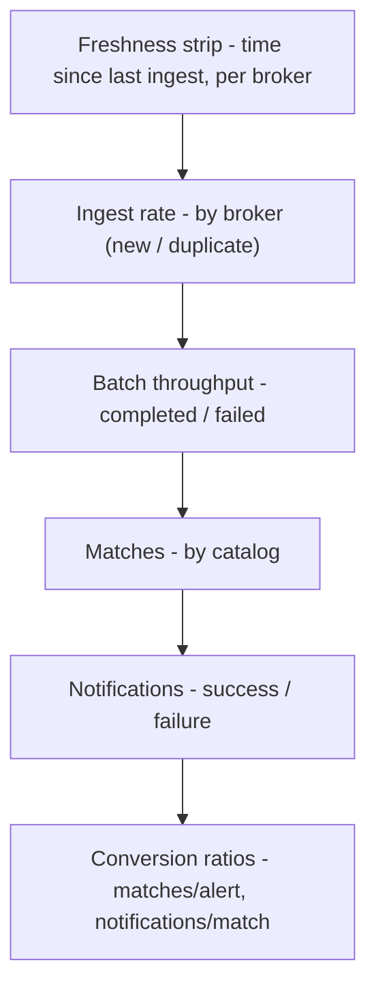

# Crossmatch App Dashboard - Plan

## Goal Capsule

- **Objective:** Ship a trends-focused "Crossmatch app" Grafana dashboard that surfaces the U6-U8 golden-signal metrics as rates, volumes, and a few derived yield ratios over time.
- **Product authority:** Scott Koranda (maintainer).
- **Open blockers:** None. The app metrics are deployed and scraped (monitoring-spine Phase 2); this dashboard is additive and display-only.
- **Where the work lands:** The GitOps repo `crossmatch-service-k8s-gitops`, under the monitoring chart. All repo-relative paths below are relative to that repo unless noted.

---

## Product Contract

### Summary

Add a dedicated Grafana dashboard for the crossmatch pipeline's own metrics, framed around trends (throughput and yield over a window) rather than live health. It ships as a hand-authored `dashboards/app.json` that the monitoring chart auto-discovers, exactly like the existing Celery/Postgres/Dask boards.

### Problem Frame

The U6-U8 instrumentation emits per-broker ingest, per-catalog match, batch, notification, and freshness metrics, and Prometheus scrapes them. But no dashboard surfaces them: today the only way to see a `crossmatch_*` series is ad-hoc Grafana Explore or the raw Prometheus UI. The existing chart already ships hand-authored boards for the exporters, and its configmap template calls dashboard curation "deferred follow-up work" — this is that follow-up for the app's own signals.

### Key Decisions

- **Trends framing, not health-glance.** Panels show rates, volumes, and a few derived yield ratios over a multi-hour window, not red stat tiles. Live alerting stays in the symptom-alert PrometheusRule (monitoring-spine U4); this board is for reading behavior over time.
- **App metrics only.** Celery task-event throughput stays on the existing Celery board; surfacing it here would duplicate it.
- **Pipeline-flow layout.** Row order mirrors the data path (ingest to notify), so a stall reads as the point down the page where the sparklines diverge.
- **Hand-authored, auto-shipped.** Follows the `dashboards/dask.json` pattern: a versioned JSON file embedded verbatim by the existing configmap glob, discovered by the Grafana sidecar. No new chart wiring.

### Requirements

**Panels**

- R1. Ingest rate per broker over time, split new vs duplicate.
- R2. Batch throughput over time, split completed vs failed.
- R3. Match rate per catalog over time (Gaia, DES, DELVE, SkyMapper).
- R4. Notification publish rate over time, split success vs failure.
- R5. Conversion-ratio trends: matches-per-alert and notifications-per-match over a window, to surface yield drift a raw-count panel would hide.
- R6. Freshness strip: time since the last successful ingest per broker, from the last-success gauge, with a threshold color cue.

**Layout**

- R7. Arrange the panels in pipeline-flow order, full-width rows top to bottom: freshness strip, then ingest, batch, match, notification, and conversion ratios last.

**Packaging**

- R8. Deliver as a versioned `dashboards/app.json` embedded by the existing configmap glob and discovered via the `grafana_dashboard=1` label; no changes to chart plumbing.
- R9. Select the datasource consistently with the existing hand-authored board (see Planning Contract KTD1 — the model board hardcodes the Prometheus datasource rather than templating it).
- R10. Default the board to a trend-suited time range and refresh (settled in planning: `now-6h`, matching `dask.json`).

**Layout shape (illustrates R7):**

### Acceptance Examples

- AE1. **Covers R5.** matches-per-alert is catalog-matches per new alert. Most transient alerts match no catalog, so it typically reads well below 1 (a matching alert may still hit several catalogs); the panel is a yield-trend line over a window, not a bounded 0-1 rate. A sustained drop signals fewer alerts matching, or fewer catalogs per matching alert, even when raw counts look steady. (Live DEV baseline is ~0.008 matches per new alert, confirming the well-below-1 regime.)
- AE2. **Covers R6.** When a broker stops delivering, its freshness tile's "time since last ingest" climbs and crosses the threshold cue, while a healthy broker's tile stays low. Thresholds mirror an ingest-staleness alert if one exists in the symptom rule, otherwise a sensible default.
- AE3. **Covers R3.** A footprint-limited catalog (DES, DELVE, SkyMapper) can legitimately show a near-zero match rate for long stretches when the alert batch falls outside its footprint — normal, not an outage. The panel must let an operator distinguish that expected baseline from an anomalous drop to zero for all-sky Gaia (per-catalog expected-baseline context or independent scaling).
- AE4. **Covers R5.** In a window with zero alerts or zero matches the conversion ratio's denominator is zero; the panel renders that as a gap (no data), not as 0, so "no alerts to divide by" is not misread as "zero yield."

### Scope Boundaries

- Celery task-throughput panels — they live on the existing Celery board.
- New alert rules — this board is display-only; alerting stays in the symptom-alert PrometheusRule.
- Broker/catalog filter template variables and any templating beyond the datasource — deferred polish.
- In-progress/stuck detection for batches and notifications — the app counters are terminal-outcome only (completed/failed, success/failure); a stalled batch surfaces as a throughput drop plus the freshness strip, and via the Celery board's task-started-vs-succeeded, not as a dedicated series here.

---

## Planning Contract

**Product Contract preservation:** changed — R9's *mechanism*. The Product Contract originally said "select the datasource through the `${datasource}` template variable, matching the existing boards." The actual hand-authored model, `dashboards/dask.json`, hardcodes `{"type":"prometheus","uid":"prometheus"}` with an empty `templating.list`; only the bulk-imported `celery.json` uses a `${datasource}` variable. R9's *intent* (a datasource convention consistent with the maintained hand-authored board) is preserved; the mechanism is resolved to the `dask.json` hardcode. Maintainer confirmed. All other Product Contract IDs (R1-R8, R10, AE1-AE4) unchanged.

### Approach

One hand-authored JSON dashboard, `apps/monitoring/dashboards/app.json`, modeled cell-for-cell on the existing `apps/monitoring/dashboards/dask.json`: same `schemaVersion` (39), same hardcoded Prometheus datasource, same `gridPos`-based layout, versioned with an integer `version`. The monitoring chart's `dashboards-configmap.yaml` already globs `dashboards/*.json` and stamps each with the `grafana_dashboard=1` label, so dropping the file in ships it — the Grafana sidecar discovers and imports it with no chart-template change. Panels read the `crossmatch_*` series that Phase 2 (U6-U8) already emits and Prometheus already scrapes on the DEV cluster (image `0.3.0`), so every panel can be verified against live data during implementation.

The build is incremental within the single file: scaffold + freshness strip (U1), the four volume/throughput trend rows (U2), the two conversion-ratio panels (U3), then ship-and-verify end to end (U4).

### Key Technical Decisions

- **KTD1 — Model on `dask.json`, not `celery.json`.** Hand-authored minimal JSON: `schemaVersion: 39`, `uid: "crossmatch-app"`, `title: "App (crossmatch)"` (matching the sibling boards' `"<Component> (<context>)"` convention), `tags: ["crossmatch","app"]`, `templating.list: []`, and a hardcoded panel/target datasource `{"type":"prometheus","uid":"prometheus"}`. Rationale: `dask.json` is the maintained hand-authored sibling and the one R8/R9 point at; `celery.json` is a bulky Grafana.com import whose `${datasource}` variable and query-driven template vars are import baggage, not the local convention. Resolves R9's mechanism.
- **KTD2 — Freshness strip is a row of per-broker `stat` panels (the one deliberate glance element).** Query `time() - max by (broker) (crossmatch_alert_last_success_timestamp_seconds)`, unit seconds. Absolute thresholds (green at 0, a warn and a crit step). `noValue` mapped to an explicit "no data" display so a broker with no last-success sample in the range reads as unknown, not healthy or blank. This is the deliberate exception to "no stat tiles" — resolves the deferred freshness-genre question (maintainer chose the glance stat-strip).
- **KTD3 — Volume/throughput/match/notification panels are `timeseries` over `sum by (label)(rate(counter[...]))`.** Ingest by `broker`+`result`, batches by `result`, matches by `catalog`, notifications by `result`. Batches and matches are low-frequency, so use `increase(...[window])` or a wide rate interval for a legible line rather than a near-zero `rate` (exact window settled against live cadence in implementation). The match panel keeps a per-catalog legend and does not treat a flat near-zero catalog as an error — DES/DELVE/SkyMapper footprint gaps are expected (AE3); documented in the panel description, not enforced. **Render all four catalogs as persistent series at a zero floor** (fieldConfig `nullValue`/no-value mapped to zero, connect-nulls off): an out-of-footprint catalog emits no samples, so a bare `sum by (catalog)(increase(...))` would drop it from the legend entirely — which defeats AE3's distinction. Holding each catalog visible at zero makes an expected footprint gap (flat zero) read differently from an anomalous all-sky Gaia drop (a line that falls to and holds zero, or gaps), rather than a catalog silently disappearing.
- **KTD4 — Conversion ratios guard the denominator.** `matches-per-alert = sum(rate(crossmatch_matches_total[w])) / (sum(rate(crossmatch_alerts_ingested_total{result="new"}[w])) > 0)`; `notifications-per-match = sum(rate(crossmatch_notifications_published_total{result="success"}[w])) / (sum(rate(crossmatch_matches_total[w])) > 0)`. The `> 0` filter drops the sample when the denominator is zero, so an empty window renders as a gap rather than `+Inf`/`0` (AE4). The matches-per-alert denominator is `result="new"` only — duplicates never enter matching, so counting them would let duplicate-rate drift move the yield line (review finding).
- **KTD5 — Trend-suited defaults.** `time: { from: "now-6h", to: "now" }` matching `dask.json`; refresh left at the board default (no forced fast auto-refresh — this is a trends board).
- **KTD6 — No chart plumbing.** The only new file is `dashboards/app.json`. The existing `dashboards-configmap.yaml` glob ships it; no template, values, or ServiceMonitor change.

### Panel / metric / query map

Directional guidance for reviewers — exact windows, legends, and field configs are set during implementation.

| Panel | Req | Metric (labels) | Directional query | Panel type |
|-------|-----|-----------------|-------------------|------------|
| Freshness strip | R6 | `crossmatch_alert_last_success_timestamp_seconds{broker}` | `time() - max by (broker) (crossmatch_alert_last_success_timestamp_seconds)` | stat (per broker) |
| Ingest rate | R1 | `crossmatch_alerts_ingested_total{broker,result}` | `sum by (broker,result) (rate(...[$__rate_interval]))` | timeseries |
| Batch throughput | R2 | `crossmatch_batches_total{result}` | `sum by (result) (increase(...[w]))` | timeseries |
| Matches | R3 | `crossmatch_matches_total{catalog}` | `sum by (catalog) (increase(...[w]))` | timeseries |
| Notifications | R4 | `crossmatch_notifications_published_total{result}` | `sum by (result) (rate(...[$__rate_interval]))` | timeseries |
| Conversion ratios | R5 | matches vs alerts(new); notifications(success) vs matches | see KTD4 | timeseries |

Label domains (confirmed live on `0.3.0`): brokers `antares`/`lasair`/`pittgoogle`; ingest `result` `new`/`duplicate`; batch `result` `completed`/`failed`; catalogs `gaia_dr3`/`des_y6_gold`/`delve_dr3_gold`/`skymapper_dr4`; notification `result` `success`/`failure`.

### Risks & Dependencies

- **Live-data dependency.** Verification assumes the `0.3.0` app image is scraped on DEV (it is — monitoring-spine Phase 2 verified). If the cluster is redeployed to an older image, the `crossmatch_*` series vanish and panels read empty.
- **ArgoCD pickup.** After the gitops push, the `monitoring` app may need a hard refresh to pick up the new revision (`kubectl -n argocd annotate application monitoring argocd.argoproj.io/refresh=hard --overwrite`); both DEV apps are auto-sync once refreshed. Known from prior phases.
- **schemaVersion drift.** Author at `schemaVersion: 39` to match the sibling boards; a mismatch risks the sidecar import massaging fields unexpectedly.

---

## Implementation Units

### U1. Scaffold `app.json` and the freshness strip

- **Goal:** Create the dashboard file with its top-level fields and the leading per-broker freshness strip.
- **Requirements:** R6, R7 (leading row), R8, R9; AE2.
- **Dependencies:** none.
- **Files:** `apps/monitoring/dashboards/app.json` (create).
- **Approach:** Write the dashboard shell per KTD1 (`uid`, `title`, `tags`, `schemaVersion: 39`, `time: now-6h`, empty `templating.list`, hardcoded datasource). Add the freshness strip as `stat` panel(s) at `gridPos` `y: 0`, full width, per KTD2: query `time() - max by (broker) (crossmatch_alert_last_success_timestamp_seconds)`, unit `s`, absolute threshold steps (green / warn / crit), `noValue` mapped to a "no data" string. Default threshold values: warn 300s, crit 900s (calibration deferred — see Open Questions).
- **Patterns to follow:** `apps/monitoring/dashboards/dask.json` stat panels (fieldConfig thresholds, reduceOptions, colorMode).
- **Verification:** file parses as JSON; a healthy cluster shows all three brokers with a low "time since last ingest"; stopping a consumer makes its tile climb past the threshold and change color; a broker with no series renders the "no data" state.
- **Test expectation:** none -- declarative dashboard JSON; verified by render + live query.

### U2. Pipeline volume/throughput panels (ingest, batch, match, notification)

- **Goal:** The four core trend rows below the strip, in pipeline order.
- **Requirements:** R1, R2, R3, R4, R7; AE3.
- **Dependencies:** U1.
- **Files:** `apps/monitoring/dashboards/app.json` (modify).
- **Approach:** Four full-width `timeseries` panels stacked by `gridPos` in ingest -> batch -> match -> notification order, per KTD3. Ingest split by `broker`+`result`; batch by `result` (use `increase` over a window for the low-frequency series); matches by `catalog`; notifications by `result`. Give the match panel a description noting that footprint-limited catalogs (DES/DELVE/SkyMapper) can sit near zero legitimately (AE3), keep a per-catalog legend so Gaia's all-sky line is read separately, and render all four catalogs as persistent series held at a zero floor (per KTD3) so an out-of-footprint catalog stays visibly at zero rather than dropping out of the legend.
- **Patterns to follow:** `dask.json` "Tasks by state" / "Task compute time (rate)" timeseries panels (legend, tooltip, rate expr).
- **Verification:** on `0.3.0`, ingest shows antares new + duplicate lines; batch shows completed (and failed if any); matches shows all four catalogs held visible with DES at a zero floor when out of footprint (not dropped from the legend); notifications shows success.
- **Test expectation:** none -- declarative dashboard JSON; verified by render + live query.

### U3. Conversion-ratio panels

- **Goal:** matches-per-alert and notifications-per-match yield-trend lines at the bottom.
- **Requirements:** R5; AE1, AE4.
- **Dependencies:** U2.
- **Files:** `apps/monitoring/dashboards/app.json` (modify).
- **Approach:** Bottom row `timeseries` per KTD4 — denominator guarded with `> 0` for gap rendering; matches-per-alert denominator restricted to `result="new"`. Panel description notes that matches-per-alert typically reads well below 1 since most alerts match no catalog (AE1) and that a gap means "no alerts/matches in the window," not zero yield.
- **Patterns to follow:** `dask.json` rate-expression timeseries; standard PromQL division-guard idiom.
- **Verification:** ratio line present and typically > 1; a synthetic or natural zero-alert window renders as a gap, not a 0-floor; no `+Inf` spikes.
- **Test expectation:** none -- declarative dashboard JSON; verified by render + live query.

### U4. Ship and verify live

- **Goal:** Confirm the board auto-ships through the existing glob and renders end to end.
- **Requirements:** R8, R10; whole-board acceptance.
- **Dependencies:** U1, U2, U3.
- **Files:** none new — relies on `apps/monitoring/templates/dashboards-configmap.yaml` (existing glob).
- **Approach:** Commit `app.json` on a branch. Confirm `helm template apps/monitoring` renders the dashboards configmap now carrying an `app.json` key with the `grafana_dashboard=1` label. After merge + sync (hard refresh if ArgoCD lags), confirm Grafana lists "App (crossmatch)" (uid `crossmatch-app`) and every panel populates. Check the grafana-sidecar logs for a clean import (no schema/parse error).
- **Execution note:** smoke/render verification, not unit coverage — this is a deploy-and-look step.
- **Verification:** board appears in the Grafana dashboard list; all six panels populate from live metrics; sidecar import logged without error; existing dask/celery/postgres boards still render (glob unaffected).
- **Test expectation:** none -- deploy/render verification.

---

## Verification Contract

Board-level gates (run against the gitops repo and the DEV cluster):

- **JSON validity:** `python3 -c "import json; json.load(open('apps/monitoring/dashboards/app.json'))"` exits clean.
- **Chart render:** `helm template apps/monitoring` emits a dashboards configmap whose data includes the `app.json` key, carrying the `grafana_dashboard=1` label.
- **Live data:** each panel's query returns a non-empty result against the cluster Prometheus (the per-unit queries above), confirming labels and metric names match the deployed `0.3.0` series.
- **Grafana discovery:** the "App (crossmatch)" board (uid `crossmatch-app`) appears in the dashboard list and the grafana-sidecar logged its import without error.
- **No regressions:** the existing hand-authored boards (dask/celery/postgres) still render — the glob change is purely additive.

---

## Definition of Done

- `apps/monitoring/dashboards/app.json` committed in the gitops repo, valid JSON, `schemaVersion: 39`, hardcoded Prometheus datasource, integer `version`.
- Six panels present (R1-R6) in pipeline-flow order (R7): freshness strip, ingest, batch, match, notification, conversion ratios.
- Freshness strip is per-broker `stat` with threshold coloring and an explicit no-data state (KTD2).
- Conversion ratios guard zero denominators (gap, not 0) and use the `result="new"` denominator for matches-per-alert (KTD4).
- Board auto-ships via the existing configmap glob with no chart-plumbing change (KTD6), appears in Grafana, and every panel populates from live `0.3.0` metrics.
- No new alert rules added; deferred items recorded in Open Questions.

---

## Open Questions

**Resolved during planning (from the 2026-07-06 review deferrals):**

- Freshness strip genre -> glance stat-strip, the one deliberate at-a-glance element (KTD2).
- Freshness "no-data / never-ingested" state -> `stat` `noValue` mapping to an explicit "no data" display (U1).
- Conversion-ratio zero-denominator + denominator grain -> guarded `> 0` division and `result="new"` denominator (KTD4).
- Datasource mechanism -> hardcoded `uid: prometheus` per `dask.json` (KTD1).

**Remaining (non-blocking, settle during implementation):**

- **Freshness threshold calibration.** The monitoring-spine U4 symptom PrometheusRule has no ingest-staleness alert to mirror (closest is `BrokerConsumerDown`), so U1 uses a default global warn 300s / crit 900s. Per-broker calibration — and alignment with a future ingest-staleness alert should one be added — is deferred; broker cadences (ANTARES / Lasair / Pitt-Google) may differ enough that a single global threshold false-alarms on a bursty broker or misses a stalled fast one.
- **notifications-per-match signal value.** Live DEV shows ~0.69 notifications per match (not the ~1:1 first assumed), so the ratio does carry some signal (not every match publishes). Keep it for now; revisit dropping it only if it flattens to a constant in practice.
- **Batch/match rate window.** The exact `increase`/`rate` window for the low-frequency batch and match series is tuned against live cadence during implementation.

---

## Sources

- `apps/monitoring/templates/dashboards-configmap.yaml` — globs `dashboards/*.json` and embeds each verbatim with the `grafana_dashboard=1` label; a new `app.json` auto-ships with no wiring change.
- `apps/monitoring/dashboards/dask.json` — the hand-authored model (schemaVersion 39, hardcoded `uid: prometheus` datasource, empty templating list, stat + timeseries panels).
- `apps/monitoring/dashboards/celery.json` — the imported board that uses a `${datasource}` variable; noted only to explain why `app.json` follows `dask.json` instead (KTD1).
- `apps/monitoring/templates/prometheusrule-symptom.yaml` — the monitoring-spine U4 symptom rule; confirmed to have no ingest-staleness/freshness alert, so the freshness threshold has none to mirror.
- `crossmatch/core/metrics.py` (app repo `crossmatch-service`) — authoritative metric names and labels: `crossmatch_alerts_ingested_total`, `crossmatch_alert_last_success_timestamp_seconds`, `crossmatch_batches_total`, `crossmatch_matches_total`, `crossmatch_notifications_published_total`.
- `docs/plans/2026-07-01-001-feat-monitoring-spine-plan.md` (app repo) — U6-U8 defined this instrumentation and the `crossmatch-app` scrape.
