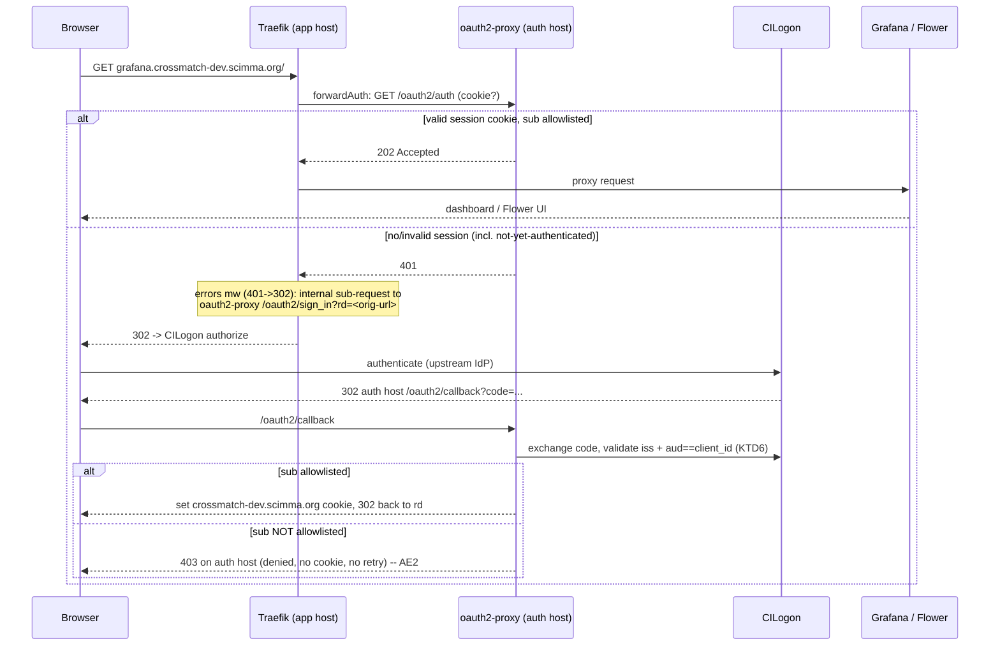
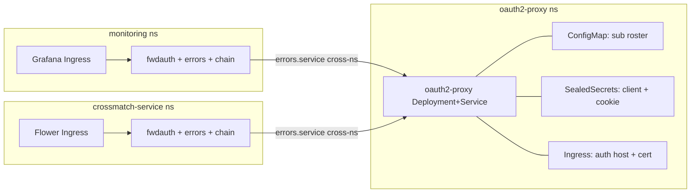

# oauth2-proxy + CILogon Auth for DEV Operator Surfaces - Plan

**Target repo:** `crossmatch-service-k8s-gitops` (the GitOps repo, checked out as a sibling at
`../crossmatch-service-k8s-gitops`). All repo-relative paths below are within that repo. This
plan document lives in the app repo; no app-repo code changes.

**Product Contract preservation:** changed R5 -- it now describes the corrected gate topology (a
Traefik `forwardAuth` + `errors` + chain middleware set per namespace, the `errors` middleware
reaching the one oauth2-proxy cross-namespace via `allowCrossNamespace`; see KTD1/KTD9). An
earlier revision wrongly claimed the login redirect was glue-free; a docs check confirmed that a
central oauth2-proxy across namespaces needs the `errors`-middleware redirect and a Traefik
cross-namespace toggle. AE2 was also corrected: oauth2-proxy's `/oauth2/auth` returns only 202 or
401 (never 403), so a not-allowlisted user is denied at `/oauth2/callback` (403 on the auth host)
after a CILogon bounce, not by a 403 on the app surface. All other Product Contract text is as
`ce-brainstorm` left it; `ce-plan` added the Planning Contract (Key Technical Decisions through
Definition of Done).

## Goal Capsule

**Objective.** Put per-user authentication in front of the DEV cluster's two exposed
operator surfaces -- Grafana and Flower -- using oauth2-proxy with CILogon as the OIDC
OpenID Provider, replacing the single-IP Traefik allowlist that gates them today.
Collaborators reach the surfaces from any network; access is granted and revoked per
person.

**Product authority.** This document (`product_contract_source: ce-brainstorm`). It is the
durable answer that an earlier shared-password stopgap deliberately deferred; a doc-review
of that stopgap argued for doing the real per-user-identity solution directly, and this
plan is that pivot.

**Where the work lands.** The GitOps repo (`../crossmatch-service-k8s-gitops`), not the app
repo -- a new oauth2-proxy workload, a ConfigMap roster plus two SealedSecrets, and edits to
the `monitoring` and `crossmatch-service` ingress/middleware manifests. No application code
changes.

**Open blockers.** None blocking planning. The Outstanding Questions below are all
planning-time, not product decisions.

## Product Contract

### Context

Only two surfaces are exposed on the cluster, both operator-only:

- **Grafana** -- `grafana.crossmatch-dev.scimma.org/` (`monitoring` namespace)
- **Flower** -- `crossmatch-dev.scimma.org/flower` (`crossmatch-service` namespace)

There is no separate Django app/API ingress and no other IngressRoutes; the public astro
community consumes matches over Hopskotch/Kafka, not the web. So gating everything exposed
carries no risk of blocking intended-public traffic. Both surfaces are currently protected
by Traefik `IPAllowList` middlewares (`grafana-allowlist`, `flower-allowlist`) documented
repo-wide as "until an auth layer (oauth2-proxy) is in front."

CILogon is the OpenID Provider, registered as a **confidential** client (it holds a client
secret). Three facts about CILogon identity shape the design:

- **Authorization keys on `sub`, never on email -- because email is reassigned.** In the
  CILogon / Internet2 / eduGAIN higher-education federation ecosystem, upstream IdPs routinely
  reassign email addresses, so an entirely new person can inherit a departed person's address.
  Email is therefore not even a stable identifier, let alone a safe authorization key. The
  CILogon user identifier -- the OIDC `sub` claim -- is guaranteed unique and never reassigned,
  and is the correct primary key.
- **Email is also not guaranteed to be released at all.** Its release is governed by the user's
  upstream IdP under REFEDS R&S policy -- not by CILogon's tier. A confidential client receives
  it best-effort and uses it only as a human-readable **label** for onboarding and debugging.
- **`sub` is per-IdP-login, not per-person.** A collaborator who authenticates through a
  different identity provider presents a different `sub`. The allowlist maps a *set* of `sub`s
  to each person, and re-onboarding a new `sub` is an expected operation.

### Requirements

**Access**

- **R1.** Both operator surfaces require a successful CILogon authentication before any
  access; neither is reachable unauthenticated.
- **R2.** Authorization is a static allowlist of CILogon `sub` values. An authenticated user
  whose `sub` is on the list is granted; any other authenticated user is denied. One
  collaborator may hold more than one `sub`.
- **R3.** An allowlisted collaborator reaches both surfaces from any network -- no IP
  restriction remains.
- **R4.** Adding or removing a collaborator is a single GitOps change to the allowlist.

**Architecture and uniformity**

- **R5.** A single oauth2-proxy Deployment and a single CILogon client front both surfaces,
  sharing one allowlist and one identity gate. The Deployment, client, and allowlist stay
  singular; each protected namespace gets a Traefik `forwardAuth` + `errors` + chain middleware
  set that reaches that one oauth2-proxy (the `errors` middleware references its Service
  cross-namespace, enabled by `allowCrossNamespace`; see KTD1/KTD9).
- **R6.** The `grafana-allowlist` and `flower-allowlist` IPAllowList middlewares are removed
  and replaced by the auth gate; no IP allowlist remains on either surface.

**Token validation**

- **R7.** oauth2-proxy validates the OIDC token's issuer and audience (this deployment's
  registered `client_id`). A token minted for a different CILogon-registered client is
  rejected, not accepted on the shared CILogon issuer alone.

**Grafana behavior**

- **R8.** Grafana serves as anonymous **Viewer** behind the proxy: an allowlisted user sees
  read-only dashboards with no second login step.
- **R9.** Grafana's local admin login remains functional but is reachable only after passing
  the CILogon gate, so it is doubly protected (allowlisted `sub` plus admin password). The
  admin account stays maintainer-only.

**Identity labels, secrets, and lifecycle**

- **R10.** Each allowlist entry may carry a human-readable label (email/name, captured
  best-effort). The label is never used for authorization -- email in particular is reassigned
  and must never become a key.
- **R11.** The CILogon client secret and the oauth2-proxy cookie secret are stored as
  SealedSecrets (namespace-wide scope); no plaintext secret is committed. The `sub` allowlist
  is a roster of opaque identifiers, not credentials, and lives in a plain ConfigMap so the
  frequent add/remove edit has a readable diff.
- **R12.** Revoking a collaborator removes all of their `sub`s and re-syncs, with no
  disruption to others. A collaborator whose `sub` changes (login via a different IdP) is
  re-onboarded by adding the new `sub`.

### Acceptance Examples

- **AE1.** An allowlisted `sub`, off the maintainer's network, opens Grafana, is redirected
  through CILogon, logs in, and lands on the dashboards; the same session reaches Flower
  without re-authenticating. **Covers R1, R3, R5, R8.**
- **AE2.** A user who authenticates successfully at CILogon but whose `sub` is not on the
  allowlist is denied: `/oauth2/auth` sees no valid session (401), the `errors` middleware bounces
  them through CILogon, and the emails-file check fails at `/oauth2/callback`, landing them on a
  403 on the auth host -- they never receive an app-surface session for Grafana or Flower.
  **Covers R2.**
- **AE3.** Adding a `sub` (with its label) and syncing grants that person access; removing a
  `sub` and syncing denies them on the next request; other collaborators are unaffected in
  both cases. **Covers R4, R10, R12.**
- **AE4.** Neither ingress carries an IPAllowList middleware afterward; a request from an
  arbitrary IP carrying a valid allowlisted session succeeds. **Covers R6.**
- **AE5.** The maintainer, after the CILogon gate, logs into Grafana admin with the admin
  password; a non-admin allowlisted user reaching Grafana gets Viewer only, no admin.
  **Covers R9.**
- **AE6.** In the GitOps repo the client secret and cookie secret exist only as SealedSecrets
  and the allowlist only as a plain ConfigMap; no plaintext Secret or credential is committed.
  **Covers R11.**
- **AE7.** A valid CILogon token issued for a different registered client is rejected by
  oauth2-proxy rather than accepted on the shared issuer. **Covers R7.**
- **AE8.** A collaborator who signs in through a second IdP presents a new `sub` and is denied
  until that `sub` is added, then granted -- same person, second allowlist entry. **Covers
  R2, R12.**

### Scope Boundaries (non-goals)

- Grafana native OIDC and role mapping -- CILogon asserts no groups, so every user would be
  Viewer anyway; not worth a second client.
- Per-user Grafana sessions / forwarded-identity (`auth.proxy`) -- identity and revocation
  live at the proxy; read-only dashboards do not need per-user Grafana attribution.
- `sub`-for-authorization is fixed; email is a display label only, never an authz key.
- A private-overlay / mesh VPN (e.g. Tailscale) -- not chosen: it requires client software on
  every collaborator, and CILogon federated identity is the deliberate community standard.
  Recorded so the oauth2-proxy choice is a weighed decision, not an assumption.
- PROD -- no PROD cluster exists yet; the pattern should generalize but PROD is not built
  here.
- Any change to public match delivery (Hopskotch/Kafka) -- untouched.

### Accepted Risks

- **Email is not a guaranteed claim and is reassigned.** Authorization keys on `sub` (always
  present, unique, never reassigned); email/name are captured only as a label. Accepted -- it
  is exactly what a stable allowlist needs.
- **Any CILogon user can reach the authorization gate.** Authentication succeeds for any
  CILogon identity; the allowlist is what grants access. Standard oauth2-proxy posture, not a
  gap.
- **Monitoring reachability now depends on CILogon.** oauth2-proxy is a shared dependency for
  both surfaces, and both now depend on the CILogon OP being reachable. A CILogon outage or
  free-tier rate-limit during a Rubin alert storm can block operator access to Grafana -- the
  incident dashboard -- exactly when it is needed, a coupling the prior IPAllowList did not
  have. Mitigation: the CILogon-outage break-glass path (`kubectl port-forward` to the Grafana
  or Flower Service). The alert-processing pipeline itself is not behind the proxy, so
  ingestion/matching/publishing are unaffected.
- **Identity is vendor-anchored.** Every authz entry is a CILogon-specific `sub`, so switching
  OP later means re-collecting every collaborator's identifier. Accepted as the cost of
  standardizing on CILogon; confirm free-tier terms permit sustained (non-evaluation) DEV use.
- **The session cookie is scoped to `crossmatch-dev.scimma.org`** so the browser sends it to
  the apex and any host under it. Mitigation: no other service is deployed under that domain
  without passing the same gate, and the cookie is set `Secure`/`HttpOnly`/`SameSite` with a
  tight `whitelist-domain` (both the apex and the wildcard, no broader scope).
- **Grafana admin login is reachable (behind the gate) by every allowlisted `sub`.** Only the
  maintainer holds the admin password, so admin stays maintainer-only in practice. Accepted.

---

## Key Technical Decisions

- **KTD1 -- Dedicated auth host + Traefik ForwardAuth, login redirect via an `errors`
  middleware.** oauth2-proxy is exposed on its own host `auth.crossmatch-dev.scimma.org`,
  serving `/oauth2/*`. Each protected app carries a **chain of two** `traefik.io/v1alpha1`
  Middlewares: a `forwardAuth` whose `address` is oauth2-proxy's in-cluster
  `http://oauth2-proxy.oauth2-proxy.svc.cluster.local:4180/oauth2/auth` (a URL, so
  cross-namespace is fine) -- it returns **202** (valid session, `sub` allowlisted) or **401**
  (no/invalid session). `/oauth2/auth` **never returns 403**; a not-allowlisted user is denied
  earlier, at `/oauth2/callback` (see below). The chain's second Middleware is an `errors`
  Middleware scoped to **status 401 only**, with `service` pointing at the oauth2-proxy Service,
  `query: /oauth2/sign_in?rd={url}`, and `statusRewrites {401: 302}`, which turns that 401 into a
  browser redirect to CILogon and back. A not-allowlisted user does **not** loop: 401 -> redirect
  -> authenticate at CILogon -> fail the emails-file check at `/oauth2/callback` -> **403 on the
  auth host** (no session cookie is ever issued, and the callback 403 terminates without
  auto-retry). A central oauth2-proxy genuinely needs this `errors`-middleware redirect:
  oauth2-proxy cannot issue a working login redirect for a *different* host's request on its own
  (verified against the oauth2-proxy Traefik docs -- the earlier "`--upstream=static://202` at root
  is glue-free" idea only holds for a single-host deployment). The `errors` middleware's `service`
  is a Kubernetes Service reference, so reaching oauth2-proxy from the app namespaces needs
  `allowCrossNamespace` (KTD9). **Three version-specific Traefik behaviors this rests on -- that
  `allowCrossNamespace` governs an `errors.service` cross-namespace ref, that `{url}` expands to
  the full request URL, and that the `errors` middleware forwards oauth2-proxy's `Location` header
  -- are verified by a spike (U10) before the cutover, not assumed.** Chosen over inline `/oauth2`
  paths on each app host for a **load-bearing** reason, not convenience: the central host exposes
  oauth2-proxy once (its own ingress, its own namespace), so the only cross-namespace element is the
  lightweight `errors.service` CRD reference -- served by the **safer** `allowCrossNamespace` toggle
  (KTD9). Inline paths would instead need each app-host Ingress to route an `/oauth2` path to
  oauth2-proxy in another namespace, which a standard Kubernetes Ingress backend cannot do (it must
  be same-namespace; `allowCrossNamespace` governs Traefik CRDs, not the `kubernetesIngress`
  Ingress->Service backend) -- forcing either the rejected `allowExternalNameServices`
  (arbitrary-DNS, SSRF-adjacent) or a per-namespace proxy (which breaks the single-proxy /
  single-allowlist requirement, R5). The dedicated host also reuses the Grafana DNS + cert + CoreDNS
  pattern. (Callback-URI count is not a deciding factor -- see KTD5.)

- **KTD2 -- First-party `apps/oauth2-proxy` chart, raw manifests, own namespace.** oauth2-proxy
  is a single Deployment + Service, so it ships as first-party raw templates (like the repo's
  own exporters/ingress), not a vendored upstream chart. This avoids the Chart.lock +
  committed-`.tgz` ceremony that `kube-prometheus-stack` and `valkey` require (ArgoCD renders
  in-repo and cannot fetch dependencies at render time). It deploys to a new `oauth2-proxy`
  namespace, keeping the auth layer separate and generalizable to PROD.

- **KTD3 -- Authorize on `sub` via `--oidc-email-claim=sub` + `--authenticated-emails-file`;
  do NOT set `--email-domain`.** Pointing oauth2-proxy's identity claim at `sub` makes its
  emails-file allowlist match `sub` values (the roster ConfigMap, mounted). **`--email-domain`
  must be left unset** -- setting `--email-domain=*` ORs to allow-all and silently bypasses the
  emails file (every authenticated CILogon user would pass), defeating R2/R4/R12. With
  `--email-domain` absent, the domain check simply never matches and the roster file is the
  sole gate (fail-closed if misconfigured -- caught immediately by AE1/AE2). This is deliberate
  and load-bearing given that email is reassigned in the federation and must never be an authz
  key.

- **KTD4 -- Roster = ConfigMap; secrets = SealedSecrets.** The `sub` allowlist is opaque
  identifiers, not credentials, so it lives in a plain, directly-edited ConfigMap (the
  authenticated-emails file, one `sub` per line with a `# label` comment) for readable diffs on
  the frequent add/remove edit -- no values-list templating indirection while there is a single
  environment. The CILogon client secret and the oauth2-proxy cookie secret are SealedSecrets
  (namespace-wide scope), mirroring `apps/monitoring/templates/sealedsecret-dev.yaml`.

- **KTD5 -- CILogon confidential OIDC client.** Provider type `oidc`, issuer
  `https://cilogon.org` (OIDC discovery), scopes `openid email profile`, redirect URI
  `https://auth.crossmatch-dev.scimma.org/oauth2/callback` (also set as `--redirect-url`),
  `--skip-provider-button=true` (one provider -- go straight to CILogon). Cookie/redirect config:
  `--cookie-domain=crossmatch-dev.scimma.org`, and **both** `--whitelist-domain=crossmatch-dev.scimma.org`
  **and** `--whitelist-domain=.crossmatch-dev.scimma.org` -- the leading-dot form matches only
  subdomains, so the bare apex (Flower's host) must be listed explicitly or the post-login `rd`
  return URL is discarded. Server config: `--http-address=0.0.0.0:4180` (the binary defaults to
  `127.0.0.1`, which the Service could not reach), `--reverse-proxy=true`, and a placeholder
  `--upstream=static://200` (oauth2-proxy requires an upstream to start; the actual gate is the
  `/oauth2/auth` endpoint the forwardAuth middleware calls, per KTD1). Cookie hardening:
  `--cookie-secure=true --cookie-httponly=true --cookie-samesite=lax`. Email/name captured
  best-effort as the display label only.

  **Callback URIs are cheap and must not drive architecture.** Adding or changing a redirect URI
  on the CILogon client is a trivial, low-latency edit to the client registration -- not a
  migration. So the number or shape of callback URIs a design implies (one central host vs. one
  per app host) is never a reason to prefer or avoid an architecture; decide topology on its own
  merits and register whatever URIs it needs.

- **KTD6 -- Token issuer AND audience validation stay on (R7).** The `oidc` provider validates
  the issuer and checks the token's `aud` contains this deployment's `client_id`, both via
  discovery, by default. The deployment must NOT set `--insecure-oidc-skip-issuer-verification`,
  must NOT relax audience validation (e.g. adding foreign values via `--oidc-extra-audience`),
  and must NOT skip discovery. The U5 render check asserts none of those flags are present; AE7
  (a live token from a different `client_id` is rejected) is the functional backstop.

- **KTD7 -- Grafana anonymous Viewer via `grafana.ini`; login form kept.** Set
  `auth.anonymous.enabled=true` and `auth.anonymous.org_role=Viewer` at
  `kube-prometheus-stack.grafana.grafana.ini.auth.anonymous` in the monitoring chart values
  (Grafana is a subchart two levels deep; no `grafana.ini` block exists there today).
  **`auth.disable_login_form` is left `false`** -- disabling it would also reject the local
  admin username/password login and break R9/AE5; anonymous-Viewer alone removes the redundant
  second login. The `grafana-admin` SealedSecret is unchanged. `ingress.allowlistSourceRanges`
  is a separate top-level `ingress:` value and is dropped in the same edit.

- **KTD8 -- Two-phase, ordered cutover.** oauth2-proxy, monitoring, and crossmatch-service are
  three independent ArgoCD Applications with automated prune+selfHeal, so nothing enforces
  cross-app order by default. To avoid a window where a surface is open or (worse) fails closed
  because it points at a not-yet-Ready proxy: (1) land and verify oauth2-proxy (U1-U6) first,
  gating the cutover on the oauth2-proxy app being Healthy (ArgoCD sync-wave, or briefly
  disabling auto-sync on the two app charts for the cutover); (2) add each forwardAuth
  middleware **alongside the retained IPAllowList** and verify the gate live; (3) remove the
  IPAllowList in a second commit. This keeps a defended fallback throughout and makes rollback a
  one-line re-add rather than a scramble. `trustForwardHeader` is left **`false`** (Traefik's
  default and the edge here) so a client cannot spoof `X-Forwarded-*` on the auth-decision path.

- **KTD9 -- Enable Traefik `allowCrossNamespace`.** The `errors`-middleware `service` (KTD1) is a
  Kubernetes Service reference, and each app namespace's middleware must reach the oauth2-proxy
  Service in the `oauth2-proxy` namespace; Traefik disables cross-namespace CRD references by
  default. Set `providers.kubernetesCRD.allowCrossNamespace: true` in the Traefik chart values
  (`argocd-apps/traefik.yaml` `valuesObject`). Chosen over `allowExternalNameServices` (which
  would need a per-namespace ExternalName shim and enables a broader, SSRF-adjacent capability --
  routing to arbitrary DNS); on this single-tenant, ops-only, gitops-managed cluster the
  cross-namespace-reference capability is low-risk. This is a **permanent cluster-policy change**
  to shared Traefik infrastructure (like the CoreDNS artifact) -- capture it for reproducibility,
  and note it affects all future Traefik routing, not just this feature.

---

## High-Level Technical Design

**Request / auth flow (per protected surface).** A chain of two middlewares -- `errors` then
`forwardAuth` -- gates each app. forwardAuth checks the session at oauth2-proxy `/oauth2/auth`
(**202 or 401** only); on a 401 the `errors` middleware turns it into a login redirect. A
not-allowlisted user is denied at `/oauth2/callback` (a 403 on the auth host), not at
`/oauth2/auth` (KTD1):



**Component / namespace layout** (one proxy; per-namespace `forwardAuth`+`errors`+chain
middleware set reaching it, the `errors` middleware referencing its Service cross-namespace via
`allowCrossNamespace`):



Prose is authoritative where it and a diagram disagree.

---

## Output Structure

New first-party chart (raw manifests, no vendored dependency):

```
apps/oauth2-proxy/
  Chart.yaml
  values.yaml
  values-dev.yaml
  templates/
    _helpers.yaml
    deployment.yaml
    service.yaml
    ingress.yaml
    configmap-allowlist.yaml
    sealedsecret-dev.yaml
  README.md                      # onboarding runbook (U4)
argocd-apps/
  oauth2-proxy-dev.yaml          # ArgoCD Application
```

Edits to existing charts add a `middleware-oauth.yaml` per namespace (the `forwardAuth` +
`errors` + chain Middlewares) and modify the two ingress templates + their values; the two
`middleware-allowlist.yaml` templates are retired in the second cutover commit (KTD8). A separate
edit enables `allowCrossNamespace` in `argocd-apps/traefik.yaml` (U9).

---

## Implementation Units

### U1. Register the CILogon confidential OIDC client

**Goal.** Obtain the OIDC credentials the deployment needs and pre-register the callback, so
downstream units have a real, approved `client_id`/`client_secret`.

**Requirements.** R5, R7, R10 (scopes), R11 (secret to seal).

**Dependencies.** None for the registration itself. **Note:** recording the resulting
non-secret values into the chart is a soft dependency on U2 (the file must exist first).

**Files.** None in-repo for registration (external, at cilogon.org). Once U2 exists, record the
`client_id`, issuer, and callback in `apps/oauth2-proxy/values-dev.yaml`; the runbook text lands
in `apps/oauth2-proxy/README.md` (U4).

**Approach.** Register a **confidential** client at CILogon with redirect URI
`https://auth.crossmatch-dev.scimma.org/oauth2/callback`, scopes `openid email profile`.
**Submit this first, before any chart work:** a confidential client typically requires manual
approval by CILogon operations, which can take days, and U3/U5 cannot complete without an
active client. Note the issuer `https://cilogon.org` and its discovery document. The
`client_secret` stays out of git; it enters only via the U3 SealedSecret.

**Execution note.** Ops/manual prerequisite. Gate the *start* of U3 and U5 on the client being
**approved and active**, not merely submitted.

**Verification.** The client is approved and active; its record shows the exact callback URL and
the three scopes; `client_id` and `client_secret` are captured for U3.

### U2. Scaffold the oauth2-proxy chart, namespace, and ArgoCD app

**Goal.** A renderable, ArgoCD-managed but not-yet-wired oauth2-proxy chart in its own
namespace.

**Requirements.** R5.

**Dependencies.** None.

**Files.** Create `apps/oauth2-proxy/Chart.yaml`, `apps/oauth2-proxy/values.yaml`,
`apps/oauth2-proxy/values-dev.yaml`, `apps/oauth2-proxy/templates/_helpers.yaml`,
`argocd-apps/oauth2-proxy-dev.yaml`.

**Approach.** `Chart.yaml` is `type: application`, no dependencies (contrast
`apps/monitoring/Chart.yaml`, which vendors kube-prometheus-stack). The ArgoCD Application
mirrors `argocd-apps/crossmatch-service-dev.yaml`: `repoURL` the GitLab gitops repo, `path
apps/oauth2-proxy`, helm `valueFiles: [values.yaml, values-dev.yaml]`, `destination.namespace:
oauth2-proxy`, `syncPolicy.automated` prune+selfHeal, `syncOptions: [CreateNamespace=true]`,
and an `ignoreDifferences` entry for `Ingress /status` (Traefik writes it). It does **not** need
the `ServerSideApply=true` monitoring carries for oversized CRDs.

**Patterns to follow.** `argocd-apps/crossmatch-service-dev.yaml`, `apps/monitoring/Chart.yaml`.

**Execution note.** Config/scaffolding; prefer `helm template` render + ArgoCD sync smoke over
unit tests.

**Test scenarios.** `Test expectation: none -- scaffolding.` Render check only: `helm template
apps/oauth2-proxy -f apps/oauth2-proxy/values.yaml -f apps/oauth2-proxy/values-dev.yaml`
produces valid YAML; the ArgoCD app appears and syncs.

**Verification.** `helm template` renders clean; `argocd-apps/oauth2-proxy-dev.yaml` validates;
the `oauth2-proxy` namespace is created on sync.

### U3. Seal the client secret and cookie secret

**Goal.** The two genuine secrets exist in git only as SealedSecrets in the `oauth2-proxy`
namespace.

**Requirements.** R7 (client secret), R11.

**Dependencies.** U1 (approved client secret value), U2 (chart + namespace).

**Files.** Create `apps/oauth2-proxy/templates/sealedsecret-dev.yaml`.

**Approach.** Mirror `apps/monitoring/templates/sealedsecret-dev.yaml`: `bitnami.com/v1alpha1`
`SealedSecret`, `sealedsecrets.bitnami.com/namespace-wide: "true"`, `namespace: oauth2-proxy`,
gated on `environment == dev`. Two sealed values: the CILogon `client-secret` and a generated
`cookie-secret` (32-byte, base64). Seal with `kubeseal --controller-name sealed-secrets`
against the `sealed-secrets` controller in `kube-system` (kubeseal 0.27.1). No plaintext
`Secret` or values committed.

**Patterns to follow.** `apps/monitoring/templates/sealedsecret-dev.yaml`.

**Execution note.** Secret material -- verify only that the sealed blobs decrypt in-cluster to
the expected keys; never echo plaintext.

**Test scenarios.**
- `Covers AE6.` Manifest scan shows the client and cookie secrets present only as SealedSecret
  encryptedData, no plaintext `kind: Secret` or literal secret in values.
- After sync, the controller unseals both into a `Secret` in `oauth2-proxy` with the two
  expected keys.

**Verification.** The SealedSecret renders and unseals in-cluster; the resulting `Secret`
carries `client-secret` and `cookie-secret`.

### U4. Sub-allowlist ConfigMap + onboarding runbook

**Goal.** The authorization roster as a readable, directly-edited ConfigMap, plus the runbook
for adding people.

**Requirements.** R2, R4, R10, R11, R12.

**Dependencies.** U2 (chart).

**Files.** Create `apps/oauth2-proxy/templates/configmap-allowlist.yaml`, create
`apps/oauth2-proxy/README.md`.

**Approach.** A ConfigMap whose single data key is the authenticated-emails file: one `sub` per
line, each preceded by a `# <label>` comment (email/name) for readability. Edit it directly --
no values-list templating indirection while there is one environment (defer that to whenever
PROD is built). Multiple `sub` lines may share a label (one person, several IdP logins). The
README documents: how a collaborator self-serves their `sub` at cilogon.org -> "User
Attributes" -> "CILogon User Identifier"; the exact `sub` format with an example (an opaque
URL-like string, e.g. `http://cilogon.org/serverA/users/NNN`); how to add/remove; that email is
a label only and never a key (it is reassigned); and the verification loop (confirm the new
user's first successful login, or match the denied `sub` in oauth2-proxy logs against the
roster).

**Patterns to follow.** Plain ConfigMap templates already in the repo.

**Execution note.** Config; verify by render + a live add/remove smoke in U8.

**Test scenarios.**
- `Covers AE3.` Render with two entries produces a ConfigMap with both `sub`s and their label
  comments; removing one entry re-renders without it.
- `Covers AE6.` The roster is a `ConfigMap`, not a `Secret`/SealedSecret.
- A single label with two `sub` lines renders both (multi-`sub` per person).

**Verification.** `helm template` yields the expected authenticated-emails ConfigMap; README
documents self-serve, format, the email-is-label-only rule, add/remove, and the verification
loop.

### U5. oauth2-proxy Deployment + Service (CILogon provider, sub gating, token validation)

**Goal.** A running oauth2-proxy that authenticates via CILogon, authorizes on `sub`, returns
202/401/403 at `/oauth2/auth`, and serves `/oauth2/sign_in` for the errors-middleware redirect.

**Requirements.** R1, R2, R5, R7, R10.

**Dependencies.** U3 (secrets), U4 (roster).

**Files.** Create `apps/oauth2-proxy/templates/deployment.yaml`,
`apps/oauth2-proxy/templates/service.yaml`; extend `apps/oauth2-proxy/values*.yaml`.

**Approach.** Deployment of the pinned `oauth2-proxy` image
(`quay.io/oauth2-proxy/oauth2-proxy:v7.8.1`). Provider/authz: `--provider=oidc`,
`--oidc-issuer-url=https://cilogon.org`, `--client-id` (from values), `--scope="openid email
profile"`, `--oidc-email-claim=sub`, `--authenticated-emails-file=/etc/oauth2-proxy/roster`
(mounted from the U4 ConfigMap), and **no `--email-domain`** (KTD3). Server: `--http-address=0.0.0.0:4180`,
`--reverse-proxy=true`, placeholder `--upstream=static://200` (required to start; the gate is the
`/oauth2/auth` endpoint the forwardAuth middleware calls -- KTD1). Redirect/cookie:
`--redirect-url=https://auth.crossmatch-dev.scimma.org/oauth2/callback`, `--skip-provider-button=true`,
`--cookie-domain=crossmatch-dev.scimma.org`, `--whitelist-domain=crossmatch-dev.scimma.org` and
`--whitelist-domain=.crossmatch-dev.scimma.org` (apex + subdomain, so the errors-middleware `rd`
back to either host is honored), `--cookie-secure=true --cookie-httponly=true
--cookie-samesite=lax`. Secrets are **not** passed as CLI args (argv is world-readable via
`/proc`): mount the U3 Secret and use `--client-secret-file`/`--cookie-secret-file`, or inject
`OAUTH2_PROXY_CLIENT_SECRET` / `OAUTH2_PROXY_COOKIE_SECRET` via `secretKeyRef`. Do **not** set any
issuer/audience/discovery skip flag (KTD6). A ClusterIP Service exposes port 4180 for the
forwardAuth `address` and the `errors`-middleware `service` reference.

**Patterns to follow.** oauth2-proxy OIDC-provider + Traefik ForwardAuth docs (the `errors` +
`forwardAuth` chain pattern); repo Deployment/Service shape in
`apps/crossmatch-service/templates/deployment-flower.yaml` + `service-flower.yaml`.

**Execution note.** Smoke-first: after sync, confirm the pod is Ready, unauthenticated
`GET /oauth2/auth` returns 401, and `GET /oauth2/sign_in?rd=https://grafana.crossmatch-dev.scimma.org/`
returns a 302 toward CILogon, before wiring the app ingresses.

**Test scenarios.**
- `Covers AE7.` With issuer + audience validation on, a token for a different `client_id` is
  rejected at `/oauth2/callback`, not accepted.
- Unauthenticated `GET /oauth2/auth` returns 401; `GET /oauth2/sign_in?rd=<app-host-url>` returns
  a 302 toward CILogon.
- Deployment mounts the U4 ConfigMap and the U3 Secret (via file/env, not argv); pod Ready.
- Render check: the Deployment carries `--http-address=0.0.0.0:4180`, `--upstream=static://200`,
  `--oidc-email-claim=sub`, both whitelist-domains, and **no** `--email-domain`, **no**
  issuer/audience/discovery skip flag, and **no** secret passed as a literal CLI arg.

**Verification.** Pod Ready; `/oauth2/auth` 401s unauthenticated and `/oauth2/sign_in` 302s to
CILogon; config matches the render-check assertions above.

### U6. Auth-host Ingress + cert + CoreDNS rewrite

**Goal.** `auth.crossmatch-dev.scimma.org` serves oauth2-proxy over HTTPS so the browser login
flow works.

**Requirements.** R1, R3, R5.

**Dependencies.** U5 (Service to route to).

**Files.** Create `apps/oauth2-proxy/templates/ingress.yaml`; plus a **manual cluster
artifact**: the CoreDNS split-horizon rewrite for the auth host (the `coredns-custom` ConfigMap,
same manual step used for Grafana -- documented in the runbook, not a chart file).

**Approach.** Ingress on `auth.crossmatch-dev.scimma.org`, `ingressClassName: traefik`,
`cert-manager.io/cluster-issuer` annotation, TLS secret `oauth2-proxy-tls`, path pinned to
`/oauth2` (Prefix) to the U5 Service -- not root, so no future oauth2-proxy route is
unintentionally public. No IPAllowList: the `/oauth2/*` endpoints are meant to be public. Add
the CoreDNS rewrite so HTTP-01 resolves internally (mirrors the Grafana cert gotcha).

**Patterns to follow.** `apps/monitoring/templates/ingress.yaml`; the CoreDNS split-horizon
rewrite used for Grafana.

**Execution note.** Smoke: confirm the cert issues and
`https://auth.crossmatch-dev.scimma.org/oauth2/start` redirects to CILogon before wiring app
ingresses.

**Test scenarios.**
- Cert issues (`oauth2-proxy-tls` Ready); the host serves HTTPS.
- `GET /oauth2/start` 302-redirects to `cilogon.org`.
- Render check: Ingress carries the cluster-issuer annotation, TLS host, and the `/oauth2` path.

**Verification.** Auth host live over HTTPS; `/oauth2/start` reaches CILogon.

### U7. Gate Grafana: forwardAuth middleware alongside allowlist, verify, then remove allowlist

**Goal.** Grafana sits behind the CILogon gate as anonymous Viewer, IP allowlist removed only
after the gate is proven.

**Requirements.** R1, R2, R3, R5, R6, R8, R9.

**Dependencies.** U5, U6 (proxy + login flow), U9 (`allowCrossNamespace`); U10 gates the phase-2
allowlist removal.

**Files.** Create `apps/monitoring/templates/middleware-oauth.yaml` (the `forwardAuth` +
`errors` + chain Middlewares); edit `apps/monitoring/templates/ingress.yaml` and
`apps/monitoring/values.yaml` / `values-dev.yaml` (add Grafana `auth.anonymous`; then, in the
second commit, drop `ingress.allowlistSourceRanges`); retire
`apps/monitoring/templates/middleware-allowlist.yaml` in the second commit.

**Approach.** Three `traefik.io/v1alpha1` Middlewares in the `monitoring` namespace:
`grafana-forwardauth` (`forwardAuth`, `address:
http://oauth2-proxy.oauth2-proxy.svc.cluster.local:4180/oauth2/auth`, `trustForwardHeader:
false`); `grafana-oauth-errors` (`errors`, `status: ["401"]`, `service: {name: oauth2-proxy,
namespace: oauth2-proxy, port: 4180}` -- the cross-namespace ref enabled by U9 -- `query:
/oauth2/sign_in?rd={url}`, `statusRewrites: {"401": 302}`); and `grafana-oauth` (`chain` of
`[grafana-oauth-errors, grafana-forwardauth]`). **Phase 1 (commit 1):** chain the Grafana Ingress
annotation to carry **both** `monitoring-grafana-allowlist@kubernetescrd` and
`monitoring-grafana-oauth@kubernetescrd`, gated on oauth2-proxy Healthy (KTD8); add
`auth.anonymous.enabled=true` + `org_role=Viewer` at
`kube-prometheus-stack.grafana.grafana.ini.auth.anonymous`, leaving `auth.disable_login_form`
false; verify the gate live. **Phase 2 (commit 2):** drop the allowlist middleware from the
annotation, remove `ingress.allowlistSourceRanges`, retire the allowlist template. Admin +
`grafana-admin` SealedSecret unchanged.

**Patterns to follow.** `apps/monitoring/templates/middleware-allowlist.yaml` (Middleware shape
+ the `<ns>-<name>@kubernetescrd` annotation convention), `apps/monitoring/templates/ingress.yaml`.

**Execution note.** Runtime verification of the full login flow; first end-user-visible cutover.
Keep the allowlist chained until the gate is verified.

**Test scenarios.**
- `Covers AE1.` Allowlisted `sub` off-network -> CILogon -> Grafana dashboards (Viewer).
- `Covers AE2.` Non-allowlisted authenticated user -> 403 at Grafana (confirms the emails-file
  is the sole gate, i.e. `--email-domain` is not defeating it).
- `Covers AE4.` After phase 2, the Grafana Ingress carries only the forwardauth middleware; no
  IPAllowList Middleware object remains in `monitoring`.
- `Covers AE5.` Maintainer reaches `/login` (behind the gate) and logs into admin; a non-admin
  allowlisted user is Viewer only.
- Render check: phase-1 render emits the allowlist + `grafana-oauth` chain; phase-2 render
  emits only `grafana-oauth` and no `grafana-allowlist`.

**Verification.** Grafana reachable only through CILogon as Viewer; admin login works behind the
gate; allowlist removed only after the gate verified.

### U8. Gate Flower + end-to-end verification

**Goal.** Flower behind the gate (same two-phase cutover), IP allowlist gone, and the full
acceptance set verified live.

**Requirements.** R1, R2, R3, R4, R5, R6, R10, R12.

**Dependencies.** U5, U6, U7, U9; U10 gates the phase-2 allowlist removal.

**Files.** Create `apps/crossmatch-service/templates/middleware-oauth.yaml` (forwardAuth +
errors + chain); edit `apps/crossmatch-service/templates/ingress.yaml` and
`apps/crossmatch-service/values*.yaml` (drop `allowlistSourceRanges` in commit 2); retire
`apps/crossmatch-service/templates/middleware-allowlist.yaml` in commit 2.

**Approach.** Same two-phase cutover as U7 in the `crossmatch-service` namespace: the
`flower-forwardauth` + `flower-oauth-errors` (cross-namespace `service` to oauth2-proxy) +
`flower-oauth` chain, chained alongside the retained `flower-allowlist`, verified, then the
allowlist removed in commit 2. Then run the end-to-end acceptance pass across both surfaces.

**Patterns to follow.** `apps/crossmatch-service/templates/middleware-allowlist.yaml`,
`apps/crossmatch-service/templates/ingress.yaml`; U7.

**Execution note.** Final cutover + full AE sweep on DEV.

**Test scenarios.**
- `Covers AE1.` The same session that reached Grafana reaches Flower without re-auth (SSO via
  the shared cookie; confirms both whitelist-domains work for the apex host).
- `Covers AE2.` Non-allowlisted user -> 403 at Flower.
- `Covers AE3.` Add a `sub` (with label) -> that person gets in; remove it -> denied next
  request; others unaffected.
- `Covers AE4.` After phase 2, the Flower Ingress carries only the forwardauth middleware; no
  `flower-allowlist` remains.
- `Covers AE8.` A second `sub` for the same person is denied until added, then granted.
- **Cookieless per-surface cutover gate.** Before phase-2 allowlist removal on **each** surface, a
  fresh cookieless (incognito) login through **that surface's own host** succeeds -- exercising its
  own `errors` middleware and cross-namespace ref end-to-end. AE1's shared-cookie SSO must **not**
  be the only evidence: with SSO, Flower's forwardAuth returns 202 on a reused Grafana session and
  Flower's cross-namespace ref is never exercised, so a broken ref would stay hidden until the
  allowlist is already gone and the first cookieless visitor is locked out.
- Render check: phase-2 render emits the `flower-oauth` chain and no `flower-allowlist`.

**Verification.** Flower reachable only through CILogon; SSO across both hosts; add/remove and
multi-`sub` behave per AE3/AE8; no IPAllowList remains on either surface.

### U9. Enable Traefik `allowCrossNamespace`

**Goal.** Let the app-namespace `errors` middlewares reference the oauth2-proxy Service across
namespaces (KTD1/KTD9).

**Requirements.** R5.

**Dependencies.** None (independent of U2-U6). Must land and sync **before** U7/U8's gate works.

**Files.** Edit `argocd-apps/traefik.yaml` (`spec.source.helm.valuesObject.providers.kubernetesCRD`).

**Approach.** Add `allowCrossNamespace: true` under the existing `providers.kubernetesCRD` block
(which today carries only `enabled: true`). No other Traefik values change. This is a permanent
cluster-policy change to shared infrastructure -- call it out in the commit/PR.

**Patterns to follow.** The existing `providers.kubernetesCRD` block in `argocd-apps/traefik.yaml`.

**Execution note.** Config; verify by ArgoCD sync of the `traefik` app + a live cross-namespace
`errors`-middleware reference resolving (an unauthenticated app request 302-redirects rather than
erroring on an unreachable service).

**Test scenarios.**
- Render/lint: `argocd-apps/traefik.yaml` carries `providers.kubernetesCRD.allowCrossNamespace: true`.
- After sync, an app-namespace `errors` Middleware referencing `oauth2-proxy` in another namespace
  is accepted by Traefik (no "cross-namespace reference disabled" error in the Traefik logs).

**Verification.** Traefik app Synced + Healthy with `allowCrossNamespace: true`; a cross-namespace
`errors`-middleware reference resolves at runtime.

### U10. Pre-cutover Traefik behavior spike (verify the redirect mechanism)

**Goal.** Confirm, on the actually-deployed Traefik version, the three version-specific behaviors
KTD1's redirect rests on -- before either app surface's IP allowlist is removed. This is the gate
that stops the plan from repeating its earlier unverified-redirect failure.

**Requirements.** R1, R2, R3, R5.

**Dependencies.** U5, U6 (proxy + auth host live), U9 (`allowCrossNamespace`). **Blocks U7/U8
phase-2 allowlist removal.**

**Files.** None permanent -- a throwaway `Middleware` + `Ingress` (or `curl`) in a scratch/app
namespace, plus a one-line pin of the observed Traefik proxy `appVersion` (comment in
`argocd-apps/traefik.yaml`).

**Approach.** With oauth2-proxy and the auth host up, drive a real cookieless request through an
app-namespace `errors` + `forwardAuth` + chain against oauth2-proxy in the `oauth2-proxy`
namespace, and assert all three:
1. **Cross-namespace `errors.service` resolves.** No Traefik "cross-namespace reference disabled"
   or unresolved-service error in the logs; the ref is honored via `allowCrossNamespace`. This is a
   Middleware->Service ref (distinct from the documented Middleware->Middleware case) over a
   cross-provider path (kubernetesIngress annotation -> kubernetesCRD middleware -> Service), which
   has had namespace-resolution bugs -- so verify at runtime, not from docs.
2. **`{url}` expands to the FULL request URL.** The `/oauth2/sign_in` redirect's `rd` equals
   `https://grafana.crossmatch-dev.scimma.org/` (scheme+host+path), not a bare path -- older
   Traefik substituted only the path, which would silently defeat the apex/subdomain
   `--whitelist-domain` matching and land post-login on the wrong host.
3. **`Location` header propagates.** The rewritten 401->302 carries oauth2-proxy's `Location`
   pointing at `cilogon.org` -- a 302 with no/wrong `Location` is a dead gate.
While here, confirm two guards: a legitimate **backend** 401 (e.g. a Grafana API path) is NOT
caught by the 401-only `errors` middleware and bounced into a CILogon loop (would break R8/R9), and
the `/oauth2/sign_in` sub-request receives Traefik-computed (not client) `X-Forwarded-*`. Pin/record
the observed proxy `appVersion` behind chart 39.0.5.

**Fallbacks if any assertion fails.** Per-namespace ExternalName + `allowExternalNameServices`
(instead of the cross-namespace `errors.service`); or hardcode a per-host full `rd` URL in each
namespace's `errors` `query` (instead of `{url}`). Treat the central-proxy topology as contingent
on this outcome.

**Patterns to follow.** The `forwardAuth` + `errors` + chain Middlewares authored in U7/U8;
`curl -sv` against the app host with no cookie.

**Execution note.** Runtime spike, not manifests. Run it before removing any IP allowlist.

**Test scenarios.**
- Cookieless `GET https://grafana.crossmatch-dev.scimma.org/` returns a 302 whose `Location` is
  `cilogon.org/...` and whose `rd` is the full `https://grafana.crossmatch-dev.scimma.org/` URL.
- Traefik logs show the cross-namespace `errors.service` resolved (no disabled/unresolved error).
- A backend 401 from behind the gate is returned as 401, not turned into a CILogon redirect.

**Verification.** All three KTD1 behaviors confirmed on the pinned Traefik version; both guards
hold; the observed `appVersion` is recorded. Only then proceed to U7/U8 phase 2.

---

## Verification Contract

Gates, in order:

1. **Render** -- `helm template` on all three charts (`apps/oauth2-proxy`, `apps/monitoring`,
   `apps/crossmatch-service`) with their dev value files produces valid manifests, and
   `argocd-apps/traefik.yaml` carries `allowCrossNamespace: true`. The oauth2-proxy Deployment
   carries no `--email-domain`, no issuer/audience/discovery skip flag, and no secret as a literal
   CLI arg; after the cutover's second commit, no `grafana-allowlist`/`flower-allowlist` remain;
   no plaintext secret appears anywhere.
2. **Sync (ordered)** -- the Traefik app (U9, `allowCrossNamespace`) and the oauth2-proxy app
   Synced + Healthy **first**; only then the monitoring and crossmatch-service cutovers (KTD8
   ordering gate). Hard-refresh if needed.
3. **Proxy smoke** -- auth host live over HTTPS; unauthenticated `/oauth2/auth` returns 401 and
   `/oauth2/sign_in?rd=<app-host>` 302s to CILogon.
4. **Redirect-mechanism spike (U10)** -- on the pinned Traefik version, a cookieless app request
   confirms the cross-namespace `errors.service` resolves, `{url}` expands to the full URL, and the
   `Location` header propagates; a backend 401 is not caught into a loop. **Gates the phase-2
   allowlist removal.**
5. **Cutover phase 1** -- with both middlewares chained, an allowlisted user reaches each surface;
   a non-allowlisted user is bounced through CILogon and denied (403 on the auth host), before any
   allowlist is removed.
6. **Acceptance sweep (live on DEV)** -- AE1-AE8 pass: allowlisted login reaches both surfaces
   from off-network (AE1), non-allowlisted denied (AE2, also proving `--email-domain` is not
   defeating the roster), add/remove works (AE3), no IPAllowList remains (AE4), admin behind the
   gate (AE5), secrets sealed + roster is a ConfigMap (AE6), wrong-client token rejected (AE7),
   multi-`sub` re-onboarding (AE8).

Gate 4 (the U10 spike) is a hard gate: the phase-2 allowlist removal on either surface does not
proceed until it passes, and each surface additionally passes a cookieless per-host fresh login
(not a reused SSO session) before its own allowlist is retired.

No unit-test suite -- this is Kubernetes manifests; evidence is render output + live smoke.

---

## Definition of Done

- Both operator surfaces are reachable only through CILogon; the two IPAllowList middlewares are
  gone and no longer render.
- A single oauth2-proxy Deployment + one CILogon confidential client gate both surfaces, via a
  per-namespace `forwardAuth` + `errors` + chain middleware set (the `errors` middleware reaching
  it cross-namespace, `allowCrossNamespace` enabled).
- Authorization is the `sub` ConfigMap roster (no `--email-domain`); client + cookie secrets are
  SealedSecrets mounted via file/env; no plaintext secret in git.
- Grafana is anonymous Viewer behind the gate; the admin login still works behind the gate.
- The onboarding runbook (`apps/oauth2-proxy/README.md`) documents self-serve `sub` capture,
  format, the email-is-label-only rule, add/remove, and the verification loop.
- The U10 redirect-mechanism spike passed on the pinned Traefik version, and each surface passed a
  cookieless per-host fresh login, before its IP allowlist was removed.
- AE1-AE8 pass live on DEV.

---

## Risks & Dependencies

- **cert-manager + DNS for the auth host.** `auth.crossmatch-dev.scimma.org` needs a DNS record
  and the CoreDNS split-horizon rewrite (manual `coredns-custom` ConfigMap) for HTTP-01, exactly
  as Grafana required. Missing this blocks U6's cert.
- **CILogon confidential-client approval latency.** Registration (U1) may require manual CILogon
  ops approval taking days; submit it first and gate U3/U5 on the client being active.
- **kubeseal 0.27.1 + `sealed-secrets` controller** in `kube-system`, namespace-wide scope --
  required for U3.
- **Cross-app sync ordering (KTD8).** Three independent auto-sync ArgoCD apps; enforce
  oauth2-proxy-Healthy-before-cutover via sync-waves or a brief auto-sync disable, or a
  mistimed merge can point a gate at a not-Ready proxy and fail closed. ArgoCD may need a
  hard-refresh after each push.
- **Traefik `allowCrossNamespace` is a permanent cluster-policy change (U9).** It edits the
  shared `traefik` ArgoCD app and affects all future Traefik routing, not just this feature. Land
  it deliberately (and before the U7/U8 cutovers) and capture it for reproducibility -- same
  category as the CoreDNS artifact.
- **`allowCrossNamespace` is cluster-wide, not scoped (defense-in-depth gap).** The toggle enables
  cross-namespace CRD references for *every* namespace, not just the oauth2-proxy pairing, and
  nothing in this plan technically confines it (no admission policy narrows it). Its safety rests on
  the operating assumption that only GitOps-reviewed changes create Traefik CRDs here -- accepted
  for a single-tenant, ops-only cluster; revisit if the cluster becomes multi-tenant or admits
  self-service namespaces.
- **Traefik-version-specific redirect behavior (U10 gates this).** The `errors`-middleware redirect
  depends on three behaviors that vary by Traefik version -- `allowCrossNamespace` governing an
  `errors.service` cross-namespace ref, `{url}` expanding to the full URL, and `Location`-header
  propagation. Chart 39.0.5's proxy `appVersion` is not pinned in-plan; U10 verifies all three live
  before the cutover and names the ExternalName / hardcoded-`rd` fallbacks if any fails. This is the
  same "asserted, not verified" trap that the earlier redirect design fell into -- U10 exists so it
  is caught on a spike, not on a live cutover with the allowlist already removed.
- **CILogon free-tier terms** for sustained (non-evaluation) DEV use -- confirm during U1.
- **Cutover rollback (distinct from the CILogon-outage break-glass).** If a cutover
  misconfigures and 403/500s everyone including the maintainer: `git revert` the offending
  cutover commit and force an ArgoCD resync; the two-phase cutover means the allowlist is still
  present through phase 1, so rollback there is a one-line re-add. For a CILogon *outage*,
  `kubectl port-forward` to the Grafana **or** Flower Service. (The earlier "retained direct
  route" idea is dropped -- it would violate R6/AE4.)

---

## Sources & Research

- Live DEV cluster verification (this session): exactly two ingresses
  (`monitoring/grafana`, `crossmatch-service/flower`), no other IngressRoutes.
- GitOps repo patterns mirrored: `apps/monitoring/templates/{middleware-allowlist,ingress,sealedsecret-dev}.yaml`,
  `argocd-apps/{monitoring,crossmatch-service}-dev.yaml`, `apps/monitoring/Chart.yaml`, and the
  `apps/crossmatch-service` flower ingress/middleware. Grafana subchart nesting confirmed at
  `kube-prometheus-stack.grafana` in `apps/monitoring/values.yaml`.
- oauth2-proxy OIDC provider + Traefik ForwardAuth documentation (verified this session): the
  `errors` + `forwardAuth` chain redirect pattern (a central proxy needs the `errors`-middleware
  redirect; `--upstream=static://202`-at-root is single-host only), `--oidc-email-claim`, the
  `--email-domain=*` allowlist-bypass footgun, `--whitelist-domain` apex-vs-subdomain matching,
  `--http-address` default, secret file/env injection, and issuer/audience validation flags.
- Traefik `providers.kubernetesCRD.allowCrossNamespace` (needed for the `errors`-middleware
  cross-namespace `service` reference); chosen over `allowExternalNameServices`.
- CILogon OIDC documentation (REFEDS R&S claim release; confidential vs public client;
  per-issuer, never-reassigned `sub`; discovery at `https://cilogon.org`). Email reassignment in
  the Internet2/eduGAIN federation is why `sub`, not email, is the authorization key.
- The requirements-only Product Contract above (ce-brainstorm) and its ce-doc-review passes,
  plus the implementation-ready plan-level review that caught the `--email-domain=*` allowlist
  bypass, the ForwardAuth redirect mechanism, the apex whitelist gap, and the cutover ordering.
