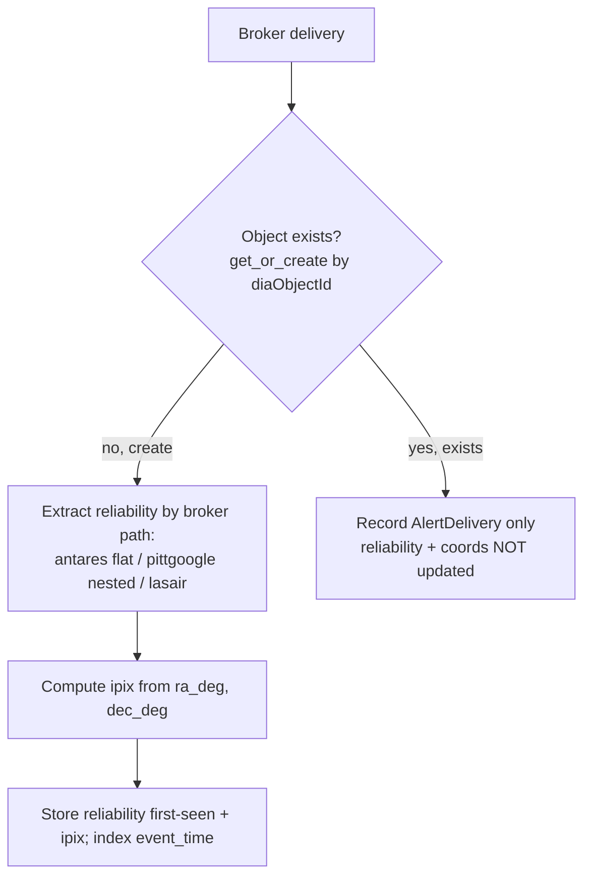

# Scientist Read Model - Plan

## Goal Capsule

- **Objective:** Build the indexed read-model substrate on the alert table — a first-class `reliability` column, a HEALPix `ipix` spatial index, and an `event_time` index — so the scientist-facing query surfaces (ranked transients, cone/region search, object lookup) can run in interactive time instead of the multi-minute timeouts they hit today.
- **Product authority:** Maintainer (Scott Koranda).
- **Open blockers:** None. The Lasair reliability key (`latestR`) is confirmed; everything else is planning-time detail.

## Product Contract

### Summary

Persist and index the three quantities scientist queries need but the alert table does not carry today: LSST `reliability` (extracted from each broker's payload at ingest), a HEALPix `ipix` sky-pixel derived from the stored coordinates, and an index on `event_time`. This is the data layer only — the REST/web/MCP surfaces that consume it are separate downstream brainstorms.

### Problem Frame

The service stores every alert's raw broker payload in a `JSONField` and its coordinates and times in unindexed columns. The three data products scientists want — "the payload for this object", "the N most-likely transients in the last M hours", "the objects in this sky region in the last M hours" — therefore have no efficient access path. Verified against the live DEV database (1,049,463 alerts, 2026-07-08): full-table `JSONB` predicate scans and unindexed coordinate/time scans time out at over two minutes. The "probability of being a transient" (`reliability`) is present in the raw payload for two of three brokers but is untyped, unindexed, and buried at broker-specific paths, so it cannot be ranked on. The read model is the prerequisite that makes those queries feasible, not merely faster.

### Key Decisions

- **First-seen reliability.** `reliability` is captured once, at object creation, and never updated when later detections of the same object arrive. This matches the existing `get_or_create` ingest semantics (`crossmatch/brokers/__init__.py:24`), avoids write-path churn on frequently-redetected objects, and defines "most likely transient" as the first-detection score. Trade-off: an object that later looks more clearly transient keeps its first value.
- **Forward-only for reliability; full history for space and time.** Reliability is not backfilled for the ~1.05M existing rows — extraction is a per-payload parse and the existing corpus warms up as new alerts arrive. The `ipix` value, by contrast, is computed for all rows including existing ones (cheap and deterministic from the stored `ra_deg`/`dec_deg`, no payload parse), and `event_time` is a plain index — so cone/region and time queries work across the full corpus from day one; only reliability ranking is limited to go-forward data.
- **HEALPix `ipix` column over the q3c extension.** Spatial search uses a computed integer HEALPix (NESTED) column plus a btree, not the q3c Postgres extension. This avoids maintaining a custom Postgres image (the DEV database is a stock `postgres:18.3` under GitOps), keeps the read model in the same tessellation as the HATS catalogs the service already crossmatches, and leaves the MOC path (coverage maps, GW watchmaps) open on the same column. Trade-off: the cone-search query assembly and fine-filter are code the service owns rather than a turnkey function.
- **Null reliability is excluded from ranking, not sorted last.** An object whose transient probability is unknown (Lasair today, and every existing row under forward-only) does not appear in ranked-transient results, but remains returnable by object lookup and region search.
- **Stay on the primary database.** No read replica or separate science store now; scientist reads run against indexed columns on the primary. Revisit only on measured contention — it is reversible without a schema change.

The ingest-time behavior these decisions produce:

### Requirements

**Reliability persistence**
- R1. `reliability` is a nullable, indexed, first-class numeric column on the alert record (a 0-1 score; verified floored at 0.6 by `MIN_DIASOURCE_RELIABILITY`).
- R2. `reliability` is extracted at ingest via a per-broker path map: ANTARES from the flat `lsst_diaSource_reliability` key, Pitt-Google from the nested `diaSource.reliability`, Lasair from the flat `latestR` key.
- R3. `reliability` is written only when the object is first created; repeat deliveries (same or other broker) do not update it.
- R4. When a broker payload carries no reliability, the column is null; null-reliability objects are excluded from reliability-ranked results but returnable by object and region queries.

**Spatial index**
- R5. A HEALPix NESTED `ipix` column is computed from the stored coordinates and indexed, populated for all rows including the existing corpus.
- R6. Cone and sky-region search resolve through `ipix` range conditions plus an exact angular-distance fine-filter, correct across RA wraparound at 0/360 and at the poles.

**Time index**
- R7. `event_time` is indexed so "last M hours" filters bound the scan rather than reading the whole table.

**Query readiness**
- R8. The substrate supports the three seed query shapes — object lookup by `diaObjectId`, top-N by `reliability` within the last M hours, and cone/region within the last M hours — through index-backed access paths, with no full-table or `JSONB` scan on the hot path.

### Acceptance Examples

- AE1. **Covers R2.** **Given** an ANTARES-created object, reliability is read from `payload["lsst_diaSource_reliability"]`; **given** a Pitt-Google object, from `payload["diaSource"]["reliability"]`; **given** a Lasair object, from `payload["latestR"]`; **given** any payload with the key absent, the column is null.
- AE2. **Covers R3.** **Given** an object first created with reliability 0.70, **when** a later delivery reports 0.90, **then** the stored value stays 0.70.
- AE3. **Covers R4.** **Given** an object with null reliability, **when** a ranked-transient query runs, **then** the object is absent from the result; **when** an object-lookup or region query runs, **then** it is returned.
- AE4. **Covers R6.** **Given** a cone centered near RA 0, **then** objects at RA 359.9 and RA 0.1 both match.

### Success Criteria

- The three seed query shapes return in roughly 1-2 seconds on the live DEV table, against the current baseline of over-two-minute timeouts.
- Cone/region and time queries return correct results over the full existing corpus; reliability ranking returns correct results over go-forward data.

### Scope Boundaries

**Deferred for later**
- The REST API, Python client, web app, and MCP surfaces, and the internal query/service-layer contract they share (ideation ideas #2 and #3).
- MOC coverage maps and watchlists/watchmaps (ideation ideas #5 and #6) — the `ipix` choice keeps this open but it is not built here.
- A read replica or separate denormalized science store.
- Backfilling `reliability` for the existing corpus.

**Not this**
- LSDB or Dask on the request path — LSDB stays the batch crossmatch engine over HATS catalogs (`crossmatch/matching/catalog.py`); the read model is served directly from Postgres. A future analytical HATS export queried via LSDB is a separate surface, not this substrate.
- Aggregating reliability across brokers or across time — foreclosed by the first-seen decision.

### Dependencies / Assumptions

- The Lasair upstream filter was edited on 2026-07-08 to add reliability under the key `latestR` (confirmed by the maintainer). That alerts carrying it will flow is assumed but not yet observed in ingested data. `latestR` is the *latest* diaSource reliability; under first-seen semantics the read model captures its value at the object's first ingest, consistent with the point-in-time snapshot the other brokers' keys also give.
- A HEALPix library providing `ang2pix` and disk-to-pixel-range queries is available in the stack; the HATS/LSDB dependencies already pull HEALPix machinery, and the exact library is a planning choice.
- `reliability` is a per-`diaSource` 0-1 real/bogus score; verified present on 100% of ANTARES-native and Pitt-Google payloads in DEV, Lasair pending.

### Outstanding Questions

**Deferred to Planning**
- Verify Lasair alerts actually arrive carrying `latestR` once volume picks up (the filter edit is hours old; not blocking — the path-map arm is defined either way, and a null-safe extraction handles absence).
- HEALPix resolution (`nside`/order) and the specific HEALPix library.
- Whether the `ipix` backfill runs as a single data migration or batched, and how the reliability column and its indexes are added without a long lock on the live table.
- Index shapes: whether the reliability ranking uses a partial index excluding nulls, and the exact index types for `ipix` and `event_time`.

### Sources / Research

- `crossmatch/brokers/__init__.py:24` — `Alert.objects.get_or_create` keyed on `diaObjectId`: first delivery wins, repeats add only an `AlertDelivery` row.
- `crossmatch/brokers/normalize.py:16-74` — all three normalizers store the raw broker message verbatim as `payload`; per-broker key shapes (flat `lsst_*` for ANTARES, nested `diaObject`/`diaSource` for Pitt-Google, flat filter columns for Lasair).
- `crossmatch/core/models.py:31-41` — `ra_deg`/`dec_deg`/`event_time` unindexed, `payload` is a `JSONField`; one `Alert` per `diaObjectId` (`unique=True`).
- `crossmatch/matching/catalog.py` — LSDB used as the crossmatch engine over HATS catalogs on Dask; `lsdb==0.9.0`/`hats==0.9.0` pinned.
- `crossmatch/project/settings.py:260-275` — `MIN_DIASOURCE_RELIABILITY` broker filter gate.
- Live DEV verification, 2026-07-08 (1,049,463 alerts): reliability present on 100% of ANTARES and Pitt-Google native payloads (range 0.60-1.0), Lasair not yet observed; full-table `JSONB`/unindexed scans time out (>2 min).
- `docs/ideation/2026-07-08-scientist-facing-data-products-ideation.md` — idea #1, of which this is the requirements-only plan.
