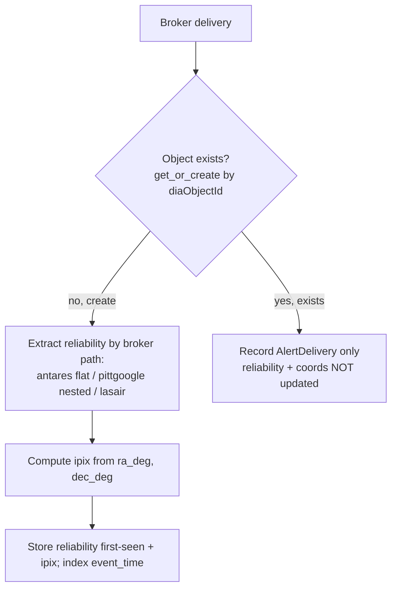

# Scientist Read Model - Plan

## Goal Capsule

- **Objective:** Build the indexed read-model substrate on the alert table — a first-class `reliability` column, a HEALPix `ipix` spatial index, and an `event_time` index — so the scientist-facing query surfaces (ranked transients, cone/region search, object lookup) can run in interactive time instead of the multi-minute timeouts they hit today.
- **Product authority:** Maintainer (Scott Koranda).
- **Open blockers:** None. The Lasair reliability key (`latestR`) is confirmed; everything else is planning-time detail.
- **Execution profile:** Behavior-bearing ingest + schema change; verify in-container with pytest (`docker compose --env-file docker/.env -f docker/docker-compose.yaml run --rm --no-deps celery-worker sh -c 'pip install -q -r requirements.dev.txt && python -m pytest'`). Prefer test-first for the HEALPix helper (U2) and the extraction/first-seen logic (U3) — both have precise input→output contracts.
- **Product Contract preservation:** unchanged. This enrichment adds only the HOW (Planning Contract, Implementation Units, Verification, Definition of Done); R1-R8 and AE1-4 are preserved verbatim.

## Product Contract

### Summary

Persist and index the three quantities scientist queries need but the alert table does not carry today: LSST `reliability` (extracted from each broker's payload at ingest), a HEALPix `ipix` sky-pixel derived from the stored coordinates, and an index on `event_time`. This is the data layer only — the REST/web/MCP surfaces that consume it are separate downstream brainstorms.

### Problem Frame

The service stores every alert's raw broker payload in a `JSONField` and its coordinates and times in unindexed columns. The three data products scientists want — "the payload for this object", "the N most-likely transients in the last M hours", "the objects in this sky region in the last M hours" — therefore have no efficient access path. Verified against the live DEV database (1,049,463 alerts, 2026-07-08): full-table `JSONB` predicate scans and unindexed coordinate/time scans time out at over two minutes. The "probability of being a transient" (`reliability`) is present in the raw payload for two of three brokers but is untyped, unindexed, and buried at broker-specific paths, so it cannot be ranked on. The read model is the prerequisite that makes those queries feasible, not merely faster.

### Key Decisions

- **First-seen reliability.** `reliability` is captured once, at object creation, and never updated when later detections of the same object arrive. This matches the existing `get_or_create` ingest semantics (`crossmatch/brokers/__init__.py:24`), avoids write-path churn on frequently-redetected objects, and defines "most likely transient" as the first-detection score. Trade-off: an object that later looks more clearly transient keeps its first value.
- **Forward-only for reliability; full history for space and time.** Reliability is not backfilled for the ~1.05M existing rows — extraction is a per-payload parse and the existing corpus warms up as new alerts arrive. The `ipix` value, by contrast, is computed for all rows including existing ones (cheap and deterministic from the stored `ra_deg`/`dec_deg`, no payload parse), and `event_time` is a plain index — so cone/region and time queries work across the full corpus from day one; only reliability ranking is limited to go-forward data.
- **HEALPix `ipix` column over the q3c extension.** Spatial search uses a computed integer HEALPix (NESTED) column plus a btree, not the q3c Postgres extension. This avoids maintaining a custom Postgres image (the DEV database is a stock `postgres:18.3` under GitOps), keeps the read model in the same tessellation as the HATS catalogs the service already crossmatches, and leaves the MOC path (coverage maps, GW watchmaps) open on the same column. Trade-off: the cone-search query assembly and fine-filter are code the service owns rather than a turnkey function.
- **Null reliability is excluded from ranking, not sorted last.** An object whose transient probability is unknown (Lasair today, and every existing row under forward-only) does not appear in ranked-transient results, but remains returnable by object lookup and region search.
- **Stay on the primary database.** No read replica or separate science store now; scientist reads run against indexed columns on the primary. Revisit only on measured contention — it is reversible without a schema change.

The ingest-time behavior these decisions produce:

### Requirements

**Reliability persistence**
- R1. `reliability` is a nullable, indexed, first-class numeric column on the alert record (a 0-1 score; verified floored at 0.6 by `MIN_DIASOURCE_RELIABILITY`).
- R2. `reliability` is extracted at ingest via a per-broker path map: ANTARES from the flat `lsst_diaSource_reliability` key, Pitt-Google from the nested `diaSource.reliability`, Lasair from the flat `latestR` key.
- R3. `reliability` is written only when the object is first created; repeat deliveries (same or other broker) do not update it.
- R4. When a broker payload carries no reliability, the column is null; null-reliability objects are excluded from reliability-ranked results but returnable by object and region queries.

**Spatial index**
- R5. A HEALPix NESTED `ipix` column is computed from the stored coordinates and indexed, populated for all rows including the existing corpus.
- R6. Cone and sky-region search resolve through `ipix` range conditions plus an exact angular-distance fine-filter, correct across RA wraparound at 0/360 and at the poles.

**Time index**
- R7. `event_time` is indexed so "last M hours" filters bound the scan rather than reading the whole table.

**Query readiness**
- R8. The substrate supports the three seed query shapes — object lookup by `diaObjectId`, top-N by `reliability` within the last M hours, and cone/region within the last M hours — through index-backed access paths, with no full-table or `JSONB` scan on the hot path.

### Acceptance Examples

- AE1. **Covers R2.** **Given** an ANTARES-created object, reliability is read from `payload["lsst_diaSource_reliability"]`; **given** a Pitt-Google object, from `payload["diaSource"]["reliability"]`; **given** a Lasair object, from `payload["latestR"]`; **given** any payload with the key absent, the column is null.
- AE2. **Covers R3.** **Given** an object first created with reliability 0.70, **when** a later delivery reports 0.90, **then** the stored value stays 0.70.
- AE3. **Covers R4.** **Given** an object with null reliability, **when** a ranked-transient query runs, **then** the object is absent from the result; **when** an object-lookup or region query runs, **then** it is returned.
- AE4. **Covers R6.** **Given** a cone centered near RA 0, **then** objects at RA 359.9 and RA 0.1 both match.

### Success Criteria

- The three seed query shapes return in roughly 1-2 seconds on the live DEV table, against the current baseline of over-two-minute timeouts.
- Cone/region and time queries return correct results over the full existing corpus; reliability ranking returns correct results over go-forward data.

### Scope Boundaries

**Deferred for later**
- The REST API, Python client, web app, and MCP surfaces, and the internal query/service-layer contract they share (ideation ideas #2 and #3).
- MOC coverage maps and watchlists/watchmaps (ideation ideas #5 and #6) — the `ipix` choice keeps this open but it is not built here.
- A read replica or separate denormalized science store.
- Backfilling `reliability` for the existing corpus.

**Not this**
- LSDB or Dask on the request path — LSDB stays the batch crossmatch engine over HATS catalogs (`crossmatch/matching/catalog.py`); the read model is served directly from Postgres. A future analytical HATS export queried via LSDB is a separate surface, not this substrate.
- Aggregating reliability across brokers or across time — foreclosed by the first-seen decision.

### Dependencies / Assumptions

- The Lasair upstream filter was edited on 2026-07-08 to add reliability under the key `latestR` (confirmed by the maintainer). That alerts carrying it will flow is assumed but not yet observed in ingested data. `latestR` is the *latest* diaSource reliability; under first-seen semantics the read model captures its value at the object's first ingest, consistent with the point-in-time snapshot the other brokers' keys also give.
- A HEALPix library providing `ang2pix` and disk-to-pixel-range queries is available in the stack; the HATS/LSDB dependencies already pull HEALPix machinery, and the exact library is a planning choice.
- `reliability` is a per-`diaSource` 0-1 real/bogus score; verified present on 100% of ANTARES-native and Pitt-Google payloads in DEV, Lasair pending.

### Outstanding Questions

**Resolved during planning**
- HEALPix library and resolution: use `cdshealpix`/`astropy-healpix` (already locked transitive deps via `hats` — see KTD1), NESTED order 16 (KTD4). No new dependency.
- Index shapes: three plain btree indexes now (`reliability`, `event_time`, `healpix_ipix`); the composite/partial ranked-query index is deferred to the query-layer work that issues those queries (KTD5).
- Schema/backfill lock profile: columns added nullable (no table rewrite); `ipix` backfilled in batches; `reliability` not backfilled (KTD6).

**Deferred to implementation / ops**
- Verify Lasair alerts actually arrive carrying `latestR` once volume picks up (the filter edit is recent; not blocking — the path-map arm is defined either way and extraction is null-safe).
- Production index creation on the live 1M-row table should use `CREATE INDEX CONCURRENTLY` to avoid a write lock; the Django migration builds indexes non-concurrently, which is fine for DEV. Out of scope for this data-layer plan; note for the eventual prod rollout.

### Sources / Research

- `crossmatch/brokers/__init__.py:24` — `Alert.objects.get_or_create` keyed on `diaObjectId`: first delivery wins, repeats add only an `AlertDelivery` row.
- `crossmatch/brokers/normalize.py:16-74` — all three normalizers store the raw broker message verbatim as `payload`; per-broker key shapes (flat `lsst_*` for ANTARES, nested `diaObject`/`diaSource` for Pitt-Google, flat filter columns for Lasair).
- `crossmatch/core/models.py:31-41` — `ra_deg`/`dec_deg`/`event_time` unindexed, `payload` is a `JSONField`; one `Alert` per `diaObjectId` (`unique=True`).
- `crossmatch/matching/catalog.py` — LSDB used as the crossmatch engine over HATS catalogs on Dask; `lsdb==0.9.0`/`hats==0.9.0` pinned.
- `crossmatch/project/settings.py:260-275` — `MIN_DIASOURCE_RELIABILITY` broker filter gate.
- Live DEV verification, 2026-07-08 (1,049,463 alerts): reliability present on 100% of ANTARES and Pitt-Google native payloads (range 0.60-1.0), Lasair not yet observed; full-table `JSONB`/unindexed scans time out (>2 min).
- `docs/ideation/2026-07-08-scientist-facing-data-products-ideation.md` — idea #1, of which this is the requirements-only plan.
- HEALPix library availability (verified 2026-07-08 in the dev image): `cdshealpix==0.8.1` and `mocpy==0.20.0` are already locked transitive deps via `hats`, and `astropy-healpix==1.1.3` via `antares-client` (`crossmatch/requirements.lock`); U2 uses `cdshealpix` (via `hats`), so no new dependency is added.
- `crossmatch/core/models.py:49-52` — `Alert.Meta.indexes` currently holds one index (`core_alert_status_idx`); the new indexes extend this list.
- `crossmatch/core/migrations/0001_initial.py` — the only existing migration; new migrations are `0002`/`0003`.
- `crossmatch/tests/test_ingest.py`, `crossmatch/tests/test_factories.py` — pytest + `@pytest.mark.django_db` patterns, the `_canonical(...)` ingest helper, and `AlertFactory` to mirror in new tests.

---

## Planning Contract

### Key Technical Decisions

- KTD1. **HEALPix geometry via already-present `cdshealpix`/`astropy-healpix` — no new dependency.** Both are already-locked transitive deps (`cdshealpix` via `hats`, `astropy-healpix` via `antares-client`), verified importable in the dev image, so the HEALPix-over-q3c decision costs zero new pins and sidesteps the repo's dependency-pin/Dask-version-skew gotcha entirely. `cdshealpix` (NESTED) yields covering pixel *ranges* for a cone directly (the shape a `WHERE ipix BETWEEN lo AND hi` query wants) and is the same library `mocpy` builds on, keeping the MOC path open. This overrides the requirements-only assumption that the library was an open choice.
- KTD2. **Per-broker extraction stays in the normalizers; `ipix` computed in a shared helper called from `ingest_alert`.** `normalize_*` already own each broker's payload shape, so the reliability path map lives there (one line each). `ingest_alert` stays broker-agnostic: it reads `canonical.get('reliability')` and computes `ipix` from the canonical `ra_deg`/`dec_deg` via the U2 helper. No broker-specific logic leaks into ingest.
- KTD3. **First-seen via `get_or_create(defaults=...)` only.** `reliability` and `healpix_ipix` are set in the `defaults=` block, which `get_or_create` applies only on creation. Repeat deliveries hit the existing row and change nothing — no update path is added, matching current ingest semantics (`crossmatch/brokers/__init__.py:24`).
- KTD4. **HEALPix NESTED, order 16 (nside 65536, ~3.2 arcsec pixels), as a single module constant** (`HEALPIX_ORDER` in `crossmatch/core/healpix.py`). Fine enough that cone-search boundary overshoot is small before the exact fine-filter, int64-safe, and used identically at ingest (point→ipix) and query time (cone→ranges). Tunable in one place.
- KTD5. **Three plain btree indexes now** (`reliability`, `event_time`, `healpix_ipix`); the composite / partial-excluding-null index that best serves `rank_transients(hours, n)` is deferred to the query-layer work that will actually issue that query. The data layer provides index-backed access paths (R8); query-shape-specific index tuning belongs with the query.
- KTD6. **Columns added nullable (no table rewrite); `ipix` backfilled, `reliability` not.** Adding two nullable columns is a metadata-only migration. `healpix_ipix` is backfilled for existing rows from stored coordinates (cheap, deterministic — U4); `reliability` is left null on existing rows (forward-only, per the Product Contract). Index builds on the 1M-row DEV table lock briefly and are acceptable; prod uses `CONCURRENTLY` (Outstanding Questions).

### Assumptions

- `cdshealpix` remains available via the pinned `hats==0.9.0` (and `astropy-healpix` via `antares-client`); they are not added to `requirements.base.txt` because they are transitive. U2 depends on `cdshealpix`; if `hats` is ever unpinned in a way that drops it, U2 would need an explicit pin (re-pinning every site per repo convention).
- Lasair `latestR` will arrive in ingested payloads once post-filter-edit volume flows; extraction is null-safe until then.

---

## Implementation Units

### U1. Add read-model columns and indexes to the Alert model

- **Goal:** Add `reliability` (nullable double) and `healpix_ipix` (nullable bigint) columns to `Alert`, plus btree indexes on `reliability`, `healpix_ipix`, and `event_time`.
- **Requirements:** R1, R5, R7.
- **Dependencies:** none.
- **Files:** `crossmatch/core/models.py` (modify), `crossmatch/core/migrations/0002_add_read_model_columns.py` (create), `crossmatch/tests/test_read_model_schema.py` (create).
- **Approach:** Add `reliability = models.FloatField(null=True)` and `healpix_ipix = models.BigIntegerField(null=True)` to `Alert`; extend `Meta.indexes` with three named `models.Index` entries (mirroring the existing `core_alert_status_idx`). Generate the migration (`AddField` x2, `AddIndex` x3). Columns are nullable so the migration does not rewrite the table.
- **Patterns to follow:** existing `Meta.indexes` entry and field declarations in `crossmatch/core/models.py`; migration style in `crossmatch/core/migrations/0001_initial.py`.
- **Test scenarios:** an `Alert` persists with `reliability=None` and `healpix_ipix=None`; an `Alert` persists and round-trips `reliability=0.7` and `healpix_ipix=123456`; the migration state / DB introspection shows the three new indexes present. (Schema-level; one persistence round-trip test plus an index-presence assertion.)
- **Verification:** the test DB migrates cleanly (pytest-django applies migrations) and the round-trip + index-presence tests pass.

### U2. HEALPix spatial helper (point→ipix, cone→ipix ranges, fine-filter)

- **Goal:** A `crossmatch/core/healpix.py` module exposing `radec_to_ipix(ra_deg, dec_deg) -> int`, `cone_ipix_ranges(ra_deg, dec_deg, radius_arcsec) -> list[tuple[int, int]]`, and `angular_separation_arcsec(ra1, dec1, ra2, dec2) -> float`, NESTED at `HEALPIX_ORDER`, correct across RA wraparound and the poles.
- **Requirements:** R5, R6.
- **Dependencies:** none (can land in parallel with U1).
- **Files:** `crossmatch/core/healpix.py` (create), `crossmatch/tests/test_healpix.py` (create).
- **Approach:** Use `cdshealpix` NESTED (`lonlat_to_healpix` for the point index; `cone_search` for the covering pixel set) and collapse the covering set into contiguous `[lo, hi]` NESTED ranges. Provide a haversine `angular_separation_arcsec` for the caller's exact fine-filter. Define `HEALPIX_ORDER = 16` here.
- **Execution note:** implement test-first — the input→output contracts (known coordinate → stable pixel; cone membership; separation) are precise and cheap to assert before writing the helper.
- **Test scenarios:**
  - `radec_to_ipix` returns a stable documented pixel for a fixed coordinate; two points closer than one pixel share an index; two widely separated points differ.
  - **Covers AE4.** `cone_ipix_ranges(0.0, 0.0, 60)` produces ranges whose membership includes `radec_to_ipix(359.99, 0.0)` and `radec_to_ipix(0.01, 0.0)` — RA wrap at 0/360 is handled.
  - a point just inside the radius passes `angular_separation_arcsec <= radius`; a point just outside fails — the fine-filter is exact.
  - a cone near Dec +89.9 returns valid ranges without error (pole handling).
- **Verification:** `test_healpix.py` passes, including the RA-wrap and pole cases.

### U3. Extract reliability per-broker and populate reliability + ipix at ingest (first-seen)

- **Goal:** Carry `reliability` through each normalizer via the per-broker path map, and in `ingest_alert` set `reliability` (first-seen) and `healpix_ipix` in the `get_or_create` `defaults`.
- **Requirements:** R2, R3, R4, R5.
- **Dependencies:** U1 (columns), U2 (ipix helper).
- **Files:** `crossmatch/brokers/normalize.py` (modify), `crossmatch/brokers/__init__.py` (modify), `crossmatch/tests/test_read_model_ingest.py` (create).
- **Approach:** `normalize_antares` adds `'reliability': raw_alert.get('lsst_diaSource_reliability')`; `normalize_lasair` adds `'reliability': raw_alert.get('latestR')`; `normalize_pittgoogle` adds `'reliability': dia_source.get('reliability')`. In `ingest_alert`, the `defaults=` block gains `reliability=canonical.get('reliability')` and `healpix_ipix=radec_to_ipix(canonical['ra_deg'], canonical['dec_deg'])`. All extraction is null-safe `.get()`. No update path — first-seen falls out of `get_or_create`.
- **Execution note:** test-first for the per-broker extraction and the first-seen freeze.
- **Test scenarios:**
  - **Covers AE1.** a canonical built from an ANTARES-shaped payload sets `reliability` from `lsst_diaSource_reliability`; a Pitt-Google payload from `diaSource.reliability`; a Lasair payload from `latestR`; a payload missing the key yields `reliability is None`.
  - **Covers AE2.** create an object via broker A with `reliability=0.70`; a second ingest (same or other broker) reporting `0.90` leaves the stored `reliability` at `0.70` and `healpix_ipix` unchanged.
  - a newly created `Alert` has `healpix_ipix == radec_to_ipix(ra_deg, dec_deg)`.
  - **Covers AE3 (storage half).** a payload lacking the reliability key persists `reliability=None`.
  - the existing `crossmatch/tests/test_ingest.py` idempotency tests still pass unchanged (no regression to the two-step ingest gate).
- **Verification:** new ingest tests pass; existing `test_ingest.py` stays green.

### U4. Backfill healpix_ipix for existing rows (reliability stays forward-only)

- **Goal:** A data migration computing `healpix_ipix` from `ra_deg`/`dec_deg` for all existing rows in batches; `reliability` is left null.
- **Requirements:** R5 (existing corpus populated), R4 (existing rows null reliability).
- **Dependencies:** U1 (column), U2 (helper).
- **Files:** `crossmatch/core/migrations/0003_backfill_healpix_ipix.py` (create), `crossmatch/tests/test_backfill_ipix.py` (create).
- **Approach:** `RunPython` with a batched update (`.iterator()` + `bulk_update(['healpix_ipix'])`) computing `ipix` via the U2 helper; reverse operation is a no-op. `reliability` is explicitly untouched. Keep batch size modest for the live 1M-row table.
- **Execution note:** verify by seeding rows with null `healpix_ipix`, running the backfill callable, and asserting populated `ipix` with still-null `reliability`.
- **Test scenarios:**
  - seed several `Alert`s with `healpix_ipix=None` (pre-migration state), run the backfill callable, assert each row's `healpix_ipix == radec_to_ipix(ra_deg, dec_deg)` and `reliability is None`.
  - the backfill is safe to re-run (already-populated rows recompute to the identical value).
  - the reverse migration runs without error (no-op).
- **Verification:** `test_backfill_ipix.py` passes; the migration applies on a populated test DB.

---

## Verification Contract

| Gate | Command / signal | Applies to |
|---|---|---|
| VG1 | Full suite green in-container: `docker compose --env-file docker/.env -f docker/docker-compose.yaml run --rm --no-deps celery-worker sh -c 'pip install -q -r requirements.dev.txt && python -m pytest'` | all units |
| VG2 | Migrations apply cleanly on a fresh test DB (a green pytest-django run implies this) | U1, U4 |
| VG3 | New tests present and passing: `test_read_model_schema.py` (U1), `test_healpix.py` (U2), `test_read_model_ingest.py` (U3), `test_backfill_ipix.py` (U4) | U1-U4 |
| VG4 | No regression: existing `crossmatch/tests/test_ingest.py` idempotency tests still pass | U3 |

---

## Definition of Done

- `Alert` has `reliability` (nullable double) and `healpix_ipix` (nullable bigint) columns, with btree indexes on `reliability`, `event_time`, and `healpix_ipix`.
- `reliability` is extracted per-broker (ANTARES `lsst_diaSource_reliability`, Pitt-Google `diaSource.reliability`, Lasair `latestR`), stored first-seen, and null when absent.
- `healpix_ipix` is computed at ingest and backfilled for existing rows; `reliability` is not backfilled.
- `crossmatch/core/healpix.py` provides point→ipix, cone→ipix ranges, and an exact fine-filter, RA-wrap/pole correct, using the already-present `cdshealpix`/`astropy-healpix` (no new dependency).
- The full pytest suite is green in-container and the existing ingest idempotency tests are unregressed.
- No REST / web / MCP surface or query-service function is built — the scope boundary (data layer only) is honored.
