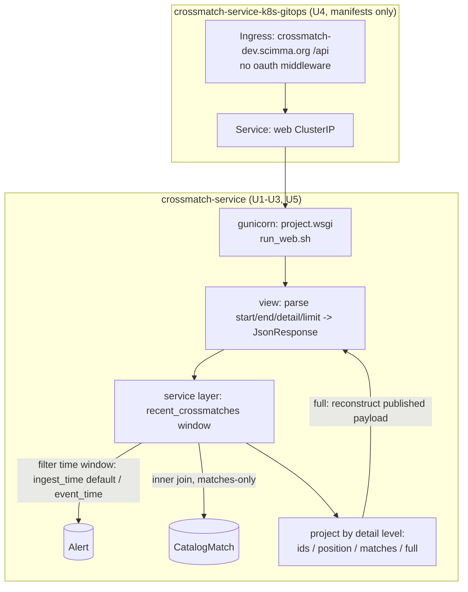

# Recent Crossmatch API - Plan

## Goal Capsule

- **Objective:** Ship a read-only HTTP endpoint that returns the catalog crossmatches for every object with an alert in a recent time window (default: the last 12 hours), grouped by object, with a selectable payload detail level — plus API docs and an example Jupyter notebook for a conference demonstration.
- **Product authority:** Maintainer/developer (Scott Koranda); use case requested by the project PI.
- **Open blockers:** None. The read-model substrate this queries is deployed on DEV (v0.4.0).
- **Target repos:** `crossmatch-service` (app; this repo) and `crossmatch-service-k8s-gitops` (deployment manifests; sibling repo at `../crossmatch-service-k8s-gitops`). Each unit names its repo; paths are repo-relative to that repo.

---

## Product Contract

**Product Contract preservation:** changed — R2, R3, R11, and AE1 amended (why: two plan-time decisions the maintainer confirmed after review). R2/R3/AE1: the window now filters on a caller-selectable `time_field` (`ingest_time` default for demo robustness, `event_time` for observation-time semantics) rather than `event_time` only — `event_time` is per-broker heterogeneous (Lasair's is the object's first-ever detection), so a fixed 12h `event_time` default could silently return empty at the demo. R11: the DEV ingress is confirmed internet-reachable and the endpoint is accepted as public-unauthenticated for the demo (Rubin alert data is ultimately public). All other requirements (R1, R4-R10, R12, R13) and AE2-AE5 are preserved verbatim. Remaining `## Outstanding Questions` deferred-to-planning items are resolved in the Key Technical Decisions.

### Summary

Add the service's first HTTP read endpoint: given a time window, return the crossmatches for objects that had an alert in that window, grouped by `diaObjectId`, at a caller-chosen level of detail. It is backed by a thin internal query layer so later endpoints and clients reuse it, and it ships with documentation and a runnable example notebook.

### Problem Frame

The PI needs to pull "crossmatches for all objects with alerts in the last 12h" from a Jupyter notebook to show at a conference talk. Today there is no way to do this without direct database access: the service has no HTTP surface at all — no `urls.py`, views, REST framework, or web-serving deployment (the running pods are broker consumers, Celery worker/beat, and Flower). The crossmatch results the demo wants are already computed and persisted per match, so the gap is purely an access path: a callable endpoint over the read model, not new science.

### Key Decisions

- **Clean endpoint over a reusable query layer, not a throwaway.** Build one endpoint for the demo, but put the window-and-matches query in a thin internal service layer so the next endpoints (object lookup, ranked transients, cone search) and a future Python client wrap it instead of re-deriving it. No web app, MCP, or client is built now.
- **Default window is a rolling 12 hours on `ingest_time`, with `event_time` selectable.** The caller picks the timestamp via `time_field`; the default is `ingest_time` (arrival time) because it is demo-robust, and `event_time` (observation time) is available for the "previous night of observing" reading. A true observatory-night (twilight/timezone) computation is not done. See KTD3 for why the default is not `event_time`.
- **Grouped by object, matches only.** One entry per `diaObjectId` with its matches nested; objects that had an alert but no catalog match are excluded, so the result reads as "objects and their crossmatches."
- **Four-level cumulative detail ladder, default `matches`.** `ids` -> `position` -> `matches` -> `full`, defaulting to `matches` (object position plus each match's catalog, source id, and separation).
- **Unauthenticated on DEV.** The endpoint is open behind cluster ingress for the demo; authentication is deferred and must be added before any non-DEV exposure.

### Requirements

**Query semantics**
- R1. The endpoint returns the catalog crossmatches for objects whose alert timestamp falls within a time window.
- R2. When the caller specifies no window, the default is the most recent 12 hours ending at request time, filtered on the default timestamp field (`ingest_time`).
- R3. The caller can override the window with an explicit start and end (ISO-8601 UTC), and can select which timestamp the window filters on via `time_field` (`ingest_time` | `event_time`).
- R4. Objects that had an alert in the window but produced no catalog match are excluded from the result.

**Response shape and detail levels**
- R5. Results are grouped by object: one entry per `diaObjectId`, with its catalog matches nested as a list.
- R6. The payload detail is selectable across four cumulative levels, each adding to the previous: `ids`, `position`, `matches`, `full`.
- R7. The default detail level is `matches`: object position (ra/dec) plus, for each match, the catalog name, the catalog source id, and the separation in arcsec.
- R8. The `full` level adds the complete published crossmatch payload for each match (the same content published over Hopskotch).
- R9. The response body is JSON.

**Access and deployment**
- R10. The endpoint is served over HTTP by a web-serving component of the service, which is stood up as part of this work (none exists today).
- R11. On DEV the endpoint requires no authentication and is reachable through the cluster ingress, which is internet-reachable; the endpoint is therefore accepted as public-unauthenticated for the demo (Rubin alert data is ultimately public). Authentication is still required before any production surface.

**Documentation and demo**
- R12. The work includes API documentation covering the endpoint, its parameters, the four detail levels, and the response shape.
- R13. The work includes an example Jupyter notebook that calls the endpoint and loads the result for analysis (e.g., into a DataFrame), suitable for the conference demonstration.

### Acceptance Examples

- AE1. **Covers R2.** **Given** a request with no window parameters, **then** the result contains objects whose `ingest_time` is within the last 12 hours.
- AE2. **Covers R3.** **Given** an explicit start and end, **then** the result is bounded to that window and ignores the 12-hour default; **given** `time_field=event_time`, **then** the window filters on `event_time` instead of `ingest_time`.
- AE3. **Covers R4.** **Given** an object with an alert in the window but no catalog match, **then** that object does not appear in the result.
- AE4. **Covers R7.** **Given** a request with no detail parameter, **then** each object carries its ra/dec and a list of matches with catalog name, catalog source id, and separation arcsec.
- AE5. **Covers R6, R8.** **Given** `detail=ids`, **then** the result is object identifiers only; **given** `detail=full`, **then** each match carries the complete published payload.

### Success Criteria

- Run against DEV, the example notebook pulls the last-12h crossmatches and renders them without any direct database access, fast enough to show live.
- Each of the four detail levels returns its documented field set, and an unspecified detail defaults to `matches`.

### Scope Boundaries

**Deferred for later**
- The Python pip client, web app, and MCP adapter — this endpoint is built to make them cheap, not to build them.
- The other seed queries: object lookup by `diaObjectId`, ranked transients by reliability, and cone/region search.
- Authentication and rate limiting — required before any non-DEV or public exposure.
- CSV / VOTable output formats.
- Pagination or streaming for very large windows.

**Outside this endpoint**
- Recomputing crossmatches on request — it reads persisted matches only.
- Twilight/observatory-night computation for the default window.

**Deferred to Follow-Up Work**
- Rolling out the deployment: merging the gitops change, the ArgoCD sync/apply, and DNS/cert verification on the live DEV cluster stay with the maintainer (same split as the read-model and v0.4.0 rollouts). This plan authors the manifests (U4) but does not deploy them.

### Dependencies / Assumptions

- Both window fields are index-backed: `event_time` from the read model (deployed on DEV as of v0.4.0) and `ingest_time` from U6; whichever the caller selects, the window filter is index-backed (R8).
- Published match payloads are already persisted per match (per catalog per object), so the query is a lookup, not a recompute.
- Over a 12-hour window on DEV, the result is small enough to return in a single response for the demo; a configurable safety cap bounds it and pagination is deferred.
- The gitops chart at `apps/crossmatch-service/` (in the sibling repo) is the authoritative deployment chart ArgoCD syncs; the app repo's `kubernetes/charts/` is not the deployed source.

---

## Planning Contract

### Key Technical Decisions

- KTD1. **Plain Django views returning `JsonResponse`; no HTTP-framework dependency.** DRF or django-ninja would each be a new pin, and the repo convention ties every dependency add to Dask-cluster version alignment (`crossmatch/requirements.base.txt`, `core/dask.py` version check). The response is straightforward JSON, so a framework earns nothing. The query lives in a service layer; the view is a thin adapter.
- KTD2. **Serve every detail level, including `full`, from an `Alert`⋈`CatalogMatch` query; reconstruct the published payload from `CatalogMatch` fields.** `Notification.payload` is built in `crossmatch/tasks/crossmatch.py` as `{diaObjectId, ra, dec, catalog_name, catalog_source_id, separation_arcsec, catalog_payload}` — every field of which is already on `CatalogMatch`. Note the payload's `ra`/`dec` are the **matched catalog-source coordinates** (`CatalogMatch.source_ra_deg`/`source_dec_deg`), NOT the alert object's position (`Alert.ra_deg`/`dec_deg`); those two differ, and the `full` reconstruction must read the source columns to stay byte-identical to what was published. The object position is used only at the `position`/`matches` levels (R7). To prevent the reconstruction drifting from the publisher over time, extract the payload-dict builder into one shared function called by both the Celery publish path (`tasks/crossmatch.py`) and the API `full` projection. Reconstructing from `CatalogMatch` is always present (no dependency on a `Notification` row that only exists once a match is notified) and needs no extra join.
- KTD3. **Filter on the selected timestamp (`ingest_time` default, `event_time` optional) and inner-join `CatalogMatch`.** Both fields carry a btree index so either window is index-backed (R8) — `event_time` from the read model, `ingest_time` added by U6. The default is `ingest_time` because `event_time` is per-broker heterogeneous (Lasair's `event_time` is the object's first-ever detection, ANTARES uses receipt wall-clock), so a fixed `event_time` window can silently miss recently-ingested objects or return empty on replayed data; `ingest_time` is monotonic with arrival and demo-robust. An inner join to `CatalogMatch` yields matches-only (R4) for free.
- KTD4. **gunicorn as the WSGI server, via a new `run_web.sh` entrypoint and a gitops `web` Deployment.** gunicorn is a server, not a library in the Dask (de)serialization path, so it carries no version-skew risk; it is still pinned per repo convention. The Deployment mirrors the existing Flower Deployment/Service.
- KTD5. **Unauthenticated DEV access via a separate Ingress whose auth posture is a dedicated, secure-by-default flag.** The existing `apps/crossmatch-service/templates/ingress.yaml` applies the oauth2-proxy/CILogon Traefik middleware at the Ingress-object level (gating Flower), and per-path auth differences require distinct Ingress objects — so the API gets its own Ingress on host `crossmatch-dev.scimma.org`. Its auth is gated on a dedicated `web.auth.enabled` flag that **defaults to true (authenticated)**; DEV explicitly sets it false (R11). This is deliberately NOT tied to the shared `oauth2.enabled` flag, which stays true on DEV to gate Flower — so the unauthenticated posture is an explicit, auditable per-API opt-out rather than a "remember not to enable `web`" trap, and a future gated environment is authenticated unless someone consciously disables it.
- KTD6. **Detail ladder via a `detail` query param, default `matches`.** `detail=ids` returns the object-identifier list; `position`/`matches`/`full` add cumulatively. The separation value uses the published key `separation_arcsec` at every level (mapped from `CatalogMatch.match_distance_arcsec`) so the key is stable across levels and not duplicated at `full`.
- KTD7. **Bound the unauthenticated endpoint's work server-side.** Because DEV is unauthenticated with rate-limiting deferred, the result cap is a **hard server-side ceiling** (from settings/env), and any caller `limit` only narrows *below* it — it can never raise the ceiling. The requested window span is also validated against a configured maximum; an over-wide `start`/`end` is rejected with 400. Together these close the unbounded-scan/exfiltration and single-expensive-request DoS paths that auth and rate-limiting would otherwise cover. `match_version`: the window query returns the current match version per `(object, catalog, source)` so a re-matched object does not surface duplicate rows across versions.

### High-Level Technical Design

The request path is view (param parsing and validation) -> service layer (the window query, grouping, and detail projection) -> JSON. The service layer is pure and DB-backed, exercisable without HTTP, and is the reuse seam for later endpoints.

### Assumptions

- `detail=full` reconstructs the published payload from `CatalogMatch` rather than reading the literal stored `Notification.payload` row (KTD2). Confirmed byte-equal to the publish-time construction in `crossmatch/tasks/crossmatch.py`.
- The API base path is `/api` on `crossmatch-dev.scimma.org`; the exact path segment (`/api` vs `/api/v1/...`) is settled in U3/U4 at implementation time.
- The DEV ingress (`crossmatch-dev.scimma.org`, 443) is internet-reachable, so the unauthenticated endpoint is public during the demo (maintainer-accepted; Rubin alert data is ultimately public). No IP allowlist is added; the `web.auth.enabled` flag defaults to authenticated so no non-DEV environment ships it open by omission.

### Sequencing

U6 (`ingest_time` index) is independent and lands first. U2 (service layer) depends on U6. U1 (serving seam) is independent scaffolding. U3 depends on U1 + U2. U4 (gitops manifests) depends on U1 (needs `run_web.sh` and the web port). U5 (docs + notebook) depends on U3.

---

## Implementation Units

### U1. HTTP serving seam

- **Goal:** Stand up the Django HTTP entry point that does not exist today, so a WSGI server can serve requests.
- **Requirements:** R10.
- **Dependencies:** none.
- **Repo:** `crossmatch-service`.
- **Files:**
  - `crossmatch/project/wsgi.py` (create) — standard Django WSGI application.
  - `crossmatch/project/urls.py` (create) — root URLconf. In U1 it mounts only a minimal health/root path; the API app's URLs are `include()`d by U3, so U1 does not import a module that does not exist yet.
  - `crossmatch/project/settings.py` (modify) — set `ROOT_URLCONF`, `WSGI_APPLICATION`, and `ALLOWED_HOSTS` from `DJANGO_ALLOWED_HOSTS` env (defaulting to include `crossmatch-dev.scimma.org`), and add the API app to `INSTALLED_APPS`.
  - `crossmatch/requirements.base.txt` (modify) — add a pinned `gunicorn`.
  - `crossmatch/entrypoints/run_web.sh` (create) — mirror `crossmatch/entrypoints/run_flower.sh`: `wait-for-it` on the DB, then `gunicorn project.wsgi:application --bind 0.0.0.0:${WEB_PORT:-8000}`.
- **Approach:** Minimal Django web wiring. No auth middleware is added for the API path (R11); existing session/auth middleware stays for the admin surface only. Re-pin `gunicorn` per the dependency-pin convention (`docs/solutions/conventions/dependency-pin-upgrade-pattern-2026-05-12.md`); it is server-only and not in the Dask serialization path, so no cluster-version alignment is required. `ALLOWED_HOSTS` and the gunicorn bind `WEB_PORT` are supplied to the web pod by U4's `web.env` helper — the two units must agree on those env var names.
- **Patterns to follow:** `crossmatch/entrypoints/run_flower.sh` for the entrypoint shape; standard Django `startproject` `wsgi.py`/`urls.py`.
- **Execution note:** Mostly scaffolding/config; prefer a runtime smoke check (gunicorn boots, `manage.py check` clean) over unit coverage. The endpoint-resolves-to-view check belongs to U3, once the API URLs are wired.
- **Test scenarios:**
  - `crossmatch/project/wsgi.py` imports and exposes `application` without error.
  - `python manage.py check` passes with the API app installed and the health/root urlconf mounted (no `include()` of an unbuilt module).
  - Test expectation: smoke-level only — this unit is wiring, not behavior.
- **Verification:** `gunicorn project.wsgi:application` boots and serves the health/root path locally; `python manage.py check` passes.

### U2. Recent-crossmatch query/service layer

- **Goal:** The reusable query that returns matches for objects with alerts in a window, grouped by object, projected to a detail level.
- **Requirements:** R1, R2, R3, R4, R5, R6, R7, R8.
- **Dependencies:** U6 (needs the `ingest_time` index for the default window to be index-backed).
- **Repo:** `crossmatch-service`.
- **Files:**
  - `crossmatch/api/__init__.py` (create).
  - `crossmatch/api/service.py` (create) — the window query and detail projection.
  - `crossmatch/tests/test_recent_crossmatch_service.py` (create).
- **Approach:** Query `Alert` filtered on the selected timestamp field — `ingest_time` (default) or `event_time` — within `[start, end]` (default `end=now`, `start=now-12h`), inner-joined to `CatalogMatch` (matches-only), restricted to the current `match_version` per `(object, catalog, source)` so re-matched objects do not surface duplicate rows. Group rows by `diaObjectId`. Project per detail level: `ids` = object-id list; `position` = + object ra/dec (`Alert.ra_deg`/`dec_deg`); `matches` = + per-match `catalog_name`, `catalog_source_id`, and `separation_arcsec` (mapped from `CatalogMatch.match_distance_arcsec`); `full` = + the reconstructed published payload via the shared builder (KTD2), whose `ra`/`dec` come from `CatalogMatch.source_ra_deg`/`source_dec_deg` (the catalog-source position), distinct from the object position. Clamp the object count to the hard server-side ceiling (KTD7). Coerce ORM values to JSON-native types at the boundary (values here are already DB-native, but keep the coercion discipline from `docs/solutions/design-patterns/coerce-numpy-pandas-scalars-to-json.md`). Carry `diaObjectId` as int64 (`int(...)`) per the domain note.
- **Patterns to follow:** `crossmatch/tasks/crossmatch.py` for the exact `Notification.payload` dict shape the `full` level must reproduce; `crossmatch/core/models.py` for `CatalogMatch` fields.
- **Execution note:** Implement test-first — AE1-AE5 specify the contract precisely.
- **Test scenarios:**
  - Covers AE1. No window args -> objects with `ingest_time` in the last 12h are returned; an object ingested 13h ago is excluded.
  - Covers AE2. Explicit start/end -> only objects in that window; the 12h default is ignored. `time_field=event_time` filters on `event_time`; an object whose `event_time` is old but `ingest_time` is recent appears under the default (`ingest_time`) but not under `time_field=event_time`.
  - Invalid `time_field=bogus` is rejected (surfaced by U3 as 400).
  - Covers AE3. An object with an alert in-window but no `CatalogMatch` is absent from the result.
  - Covers AE4. Default detail -> each object has ra/dec and matches with `catalog_name`, `catalog_source_id`, separation arcsec.
  - Covers AE5. `detail=ids` -> object-id list only; `detail=full` -> each match carries the reconstructed payload, equal to the shared builder's output for the same `CatalogMatch` row (the builder is the same one the publisher calls, so this also guards against publisher drift). The payload `ra`/`dec` equal `source_ra_deg`/`source_dec_deg`, not the object `ra_deg`/`dec_deg`.
  - `separation_arcsec` is present at the `matches` level and carries the same value as `match_distance_arcsec`; the `full` payload does not duplicate a separation key.
  - An object with matches across multiple catalogs (e.g., Gaia and DELVE) groups all matches under one object entry.
  - An object re-matched at a higher `match_version` returns one row per `(catalog, source)`, not one per version.
  - Empty window -> empty result (not an error).
  - The object count is clamped to the hard server-side ceiling even when a caller `limit` is larger; a window span beyond the configured maximum is rejected.
- **Verification:** The service function returns correct grouped structures for each detail level against seeded fixtures; all AE scenarios pass.

### U3. Endpoint view and route

- **Goal:** The HTTP view that parses request params, calls the service, and returns JSON.
- **Requirements:** R2, R3, R6, R7, R9, R11.
- **Dependencies:** U1, U2.
- **Repo:** `crossmatch-service`.
- **Files:**
  - `crossmatch/api/views.py` (create) — the view; parse `start`, `end` (ISO-8601 UTC), `time_field`, `detail`, `limit`; call the service; `JsonResponse`.
  - `crossmatch/api/urls.py` (create) — the API URL patterns, included by `crossmatch/project/urls.py`.
  - `crossmatch/tests/test_recent_crossmatch_view.py` (create).
- **Approach:** A GET-only view. Validate params (bad `detail`, bad `time_field`, unparseable timestamps, non-positive `limit`, and a window span beyond the configured maximum -> 400 with a JSON error body). A caller `limit` above the hard server-side ceiling is clamped down to the ceiling, not rejected (KTD7). No login/permission decorator and no CSRF concern (read-only GET) — unauthenticated on DEV (R11). Defaults when absent: `detail=matches`, `time_field=ingest_time`.
- **Patterns to follow:** Django class-based or function view returning `django.http.JsonResponse`; `crossmatch/core/log.py` structlog logger for request logging.
- **Test scenarios:**
  - No params -> 200, default 12h window and `matches` detail (integration with U2).
  - Explicit `start`/`end`/`detail`/`limit` -> passed through to the service correctly.
  - Invalid `detail=bogus` -> 400 JSON error; unparseable `start` -> 400; `limit=0` or negative -> 400; window span beyond the configured maximum -> 400.
  - A caller `limit` above the server ceiling is clamped to the ceiling, not rejected.
  - `detail` absent -> defaults to `matches`.
  - The endpoint responds without authentication (no redirect/401 on DEV config).
- **Verification:** `pytest` view tests pass; a local `gunicorn`/`runserver` request to the endpoint returns the expected JSON for each detail level.

### U4. Web workload and unauthenticated ingress (gitops manifests)

- **Goal:** Author the deployment manifests that serve the endpoint on DEV — the web Deployment, its Service, and a dedicated unauthenticated Ingress — without rolling them out.
- **Requirements:** R10, R11.
- **Dependencies:** U1.
- **Repo:** `crossmatch-service-k8s-gitops` (sibling repo `../crossmatch-service-k8s-gitops`).
- **Files:**
  - `apps/crossmatch-service/templates/_helpers.yaml` (modify) — add a `web.env` helper (mirroring `flower.env`) that injects `DJANGO_ALLOWED_HOSTS` from `.Values.ingress.host` and `WEB_PORT` from `.Values.web.port`, so the app's `ALLOWED_HOSTS` and gunicorn bind port derive from one source (closes the DisallowedHost-400 and port-mismatch gaps).
  - `apps/crossmatch-service/templates/deployment-web.yaml` (create) — mirror `templates/deployment-flower.yaml`: same image, `crossmatch-service.scheduling` include, `command: bash entrypoints/run_web.sh`, `containerPort` from `.Values.web.port`; env via the `common.env`/`django.env`/`db.env`/`valkey.env` includes **plus the new `web.env`**; gated by `.Values.web.enabled`.
  - `apps/crossmatch-service/templates/service-web.yaml` (create) — mirror `templates/service-flower.yaml`: ClusterIP on `.Values.web.port`, selector `app: web`.
  - `apps/crossmatch-service/templates/ingress.yaml` (modify) — add a second `Ingress` object (e.g. `crossmatch-api`) for host `.Values.ingress.host`, path from `.Values.web.ingress.basePath`, backend the web Service. Its auth posture is gated on a **dedicated** `.Values.web.auth.enabled` flag (NOT the shared `.Values.oauth2.enabled`, which stays true on DEV to gate Flower): when `web.auth.enabled` is true, attach a `crossmatch-api-oauth` middleware; when false, render the API path with no middleware. Gated by `.Values.web.enabled`.
  - `apps/crossmatch-service/values.yaml` (modify) — add a `web` block: `enabled: false`, `auth.enabled: true` (secure by default), `port`, `replicaCount`, `ingress.basePath`.
  - `apps/crossmatch-service/values-dev.yaml` (modify) — set `web.enabled: true` and `web.auth.enabled: false` (the explicit, auditable opt-out that makes the API unauthenticated on DEV per R11), plus any DEV-specific web values.
- **Approach:** Follow the Flower workload trio (Deployment + Service + ingress rule), swapping the command and the auth posture. TLS: pin the API Ingress `tls.secretName` to the **same** secret as the Flower Ingress on the shared host and omit the `cert-manager.io/cluster-issuer` annotation on the API Ingress, so only one cert-manager Certificate exists for `crossmatch-dev.scimma.org` (avoids two Certificates racing ACME challenges and hitting Let's Encrypt production rate limits). Default `web.enabled: false` in `values.yaml` so only DEV turns it on.
- **Execution note:** Manifests only. Verify with `helm template` / `helm lint`; do **not** `kubectl apply`, trigger an ArgoCD sync, or merge — rollout is the maintainer's (Scope Boundaries: Deferred to Follow-Up Work).
- **Test scenarios:**
  - `helm template` with `web.enabled=true` renders the web Deployment, Service, and the API Ingress; with `web.enabled=false` renders none of them.
  - With `web.auth.enabled=false` (the DEV setting) the API Ingress carries no oauth middleware annotation; with `web.auth.enabled=true` (the default) it carries the `crossmatch-api-oauth` middleware. It points at the web Service on `.Values.web.port`.
  - The rendered web Deployment sets `DJANGO_ALLOWED_HOSTS` and `WEB_PORT` from `web.env`; the API Ingress `tls.secretName` matches the Flower Ingress secret and carries no cluster-issuer annotation (single cert for the host).
  - Test expectation: none beyond `helm template`/`helm lint` render checks — these are manifests, not runtime behavior, and rollout is out of scope.
- **Verification:** `helm template apps/crossmatch-service -f apps/crossmatch-service/values-dev.yaml` renders the three web resources with the correct host/path and no oauth middleware; chart lints clean.

### U5. API documentation and example notebook

- **Goal:** Document the endpoint and provide a runnable notebook for the demo.
- **Requirements:** R12, R13.
- **Dependencies:** U3.
- **Repo:** `crossmatch-service`.
- **Files:**
  - `docs/api/recent-crossmatch-api.md` (create) — endpoint URL, params (`start`/`end` ISO-8601 UTC with the 12h default, `time_field` with its `ingest_time` default, `detail` levels, `limit` and the server-side ceiling, the max window span), the grouped-by-object response shape per detail level, and the DEV public-unauthenticated note.
  - `notebooks/recent_crossmatch_demo.ipynb` (create) — call the endpoint with `httpx`/`requests`, load the result into a pandas DataFrame, and show at least the `matches` and `full` detail levels.
- **Approach:** Documentation mirrors the field sets defined in U2. The notebook targets the DEV host (`https://crossmatch-dev.scimma.org/api/...`) and is written to run top-to-bottom for the talk.
- **Execution note:** Verify the notebook executes end-to-end against a running endpoint (local `gunicorn` or DEV), or documents the exact run steps if DEV is not reachable from the authoring environment.
- **Test scenarios:**
  - Test expectation: none (documentation). The notebook is the runnable artifact; its cells executing without error against a live endpoint is the acceptance signal.
- **Verification:** The doc's request/response examples match the implemented shapes; the notebook runs cleanly and renders the last-12h crossmatches.

### U6. Index `ingest_time`

- **Goal:** Add a btree index on `Alert.ingest_time` so the default (`ingest_time`) window is index-backed, keeping R8 satisfied for both `time_field` options.
- **Requirements:** R8 (with R2/R3).
- **Dependencies:** none.
- **Repo:** `crossmatch-service`.
- **Files:**
  - `crossmatch/core/models.py` (modify) — add `models.Index(fields=['ingest_time'], name='core_alert_ingest_time_idx')` to `Alert.Meta.indexes`, mirroring the read-model `core_alert_event_time_idx`.
  - `crossmatch/core/migrations/000N_add_ingest_time_index.py` (create) — `AddIndex` migration; number it after the latest existing `core` migration at implementation time (currently `0004_backfill_healpix_ipix`), per the migration-numbering discipline.
  - `crossmatch/tests/test_read_model_schema.py` (modify) — extend the existing index-presence assertion to include `core_alert_ingest_time_idx`.
- **Approach:** A plain schema migration mirroring the read-model index units. Note the DEV rollout applies migrations automatically via `locked_init` at consumer startup; no manual step. A production build of this index on the live table should use `CREATE INDEX CONCURRENTLY` (deferred ops step, out of scope here) — but for DEV the ordinary `AddIndex` is fine.
- **Patterns to follow:** `crossmatch/core/migrations/0002_add_read_model_columns.py` (the read-model `AddIndex` migrations) and the `Alert.Meta.indexes` list.
- **Execution note:** Verify no migration-graph split with `makemigrations --check` after numbering (a rebase onto a new `core` migration is the known split-graph vector).
- **Test scenarios:**
  - `makemigrations --check` reports no changes and a linear graph after the migration is added.
  - `test_read_model_schema` asserts `core_alert_ingest_time_idx` exists in `pg_indexes`.
- **Verification:** The index is present after migrating a fresh test DB; `makemigrations --check` is clean.

---

## Verification Contract

| Gate | Command | Applies to |
|---|---|---|
| App unit tests | `pytest` in-container (per `docs/developer.md`: `docker compose --env-file docker/.env -f docker/docker-compose.yaml run --rm --no-deps celery-worker sh -c 'pip install -q -r requirements.dev.txt && python -m pytest'`) | U1, U2, U3, U6 |
| Migration graph | `python manage.py makemigrations --check` clean, linear graph | U6 |
| Serving smoke | `gunicorn project.wsgi:application` boots and the endpoint returns JSON for each detail level | U1, U3 |
| Chart render | `helm template apps/crossmatch-service -f apps/crossmatch-service/values-dev.yaml` and `helm lint` (in the gitops repo) | U4 |
| Notebook | `notebooks/recent_crossmatch_demo.ipynb` runs top-to-bottom against a live endpoint | U5 |

---

## Definition of Done

- The endpoint returns crossmatches grouped by object for the default 12h window and for an explicit `start`/`end`, matches-only, over the `event_time` index (R1-R5).
- All four detail levels return their documented field sets, defaulting to `matches`; `full` reproduces the published payload shape (R6-R9, AE1-AE5).
- A web Deployment, Service, and API Ingress are authored in the gitops chart and render under `web.enabled=true`; the API Ingress is unauthenticated only under `web.auth.enabled=false` (the DEV setting) and authenticated by default (R10, R11) — not deployed.
- API documentation and a runnable example notebook exist and match the implemented shapes (R12, R13).
- App unit tests pass in-container and the gitops chart lints/renders.

---

## Sources / Research

- `docs/ideation/2026-07-08-scientist-facing-data-products-ideation.md` — idea #2 (one query core, three thin adapters) and idea #3 (the three seed queries); this endpoint is a first, demo-driven slice.
- `docs/plans/2026-07-08-001-feat-scientist-read-model-plan.md` — the read-model substrate (reliability, `healpix_ipix`, `event_time` index) this endpoint queries; it explicitly deferred the REST surface to a downstream brainstorm (this one).
- `crossmatch/core/models.py` — `Alert` (`event_time`, indexed), `CatalogMatch` (`catalog_name`, `catalog_source_id`, `match_distance_arcsec`, `source_ra_deg`, `source_dec_deg`, `catalog_payload`), `Notification` (`payload`).
- `crossmatch/tasks/crossmatch.py` — the exact `Notification.payload` dict the `full` detail level reconstructs; `CatalogMatch` field construction.
- `crossmatch/matching/payload.py` — the lowercase-keyed, JSON-native `catalog_payload` shape nested inside `full`.
- `crossmatch/entrypoints/run_flower.sh` — entrypoint pattern for `run_web.sh`.
- `../crossmatch-service-k8s-gitops/apps/crossmatch-service/templates/{deployment-flower.yaml,service-flower.yaml,ingress.yaml}` and `values-dev.yaml` — the deployment/Service/Ingress patterns U4 mirrors; host `crossmatch-dev.scimma.org`, issuer `letsencrypt-production`, Traefik oauth middleware applied at the Ingress-object level (the reason the API needs its own un-middlewared Ingress).
- Codebase scan (2026-07-13): no `urls.py`, views, REST framework, or WSGI/ASGI app under `crossmatch/` — the HTTP surface is greenfield; the gitops `apps/crossmatch-service/` chart is the authoritative deployment source, not the app repo's `kubernetes/charts/`.
