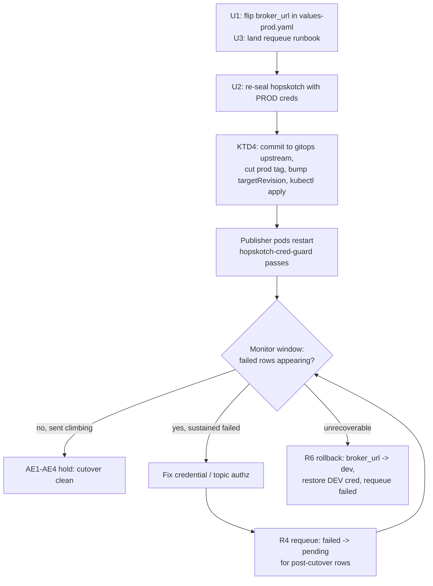

# PROD Hopskotch Production Cutover - Plan

## Goal Capsule

- **Objective:** Move PROD match publishing off the DEV Hopskotch broker and onto
  the production SCiMMA Hopskotch service (`kafka://kafka.scimma.org`, topic
  `scimma-crossmatch.rubin-lsdb`), authenticated with the PROD credential, via a
  flip-and-monitor cutover with a requeue safety net.
- **Product authority:** the crossmatch-service maintainer/operator.
- **Open blockers:** the PROD SASL credential must be provisioned and authorized to
  produce to `scimma-crossmatch.rubin-lsdb` on `kafka://kafka.scimma.org`, and the
  topic must exist (SCiMMA-ops prerequisite, confirmed out-of-band before cutover).

**Product Contract preservation:** Product Contract unchanged — planning enriched
this artifact with the Planning Contract, Implementation Units, Verification
Contract, and rollout/runbook sections only.

---

## Summary

This is a **configuration-only** change (no application code). The pipeline already
publishes every match through the `hopskotch` destination: `dispatch_notifications`
(Celery Beat) polls `PENDING` `core_notification` rows and `send_hopskotch_batch`
writes each to `{HOPSKOTCH_BROKER_URL}/{HOPSKOTCH_TOPIC}`. PROD currently publishes
to the DEV broker (`kafka://dev.hop.scimma.org`) by design — a documented bootstrap
state so validation matches never reach the public topic. Verified live on PROD:
~1.29M notifications, all `sent`, zero `pending`/`failed`, publishing continuously.

The switch is: (U1) flip `hopskotch.broker_url` to the prod broker in the gitops
`values-prod.yaml` (topic already correct), (U2) re-seal the `hopskotch` SealedSecret
with PROD creds, (U3) land a requeue runbook; then promote through the standard PROD
flow and monitor. Because no code path requeues notifications, an unauthorized
credential would strand matches as `failed` — the runbook + monitoring make that
recoverable.

---

## Problem Frame

PROD has been publishing to the DEV Hopskotch broker as an intentional bootstrap
target. Real production requires matches on the public SCiMMA topic
`scimma-crossmatch.rubin-lsdb` at `kafka://kafka.scimma.org`, authenticated with a
PROD credential. The cutover is the documented "before real production cutover" step
already written into the gitops `docs/prod-bootstrap-steps.md` and the
`values-prod.yaml` comment.

The single non-obvious hazard: `dispatch_notifications` only ever selects `PENDING`
rows (`crossmatch/tasks/schedule.py:108`), and there is no `FAILED -> PENDING`
requeue anywhere in the code. A mis-authorized PROD credential passes the
`hopskotch-cred-guard` initContainer (it checks only that the username is non-empty)
but then fails every publish, marking rows `failed` — surfaced (never silently
dropped, per the delivery-callback design in `crossmatch/notifier/impl_hopskotch.py`)
but not auto-recovered. The plan handles this with a prepared requeue runbook and an
active monitoring window rather than a pre-flight validation harness.

---

## Product Contract

Carried forward from the brainstorm requirements (IDs stable).

### Requirements

- **R1 — Repoint the broker.** In the gitops repo,
  `apps/crossmatch-service/values-prod.yaml` `hopskotch.broker_url` changes from
  `kafka://dev.hop.scimma.org` to `kafka://kafka.scimma.org`. `hopskotch.topic`
  stays `scimma-crossmatch.rubin-lsdb`.
- **R2 — Re-seal the credential.**
  `apps/crossmatch-service/templates/sealedsecret-prod.yaml` `hopskotch`
  `encryptedData` (`HOPSKOTCH_USERNAME`, `HOPSKOTCH_PASSWORD`) is re-sealed with the
  PROD Hopskotch SASL creds, against the PROD sealed-secrets controller, namespace-
  wide scope. Sealed secrets are per-cluster; DEV ciphertext is not reusable. The
  maintainer runs `kubeseal` (holds the credential).
- **R3 — Refresh the bootstrap documentation.** The "BOOTSTRAP TARGET = DEV
  Hopskotch" comment in `values-prod.yaml` (and the matching checklist item in
  `docs/prod-bootstrap-steps.md`) is updated to reflect that production cutover has
  occurred.
- **R4 — Prepared requeue runbook.** A one-off requeue is documented and ready
  before cutover: `UPDATE core_notification SET state='pending' WHERE state='failed'
  AND created_at > <cutover_ts>`. Run only after any authorization failure is
  corrected, and only for post-cutover rows. Re-publishing is **at-least-once** —
  some `failed` rows may already have been delivered (rows are also marked `failed`
  on the no-delivery-confirmation and connection/flush-exception paths in
  `impl_hopskotch.py`, not only on genuine rejection), so duplicate matches are
  possible on the public topic. This is safe only if downstream consumers dedupe on
  `diaObjectId` (see D3).
- **R5 — Monitored cutover.** After rollout the operator actively watches the
  publish path long enough to catch an authorization failure while the requeue
  window is still small.
- **R6 — Rollback procedure.** Documented rollback: revert `broker_url` to
  `kafka://dev.hop.scimma.org` and restore the DEV sealed credential, then requeue
  any post-cutover `failed` rows so they re-publish to the restored broker.

### Acceptance Signals

- **AE1 — Matches land on the production topic.** New `core_notification` rows reach
  `sent` with `sent_at` later than the cutover timestamp, and an independent consumer
  on `kafka://kafka.scimma.org/scimma-crossmatch.rubin-lsdb` observes messages.
- **AE2 — No silent stranding.** `core_notification` `failed` count stays at zero (or
  only transient blips that clear next tick); sustained `failed` growth triggers the
  R4 requeue after a credential fix.
- **AE3 — Pipeline liveness holds.** `crossmatch_notifications_published_total`
  (`result="success"` series) climbs while the `result="failure"` series stays flat,
  and alerts continue advancing to `NOTIFIED` at the normal batch cadence. (The
  counter is labeled by `result` and increments on failures too, so the unlabeled
  total is not a clean success signal.)
- **AE4 — Fail-closed still armed.** The `hopskotch-cred-guard` initContainer still
  gates on a non-empty `HOPSKOTCH_USERNAME`; the re-sealed secret decrypts on the
  PROD controller so the publisher pods start.

---

## Key Technical Decisions

- **KTD1 — Configuration-only cutover, no code release.** The switch is a gitops
  values + sealed-secret change promoted through the standard PROD flow, because the
  pipeline already publishes to the `hopskotch` destination; only the target broker
  and credential differ. (Instantiates Product Contract KD2.)
- **KTD2 — Flip-and-monitor + requeue, not pre-flight validation.**
  *(session-settled: user-directed — chosen over an out-of-band pre-flight publish
  test: the delivery-callback design records auth rejection as `failed`, so the
  failure is observable, and the requeue runbook makes it fully recoverable without a
  separate validation harness.)* (Instantiates KD1.)
- **KTD3 — Requeue runbook lives in the gitops repo `docs/`.**
  *(session-settled: user-approved — chosen over app-repo `docs/solutions/`: it is a
  PROD ops procedure tied to the cutover and belongs beside
  `docs/prod-bootstrap-steps.md`.)*
- **KTD4 — Promote via the established PROD tag flow.** Commit the gitops change to
  the gitops **upstream** (ArgoCD's canonical repo), cut a new `prod-YYYY-MM-DD[-N]`
  git release tag — the next free sequence past the Application's current
  `targetRevision` (`prod-2026-07-21-2`, so `prod-2026-07-21-3`); the new tag must
  advance strictly past the current pin — bump the `crossmatch-service-prod`
  Application's `targetRevision` to it, and `kubectl apply` that argocd-app. Re-seal
  (R2) must be committed before the tag is cut so the tag captures valid ciphertext.
- **KTD5 — Isolate the gitops edits from the concurrent session.** A second session
  is actively editing this gitops repo (README.md) and creating/managing branches
  simultaneously. The cutover edits (U1, U3) go on a uniquely-named branch, touch
  only the `apps/crossmatch-service/` cutover files (never README.md), and rebase
  onto the latest upstream `main` immediately before the tag cut so the promotion
  captures the other session's landed work rather than reverting it.

---

## High-Level Technical Design

Cutover control flow (operator-driven; the app pipeline is unchanged):

Prose is authoritative where it disagrees with the diagram.

---

## Implementation Units

### U1. Flip the PROD broker URL and refresh the bootstrap comment

- **Goal:** Repoint PROD publishing to the production Hopskotch broker.
- **Requirements:** R1, R3. Advances KTD1.
- **Dependencies:** none.
- **Files (gitops repo `crossmatch-service-k8s-gitops`):**
  - Modify `apps/crossmatch-service/values-prod.yaml` — `hopskotch.broker_url:
    "kafka://dev.hop.scimma.org"` -> `"kafka://kafka.scimma.org"`; leave
    `hopskotch.topic: "scimma-crossmatch.rubin-lsdb"` unchanged.
  - Modify the same file's "BOOTSTRAP TARGET = DEV Hopskotch" comment block to state
    that production cutover has occurred.
  - Modify `docs/prod-bootstrap-steps.md` — mark the Hopskotch-target checklist item
    as cutover-done.
- **Approach:** Single-value edit plus comment hygiene. No topic change. Stay within
  `apps/crossmatch-service/` and `docs/`; do not touch README.md (KTD5).
- **Patterns to follow:** the existing `values-dev.yaml` / `values-prod.yaml`
  `hopskotch:` block shape.
- **Test scenarios:** `Test expectation: none — gitops values/comment edit, no
  behavioral code.` Verified at rollout via the Verification Contract (AE1/AE3).
- **Verification:** after promotion, the live `celery-worker` env shows
  `HOPSKOTCH_BROKER_URL=kafka://kafka.scimma.org`.

### U2. Re-seal the hopskotch SealedSecret with PROD credentials

- **Goal:** Provide the PROD SASL credential to the publisher, sealed for the PROD
  cluster.
- **Requirements:** R2. Satisfies AE4.
- **Dependencies:** none (parallel to U1); must be committed before the KTD4 tag cut.
- **Files (gitops repo):** Modify
  `apps/crossmatch-service/templates/sealedsecret-prod.yaml` — replace the
  `hopskotch` `encryptedData.HOPSKOTCH_USERNAME` and `.HOPSKOTCH_PASSWORD` ciphertext.
- **Approach:** Maintainer-run (holds the credential). For each value:
  `printf %s "$VALUE" | kubeseal --raw --controller-name sealed-secrets
  --controller-namespace kube-system --scope namespace-wide --namespace
  crossmatch-service`, sealed against the **PROD** controller (sealed secrets are
  per-cluster; DEV ciphertext will not decrypt). Paste each result into the matching
  `encryptedData` key. Key names (`HOPSKOTCH_USERNAME`, `HOPSKOTCH_PASSWORD`) are
  load-bearing and must match the chart `secretKeyRef`.
- **Execution note:** Do not commit plaintext credentials at any step; only the
  sealed ciphertext enters the repo.
- **Test scenarios:** `Test expectation: none — sealed credential material.` Verified
  at rollout: the `hopskotch` Secret decrypts and publisher pods start (AE4).
- **Verification:** on the PROD cluster the `hopskotch` Secret exists with both keys
  and the `hopskotch-cred-guard` initContainer passes (pods reach Running).

### U3. Author the requeue runbook

- **Goal:** A ready, unambiguous procedure to recover `failed` notifications if the
  PROD credential turns out unauthorized.
- **Requirements:** R4 (and supports R6's requeue step).
- **Dependencies:** none.
- **Files (gitops repo):** Create a runbook under `docs/` (e.g.
  `docs/prod-hopskotch-cutover-runbook.md`) beside `docs/prod-bootstrap-steps.md`
  (KTD3), covering:
  - **The two bad-cutover signatures** (per R5): sustained `failed` growth with a
    `last_error` sample (topic-authz rejection), *and* a stalled publisher + long-open
    Postgres transaction with no `failed` rows yet (bad SASL cred / missing topic /
    unreachable broker, until `message.timeout.ms` elapses).
  - **The scoped requeue statement** (`UPDATE core_notification SET state='pending'
    WHERE state='failed' AND created_at > <cutover_ts>`) and the ordering rule (fix
    the credential/topic first, then requeue). Note: given the verified zero
    pre-cutover `failed` rows, `state='failed'` is the operative filter; the
    `created_at` bound is belt-and-suspenders (a row created just before cutover but
    first failing against the prod broker after it would be missed by the bound —
    negligible here, tighter to key on `attempts`/`updated_at` if ever a concern).
  - **At-least-once caveat:** some `failed` rows may already have been delivered, so
    requeue can emit duplicates on the public topic — safe only if D3 (downstream
    dedupe) holds.
  - **Credential lifecycle / compromise response:** how to rotate the PROD Hopskotch
    SASL credential (SCiMMA-ops reissue -> `kubeseal` re-seal against the PROD
    controller -> commit ciphertext -> promote per KTD4), and that this same
    procedure is the incident response for a suspected credential leak — distinct from
    the R6 broker rollback.
  - **The R6 rollback + requeue path.**
- **Approach:** Operational documentation; mirror the structure/tone of
  `prod-bootstrap-steps.md`.
- **Test scenarios:** `Test expectation: none — documentation.`
- **Verification:** the runbook's requeue statement is scoped to `created_at >
  <cutover_ts>` and never touches pre-cutover rows.

---

## Verification Contract

Run at/after promotion (runtime, not unit tests):

- **VC1 (AE1):** `SELECT count(*) FROM core_notification WHERE state='sent' AND
  sent_at > '<cutover_ts>'` increases across ticks; **and (mandatory)** an
  independent consumer on `kafka://kafka.scimma.org/scimma-crossmatch.rubin-lsdb`
  receives messages. The consumer check is authoritative, not optional: a promotion
  that did not actually restart the publisher pods would keep publishing to the DEV
  broker while `sent` still climbs, and only the independent consumer distinguishes
  "publishing to prod" from "publishing to dev."
- **VC2 (AE2):** `SELECT state, count(*) FROM core_notification GROUP BY state` shows
  no sustained `failed` growth; any transient `failed` clears the next tick.
- **VC3 (AE3):** `crossmatch_notifications_published_total{result="success"}` climbs
  while `{result="failure"}` stays flat; alerts advance to `NOTIFIED` at the normal
  batch cadence.
- **VC4 (AE4):** publisher pods (`celery-worker`, `celery-beat`) reach Running with
  the re-sealed secret; `hopskotch-cred-guard` did not fail-close.

---

## Operational / Rollout Notes

- **Promotion (KTD4):** commit U1–U3 to the gitops **upstream** (ArgoCD's canonical
  repo — a personal fork is invisible to ArgoCD); cut a new `prod-<YYYY-MM-DD>` git
  release tag; bump `argocd-apps/crossmatch-service-prod.yaml` `targetRevision` to the
  new tag; `kubectl apply -f argocd-apps/crossmatch-service-prod.yaml`. Only the
  crossmatch-service Application needs to advance for this change.
- **Concurrency (KTD5):** rebase the cutover branch onto the latest upstream `main`
  immediately before the tag cut so the tag captures the concurrent session's landed
  README/other work; confirm the tag commit contains the cutover files and not a
  stale tree.
- **Monitoring window (R5):** two failure modes surface differently, and the window
  must cover the slower one:
  - *Topic-authorization rejection* surfaces quickly — the broker rejects each
    message and the delivery callback flips rows to `failed` within the first ticks.
  - *A bad SASL credential, a not-yet-existing topic, or an unreachable broker* does
    **not** reject per-message: librdkafka keeps retrying and only fails the queued
    messages when `message.timeout.ms` elapses (librdkafka default ~5 min). During
    that block `send_hopskotch_batch`'s `flush()` stalls while `dispatch_notifications`
    holds an open transaction with `select_for_update` on up to 500 rows — so the
    early symptom is a **stalled publisher and a long-running Postgres transaction**,
    not `failed` rows.
  Size the window to at least one `message.timeout.ms` interval (confirm the effective
  value hop-client's producer uses), and watch VC1–VC4 **plus** a stalled
  celery-beat/celery-worker and a long-open Postgres transaction as equally valid
  bad-cutover signals.
- **Rollback (R6):** revert `broker_url` to `kafka://dev.hop.scimma.org`, restore the
  DEV sealed credential, re-promote, then requeue post-cutover `failed` rows so they
  re-publish to the restored broker.

---

## Scope Boundaries

**In scope:** the three gitops edits (U1–U3), the promotion, and the monitored
verification/rollback procedure.

**Non-goals:**
- No application code change (publisher, dispatch, delivery-callback semantics
  unchanged).
- No change to `hopskotch.topic` (already `scimma-crossmatch.rubin-lsdb`).
- No change to the DEV publishing path or DEV sealed secret.

### Deferred to Follow-Up Work

- Building an automated `FAILED -> PENDING` requeue into the app. The U3 runbook is
  the deliberate manual mechanism for this cutover; an in-app requeue is a separate
  improvement if bad-auth stranding recurs.

---

## Risks & Dependencies

- **D1 (hard external prerequisite):** the PROD SASL credential is provisioned and
  **authorized to produce** to `scimma-crossmatch.rubin-lsdb` on
  `kafka://kafka.scimma.org`, and the topic exists. SCiMMA-ops owned; confirm
  out-of-band before cutover. If unmet, every publish fails (recoverable via R4).
- **D2:** no production-relevant consumer depends on the DEV-broker feed this cutover
  cuts off (bootstrap/validation feed). Assumption, not a gating check.
- **D3 (requeue safety — confirm before relying on R4):** downstream SCiMMA consumers
  dedupe on `diaObjectId`, so the at-least-once requeue (R4) and any duplicate
  publishes are absorbed rather than seen twice by subscribers. This was previously
  stated as fact; it is an assumption about external subscribers and must be confirmed
  with SCiMMA-ops out-of-band. If unconfirmed, a requeue can flood public subscribers
  with duplicate transient detections — the opposite of a safe recovery.
- **Risk — silent stranding:** no code requeues `failed` rows; mitigated by R4 + R5
  (monitored window + prepared requeue).
- **Risk — concurrent-session collision (KTD5):** a second session is editing this
  gitops repo and managing branches; mitigated by an isolated uniquely-named branch,
  scoped file edits (no README.md), and a rebase-before-tag step.

---

## Sources & Research

- `crossmatch/notifier/dispatch.py`, `crossmatch/notifier/impl_hopskotch.py`,
  `crossmatch/tasks/schedule.py:108` (`dispatch_notifications`, `PENDING`-only select),
  `crossmatch/project/settings.py:360` (Hopskotch config).
- `crossmatch/core/metrics.py:82` (`crossmatch_notifications_published_total`).
- gitops `apps/crossmatch-service/values-prod.yaml` (bootstrap comment + hopskotch
  block), `templates/sealedsecret-prod.yaml` (re-seal recipe, per-cluster note),
  `templates/statefulset.yaml` (`hopskotch-cred-guard`), `docs/prod-bootstrap-steps.md`
  (cutover checklist + promotion/tag flow).
- Live PROD verification (2026-07-21): broker `kafka://dev.hop.scimma.org`, topic
  `scimma-crossmatch.rubin-lsdb`, 1,295,277 notifications all `sent`.
- `docs/solutions/conventions/argocd-apps-applied-manually.md` — the `kubectl apply`
  promotion mechanics.

---

## Definition of Done

- `values-prod.yaml` `hopskotch.broker_url` is `kafka://kafka.scimma.org`; bootstrap
  comment and `prod-bootstrap-steps.md` updated (R1, R3).
- `hopskotch` SealedSecret re-sealed with PROD creds against the PROD controller
  (R2); publisher pods Running (AE4).
- Requeue runbook committed in gitops `docs/` (R4).
- Promoted per KTD4 on an isolated, rebased branch (KTD5).
- VC1–VC4 verified after cutover: matches on the prod topic, no sustained `failed`,
  metric climbing, alerts reaching `NOTIFIED` (AE1–AE4).
- Rollback + requeue procedure documented and ready (R6).
