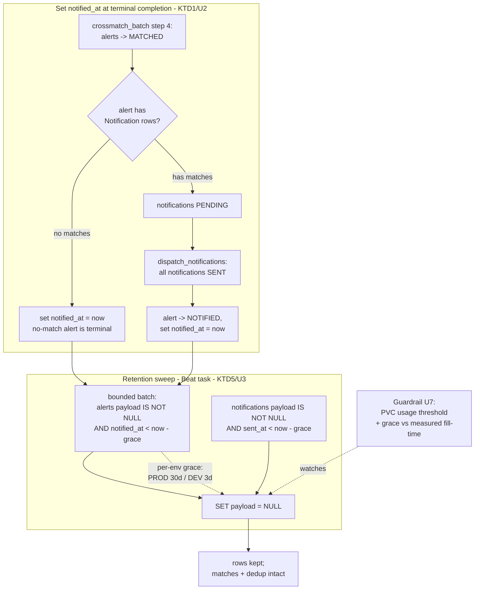

# Alert Payload Retention and Disk Guardrail (DEV + PROD) - Plan

## Goal Capsule

- **Objective:** Cap **payload-driven** PostgreSQL growth in **both DEV and PROD** by
  dropping the raw `core_alert.payload` (and the duplicate `core_notification.payload`)
  once an alert/notification has been terminal for a configurable grace period (default
  30 days), keeping the rows and all match history. This roughly halves PROD's fill rate
  (payload is ~46% of growth) and reclaims most of DEV's DB (payload is ~94%), but
  does **not** bound total growth — skinny-row growth continues, so row age-out remains
  the eventual bound (deferred). Pair it with a one-time reclaim and a monitoring-based
  disk guardrail.
- **Product authority:** crossmatch-service maintainer/operator.
- **Open blockers:** none. Product decisions are settled; environment-specific values
  are grounded (below) or deferred to deploy-time config.

**Product Contract preservation:** Product Contract unchanged in intent; the Problem
Frame's environment figures were corrected to measured values (DEV is 200Gi, not 50Gi;
DEV payload ~56 KB/alert vs PROD ~1 KB) and the DEV grace default is now grounded.
Planning added the Planning Contract, Implementation Units, Verification Contract, and
Definition of Done.

---

## Summary

Add a Celery Beat retention task that nulls terminal payloads past a per-environment
grace period, anchored on a new `Alert.notified_at` terminal-completion timestamp that
covers **all** terminal outcomes (including no-match alerts, which never reach NOTIFIED).
Make the two payload columns nullable, backfill `notified_at` for existing terminal
rows, reclaim the freed space (DEV now; PROD deferred), and add a monitoring guardrail.
No product-behavior change — publishing, crossmatch, and dedup are untouched.

---

## Problem Frame

Ingested alerts are never pruned today (verified: no retention task, no TTL). Growth is
linear and unbounded in both environments; ~90%+ of the bytes are the raw payload while
an alert is in flight, and nothing reads `core_alert.payload` after NOTIFIED nor
`core_notification.payload` after SENT (the durable result lives in `catalog_matches` /
`core_notification`).

Measured 2026-07-21:

| | DEV | PROD |
|---|---|---|
| Volume | 200Gi Cinder, **60% used (118/197 GB)** | 200Gi Cinder, 3% used (4.5 GB) |
| DB size | 117 GB | ~4.4 GB |
| Alert payload | **~56 KB/alert**, ~94% of DB | ~1 KB/alert |
| Droppable payload share | ~94% | **~46%** (alert + notification payload) |
| Ingest | paused (0/24h); historically fast | ~340k alerts/day, ~2.0 GB/day |
| Retention effect | reclaims most of the DB | ~halves fill rate (~95 → ~150+ day runway) |

The environments diverge sharply: DEV ingests a much fuller alert stream (~56 KB
payloads), so payload-nulling is near-total there; on PROD it is worth ~half the growth.
Neither is bounded by this work alone — skinny-row growth (matches / notification
metadata / deliveries) continues until row age-out (deferred).

The non-obvious anchor hazard (fixed by this plan): an alert that crossmatches to **zero**
sources is set to MATCHED with no `Notification` rows and never transitions to NOTIFIED
(`schedule.py` transitions only alerts whose notifications were just sent). A
NOTIFIED-only anchor would retain every no-match payload forever — PROD already holds
~124k alerts in MATCHED.

---

## Product Contract

Requirements R1–R11, Key Decisions KD1–KD8, and Acceptance Examples AE1–AE8 are those of
this artifact's requirements-only version (which restructured and extended the legacy
brainstorm `origin`'s earlier numbering — origin used R1–R10 / AE1–AE6 / unnumbered
decisions). Planning did not change product scope; it added the planning layers below.

### Requirements (summary; full text retained above the Planning Contract)

- **R1/R2** — periodic task nulls `core_alert.payload` (anchor `notified_at`) and
  `core_notification.payload` (anchor `sent_at`) past the grace.
- **R3** — `Alert.notified_at` set at **every** terminal outcome (NOTIFIED for matched
  alerts, crossmatch-completion for no-match alerts).
- **R4** — both payload columns become nullable.
- **R5** — nulling preserves row identity/lifecycle, dedup, and match records.
- **R6** — task idempotent and non-blocking (critical on live PROD).
- **R7** — applies to both envs; PROD 30-day default, DEV shorter, no DEV volume change.
- **R8/R9** — migration-time backfill of `notified_at` + one-time reclaim of freed space.
- **R10** — monitoring guardrail: PVC/DB usage threshold (primary) + grace-vs-measured-
  fill-time early warning.
- **R11** — all tunables via chart-value → env → settings, per-env defaults.

### Key Decisions (settled)

- **KD1** — retention applies to both DEV and PROD. *(session-settled: user-directed.)*
- **KD2** — grace configurable, default 30 days. *(session-settled: user-directed.)*
- **KD3** — DEV configures a shorter grace, no DEV volume change. *(session-settled:
  user-approved — over growing DEV's volume / guardrail-driven expansion.)* Note: DEV is
  already 200Gi (expanded out-of-band); this work changes no volume.
- **KD4–KD8** — null-in-place keep-rows; drop-after-grace; anchor on terminal time;
  guardrail via the monitoring stack; PROD reclaim prefers online. (Carried.)

---

## Planning Contract — Key Technical Decisions

- **KTD1 — Anchor `notified_at` at every terminal transition (three sites).** Set it in
  `schedule.py`'s NOTIFIED transition (matched+notified alerts); in `crossmatch.py` step
  4's atomic MATCHED transition for the no-match subset (alerts with zero `Notification`
  rows); **and in `crossmatch.py`'s invalid-coordinate early return (~lines 58-63), which
  sets a whole batch to MATCHED and returns *before* step 4** — a second terminal,
  zero-notification path. Missing any MATCHED-terminal site leaves those payloads
  unreclaimable forever (the exact hazard this plan fixes). This makes `notified_at` a
  true terminal-completion time (R3).
- **KTD2 — Metadata-only schema change; live-table safety for index + backfill.** Adding
  a nullable `notified_at` and `DROP NOT NULL` on the payload columns are catalog-only
  changes (no table rewrite) even on DEV's 110 GB table. Create the retention query's
  `notified_at` index `CONCURRENTLY` and commit the backfill in chunks (mirroring the
  documented ops note in `crossmatch/core/migrations/0004_backfill_healpix_ipix.py`).
  Precise mechanism: the `locked_init` runner serializes ingest behind the whole migrate
  run regardless of chunking, so chunking bounds table-lock time and transaction size
  rather than eliminating the serialized window; that window is short here (DEV ingest is
  paused; PROD's backfill is ~124k timestamp-only rows), and `CONCURRENTLY` keeps the
  index build off the ingest-blocking path.
- **KTD3 — Reclaim split by environment.** DEV: run `VACUUM FULL` in a quiet window now —
  DEV is 60% full, ingestion is paused, and nulling payloads past a 3-day grace frees
  most of the 110 GB. PROD: reclaim is a **no-op at migration** (all PROD data is <30 days
  old, so nothing is past the 30-day grace yet), so defer the online-reclaim mechanism
  (`pg_repack`, not currently installed — a net-new extension) until PROD payload actually
  accumulates past the grace. (R9.)
- **KTD4 — Per-env grace defaults: PROD 30d, DEV 3d.** DEV's ~56 KB payloads + historical
  ingest fill any 30-day window long before 30 days, so DEV uses a short debug-window
  grace; 3 days is grounded on the measurement and tunable via config. The guardrail's
  measured-fill-time check backstops a too-long value. (R7/R11; instantiates KD2/KD3.)
- **KTD5 — Retention sweep is a bounded, idempotent Beat task.** New periodic task
  mirroring `DispatchCrossmatchBatch`/`DispatchNotifications`: per run, null a bounded
  number of past-grace payloads (`UPDATE ... SET payload = NULL WHERE payload IS NOT NULL
  AND <anchor> < now() - grace` with a row cap), so it never starves ingest/crossmatch/
  notify; already-null rows are skipped (idempotent). (R1/R2/R6.)
- **KTD6 — Guardrail specified here, applied in gitops.** The app exposes a DB/PVC-size
  signal (or the plan relies on existing kube PVC metrics — resolved in U7); the Prometheus
  alert rules (usage threshold + grace-vs-measured-fill-time) are specified in this plan
  and committed to the gitops monitoring stack as a separate step, mirroring the
  monitoring-spine two-repo pattern. (R10.)

---

## High-Level Technical Design

Terminal anchor + retention sweep (the two anchor sites are the crux):

Prose is authoritative where it disagrees with the diagram.

---

## Implementation Units

### U1. Schema: add `notified_at`, make payload columns nullable

- **Goal:** Data model for the anchor and null-in-place.
- **Requirements:** R3, R4. KTD2.
- **Dependencies:** none.
- **Files:** `crossmatch/core/models.py` (add `Alert.notified_at = DateTimeField(null=True, blank=True)`; change `Alert.payload` and `Notification.payload` to `null=True`); new `crossmatch/core/migrations/0006_*.py`; test `crossmatch/tests/test_migrations_retention.py` (or extend existing model tests).
- **Approach:** Add-nullable-column and `DROP NOT NULL` are catalog-only (fast on the 110 GB DEV table). Add the retention-query index on `notified_at` — but as a **separate** migration/op created `CONCURRENTLY` on live tables (KTD2), not inline here. Mirror `0002_alert_queued_at.py` for the column add.
- **Patterns to follow:** `crossmatch/core/migrations/0002_alert_queued_at.py`, `0005_add_ingest_time_index.py`.
- **Test scenarios:** `Covers R4.` migration makes both payloads nullable (a row can be saved with `payload=None`); `notified_at` exists and defaults NULL. `Test expectation: schema/migration test — assert nullability and column presence, not behavior.`
- **Verification:** `makemigrations --check` clean; migration applies; `payload` accepts NULL.

### U2. Set `notified_at` at both terminal sites

- **Goal:** Anchor every terminal alert, including no-match.
- **Requirements:** R3. KTD1. Satisfies AE8.
- **Dependencies:** U1.
- **Files:** `crossmatch/tasks/crossmatch.py` (**two** MATCHED sites: step 4's atomic transition for the zero-notification subset, **and** the invalid-coordinate early return @~58-63 that sets a whole batch to MATCHED and returns before step 4); `crossmatch/tasks/schedule.py` (NOTIFIED transition — add `notified_at` to the `.update()`); tests `crossmatch/tests/test_crossmatch.py`, `crossmatch/tests/test_notification_dispatch.py` (or nearest existing).
- **Approach:** In `crossmatch.py` step 4, alerts with matches get notifications and go MATCHED→(later)NOTIFIED; alerts with **zero** matches go MATCHED terminally — set their `notified_at` at that atomic transition. Do the same in the invalid-coordinate early return (@~58-63), which is a second terminal MATCHED path. In `schedule.py`, set `notified_at` alongside the existing `status=NOTIFIED` update. All three are inside existing atomic blocks. (The U5 backfill's "MATCHED with zero notifications" clause already covers historical rows from both paths, so only the forward code needs these edits.)
- **Execution note:** Proof-first — add failing tests that a no-match alert gets `notified_at` at MATCHED and a matched alert gets it at NOTIFIED, before wiring.
- **Patterns to follow:** the existing atomic transitions in `crossmatch.py` step 4 and `schedule.py`'s NOTIFIED block.
- **Test scenarios:**
  - `Covers AE8.` no-match alert (MATCHED, zero notifications) → `notified_at` set at crossmatch completion.
  - an all-invalid-coordinate batch (the `clean_df.empty` early return @~58-63 → MATCHED, zero notifications) → `notified_at` set (the third terminal site).
  - matched alert whose notifications all reach SENT → `notified_at` set at the NOTIFIED transition.
  - matched alert with notifications still PENDING → `notified_at` stays NULL (not yet terminal). `Covers AE3.`
  - `notified_at` is set once and not overwritten on a later re-run/idempotent tick.
- **Verification:** every terminal alert has non-NULL `notified_at`; in-flight alerts do not.

### U3. Retention sweep periodic task

- **Goal:** Null past-grace terminal payloads, bounded and idempotent.
- **Requirements:** R1, R2, R5, R6. KTD5.
- **Dependencies:** U1, U2, U4.
- **Files:** `crossmatch/tasks/retention.py` (new `@shared_task retention_sweep`); `crossmatch/tasks/schedule.py` (register a `RetentionSweep` in `periodic_tasks`); test `crossmatch/tests/test_retention.py`.
- **Approach:** Per run, null a bounded batch: alerts where `payload IS NOT NULL AND notified_at < now() - grace`; notifications where `payload IS NOT NULL AND sent_at < now() - grace`. Cap rows per run (config) so it never blocks ingest. Idempotent — already-null rows are skipped by the `IS NOT NULL` predicate. Set-based `UPDATE`, not per-row.
- **Execution note:** Proof-first — the sweep's drop/keep matrix (AE1–AE5, AE8) drives the tests before the query.
- **Patterns to follow:** `crossmatch/tasks/schedule.py` (`dispatch_notifications` set-based update + `periodic_tasks` registration), `crossmatch/project/celery.py`.
- **Test scenarios:**
  - `Covers AE1.` alert `notified_at` past grace → payload nulled; status/matches/notifications unchanged.
  - `Covers AE2.` alert `notified_at` within grace → payload retained.
  - `Covers AE3.` in-flight alert (`notified_at` NULL) → payload retained regardless of age.
  - `Covers AE4.` SENT notification past grace → payload nulled; PENDING/FAILED notification → retained.
  - `Covers AE5.` second run over already-nulled rows → zero changes, no error.
  - `Covers AE8.` no-match alert past grace → payload nulled.
  - row cap honored — a run over more-than-cap eligible rows nulls only the cap and leaves the rest for the next tick.
- **Verification:** eligible payloads null out over successive ticks; ineligible retained; run bounded.

### U4. Per-environment configuration

- **Goal:** Grace, guardrail thresholds, task cadence, and row cap configurable per env.
- **Requirements:** R7, R11. KTD4.
- **Dependencies:** none (U3 consumes it).
- **Files:** `crossmatch/project/settings.py` (`CROSSMATCH_RETENTION_GRACE_DAYS` default 30, `CROSSMATCH_RETENTION_MAX_ROWS`, guardrail threshold(s), cadence); `crossmatch/project/celery.py` or `tasks/schedule.py` (cadence wiring); gitops chart values (`values-dev.yaml` grace=3, base/prod 30). Chart lives in `crossmatch-service-k8s-gitops`.
- **Approach:** Mirror `CROSSMATCH_BATCH_*` exactly: `int(os.getenv('CROSSMATCH_RETENTION_GRACE_DAYS', '30'))`. DEV overrides to 3 via `values-dev.yaml` (grounded on the DEV measurement); PROD inherits 30.
- **Patterns to follow:** `crossmatch/project/settings.py` `CROSSMATCH_BATCH_MAX_WAIT_SECONDS` block; the `hopskotch`/env override pattern in the gitops values files.
- **Test scenarios:** `Covers R7/R11/AE6.` settings read the env var with the 30-day default; an override changes the effective grace, so a given alert age clears on DEV (3d) but is retained on PROD (30d). `Test expectation: settings/config test.`
- **Verification:** DEV renders grace=3, PROD grace=30; task reads the configured value.

### U5. Migration-time backfill of `notified_at`

- **Goal:** Bring existing terminal rows under retention.
- **Requirements:** R8. KTD2.
- **Dependencies:** U1, U2.
- **Files:** new `crossmatch/core/migrations/0007_backfill_notified_at.py`; test `crossmatch/tests/test_retention_backfill.py`.
- **Approach:** Chunked backfill (mirror `0004_backfill_healpix_ipix.py`): set `notified_at` for existing NOTIFIED alerts and for no-match MATCHED alerts (MATCHED with zero notifications). Use a defensible timestamp for historical rows (e.g. `updated_at`/last transition time, or `ingest_time` as a floor — decide during implementation from available columns; a NULL `notified_at` is never caught by R1, so none may be left NULL for terminal rows). On live tables (PROD; DEV if ingesting), commit in chunks and create the `notified_at` index `CONCURRENTLY` outside the atomic migration (KTD2).
- **Execution note:** Characterize first — assert the backfill sets `notified_at` for both terminal populations and leaves in-flight alerts NULL, on a seeded fixture, before running against volume.
- **Patterns to follow:** `crossmatch/core/migrations/0004_backfill_healpix_ipix.py` (batched `iterator` + `bulk_update`, and its documented live-table ops note).
- **Test scenarios:**
  - existing NOTIFIED alert with NULL `notified_at` → backfilled non-NULL. `Covers R8.`
  - existing no-match MATCHED alert (zero notifications) → backfilled.
  - in-flight alert (INGESTED/QUEUED/MATCHED-with-pending) → left NULL.
  - re-run is a no-op (only NULL terminal rows updated).
- **Verification:** post-backfill, no terminal alert has NULL `notified_at`; in-flight untouched.

### U6. One-time reclaim (DEV now; PROD deferred)

- **Goal:** Return freed payload space to the OS.
- **Requirements:** R9. KTD3.
- **Dependencies:** U3, U5 (payloads must be nulled first).
- **Files:** a runbook doc (`docs/solutions/` or gitops `docs/`) — no app code. PROD portion is deferred.
- **Approach:** DEV — after backfill + the sweep nulls past-3-day payloads, run `VACUUM FULL core_alert` (and `core_notification`) in the paused-ingest window; expect a large drop (DEV 60% → ~15%). PROD — no dead payload for 30 days, so reclaim is deferred; when PROD payload accumulates past 30 days, choose the online path (`pg_repack`, requires installing the extension — a separate dependency-pin/infra change) to avoid a long exclusive lock on the live service.
- **Test scenarios:** `Test expectation: none — operational reclaim.` Verified at runtime (VC5).
- **Verification:** DEV `df` on the postgres mount drops after `VACUUM FULL`; PROD unaffected (deferred).

### U7. Disk guardrail (specify here, apply in gitops)

- **Goal:** Warn before a full volume, and warn early if the grace is ineffective.
- **Requirements:** R10. KTD6.
- **Dependencies:** none (independent; can land in parallel).
- **Files:** app side — expose a DB/PVC-size gauge if kube PVC metrics are insufficient (`crossmatch/core/metrics.py`, mirroring the existing Prometheus counters) OR document reliance on kube-state/node PVC metrics; gitops — Prometheus alert rules in the monitoring stack (`crossmatch-service-k8s-gitops`, applied separately).
- **Approach:** Primary: alert when PVC/DB usage crosses a configurable threshold. Early warning: alert when the configured grace ≥ the **measured** fill-time (from current ingest rate), the condition where retention frees nothing. Resolve app-metric-vs-kube-metric during implementation.
- **Test scenarios:** app-metric unit test if a metric is added (`Covers R10/AE7.` gauge reflects DB/PVC size). Alert-rule firing (usage threshold + grace-vs-measured-fill-time early warning) is verified in the gitops/runtime step. `Test expectation: partial — app metric unit-tested; alert rules verified at gitops apply.`
- **Verification:** metric present (if added); the specified alert rules are captured for the gitops commit.

---

## Verification Contract

- **VC1 (AE1–AE5, AE8):** `test_retention.py` proves the sweep's drop/keep matrix and idempotency.
- **VC2 (AE8, R3):** `test_crossmatch.py`/`test_notification_dispatch.py` prove `notified_at` is set for no-match and matched-notified alerts, and NULL in-flight.
- **VC3 (R4, R8):** migrations apply; both payloads nullable; backfill leaves no terminal row with NULL `notified_at`.
- **VC4 (R7, R11, AE6):** config resolves per env (PROD 30d, DEV 3d).
- **VC5 (R9):** DEV `df` drops after `VACUUM FULL`; PROD reclaim correctly deferred.
- **VC6 (R10, AE7):** guardrail alert rules specified and (in the gitops step) fire at threshold; the grace-vs-measured-fill-time early warning is captured.
- Full suite green (`python -m pytest` in-container); `makemigrations --check` clean; `requirements.lock` unchanged (no new Python deps — `pg_repack` deferred).

---

## Risks & Dependencies

- **Backfill/index blocking ingest (KTD2).** The `locked_init` runner blocks ingest during atomic migrations; a naive backfill on DEV's 110 GB or the live PROD table would stall ingest. Mitigated by chunked commits + `CONCURRENTLY` index (the `0004`-documented approach).
- **`VACUUM FULL` exclusive lock on DEV (KTD3).** Locks the table; safe because DEV ingestion is paused — run in that window. Not used on PROD.
- **Irreversibility.** Nulling is permanent; accepted as a governance decision (no raw-payload retention/audit obligation; durable record is the published matches).
- **DEV/PROD payload divergence.** DEV ~56 KB vs PROD ~1 KB per alert — the retention math and grace defaults differ by env accordingly; not a defect, but the reason the two envs are configured differently.
- **Rate ramp.** The 30-day PROD default is safe only at the current alert rate; the guardrail's measured-fill-time check backstops a future Rubin volume increase.
- **`pg_repack` is not installed** — deferring PROD reclaim avoids adding it now (would be a dependency-pin/infra change per the repo's pin discipline).

---

## Scope Boundaries

**In scope:** U1–U7 (schema, anchor, sweep, config, backfill, DEV reclaim, guardrail spec + app metric).

**Non-goals / Deferred to Follow-Up Work:**
- **Row age-out** — deleting terminal alerts + their `catalog_matches`/`notification`/`delivery` children; the eventual bound on total growth. Needs FK-cascade + dedup handling; deferred.
- **PROD online reclaim (`pg_repack`)** — deferred until PROD payload accumulates past 30 days (no dead payload before then).
- **Archival to object storage** and **ingestion-time payload shrinking** — out of scope (payloads disposable after the grace).
- **The gitops alert-rule commit** — specified here, applied in the gitops repo as a separate step.

---

## Sources & Research

- `crossmatch/core/models.py` — `Alert` (payload `null=False` @41, status enum @9-13, `queued_at`), `Notification` (payload, `sent_at` nullable, FK `to_field=lsst_diaObject_diaObjectId`).
- `crossmatch/tasks/schedule.py` — NOTIFIED transition (@~131-145; anchor site) + `periodic_tasks` pattern.
- `crossmatch/tasks/crossmatch.py` — the two MATCHED-terminal sites: step 4 atomic transition (@~230-238) and the invalid-coordinate `clean_df.empty` early return (@~58-63); the "Catalogs do not overlap" per-catalog handler (@~102-108) is a separate concern, not the alert-level no-match path.
- `crossmatch/project/settings.py` — `CROSSMATCH_BATCH_*` env→settings pattern (@132-169).
- `crossmatch/core/migrations/0002_alert_queued_at.py`, `0004_backfill_healpix_ipix.py` (batched backfill + live-table ops note), `0005_add_ingest_time_index.py`.
- `crossmatch/project/management/commands/locked_init.py` — advisory-lock migration runner (ingest-blocking).
- Live measurements (2026-07-21): PROD 200Gi 3% / ~1 KB payload / ~46% share; DEV 200Gi 60% / ~56 KB payload / ~94% share, ingestion paused.
- Memory: migrations-auto-applied-via-locked_init; requirements-lock drift is CI-enforced; monitoring-spine two-repo execution.

---

## Definition of Done

- `notified_at` added, payload columns nullable, migration applied (U1); `makemigrations --check` clean.
- `notified_at` set at both terminal sites incl no-match (U2); VC2 green.
- Retention sweep task registered, bounded, idempotent (U3); VC1 green.
- Per-env config: PROD 30d, DEV 3d (U4); VC4 green.
- Backfill leaves no terminal row NULL, chunked/non-blocking (U5); VC3 green.
- DEV reclaim run and `df` drop observed; PROD reclaim documented-deferred (U6); VC5.
- Guardrail (usage threshold + measured-fill-time) specified for the gitops commit, app metric added if needed (U7); VC6.
- Full pytest suite green; `requirements.lock` unchanged.
