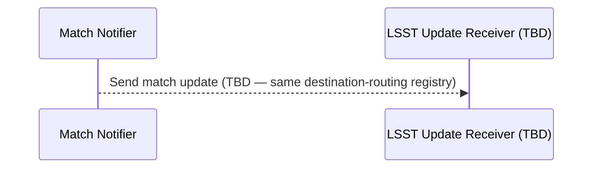

# Mermaid sequence diagrams treat `;` as a statement separator inside message text

## Context

Mermaid's sequence-diagram grammar treats the semicolon `;` as a **statement separator** — equivalent to a newline — even inside the message-text portion of an arrow line, i.e., after the `:`. Most agents (and most humans) assume that message text is opaque to the parser once `:` is reached. It isn't. A semicolon mid-message will close the current message statement at the truncated text, then try to parse the remainder as a fresh statement on the next implicit line.

The failure mode is particularly misleading: the parser error points at the end of the line, not at the semicolon, because that's where the parser runs out of input while looking for an arrow token for the "next statement" that the `;` opened. A typical session looks like a 30-second edit (add a parenthetical aside containing a semicolon to one of the diagram's message labels) followed by hours of staring at a syntactically-fine-looking line wondering why mermaid is broken.

The single fix is to replace `;` with anything that isn't a mermaid statement separator — em-dash (`—`), comma (`,`), or simply split into two sentences. The `;` is the only character with this quirk; commas, parentheses, equals signs, slashes, hyphens, and quotes in message text are all parsed as literal text.

## Guidance

**Do not use `;` inside the text portion of a mermaid sequence-diagram message arrow.** Use an em-dash, a comma, or restructure the prose. This rule is specific to the text after `:` on a message-arrow line; semicolons outside mermaid blocks and in non-sequence-diagram mermaid types (flowcharts, ER diagrams, etc.) are not affected by this exact behavior, though several other mermaid diagram types share the `;`-as-separator quirk.

Concretely:

- A parenthetical aside is fine; just punctuate it with something other than `;`. `Send match update (TBD — same destination-routing registry)` ✅. `Send match update (TBD; same destination-routing registry)` ❌.
- The parser does NOT care about parentheses, `=`, `/`, hyphens, or commas in message text. `INSERT alert_deliveries (broker=pittgoogle)` works fine, as does `Stream alert on Lasair Kafka topic (filtered by Lasair filter)`.
- Smart-quote rendering (some markdown pipelines) is also a separate hazard for `'` inside Python snippets within mermaid blocks, but not for the `;` gotcha — it's purely a grammar issue with semicolons.

When validating a diagram before commit, use the official mermaid CLI rather than relying on a particular renderer's tolerance:

```bash
# minlag/mermaid-cli wraps mmdc and headless Chrome; no local Node install needed
docker run --rm -v "$PWD":/data minlag/mermaid-cli -i /data/diagram.mmd -o /data/out.svg
```

A clean SVG output means the diagram will render in every standard mermaid renderer (GitHub, GitLab, VS Code preview, mkdocs-mermaid2, etc.). A parse error here will reproduce wherever the doc is rendered.

## Why This Matters

The cost imbalance on this gotcha is severe. Hitting it costs a multi-hour debugging session because the parser error message is misleading — it points at the line-end of a syntactically-clean-looking message arrow, and visual inspection finds nothing wrong with the arrow token, the participant aliases, or the indentation. Avoiding it costs zero — there's no readability sacrifice in using an em-dash or comma instead of a semicolon in a parenthetical aside.

Beyond the time cost: a mermaid block that fails to render breaks the whole sequence-diagram section of a design doc. The placeholder text in most viewers (a small red `Syntax error in text` block) doesn't tell the reader what the diagram was supposed to convey, and the reader is sent to the raw mermaid source — which, if it's at all complex, is the wrong primary reading surface.

For this specific service, the §3.1 sequence diagram in `scimma_crossmatch_service_design.md` is the only end-to-end picture of how alerts flow from brokers through ingest, crossmatch, and Hopskotch publishing. A broken §3.1 takes the most reader-friendly architecture summary in the doc offline.

## When to Apply

- Always, on any edit to a `mermaid` fenced code block whose first line is `sequenceDiagram` (or `gitGraph`, `journey`, or other mermaid types known to treat `;` as a statement separator).
- Especially on parenthetical asides in message text — semicolons inside parens are the most common shape of this bug because the parens encourage natural-prose punctuation.
- During code review of a doc PR that adds or modifies mermaid blocks: grep the diff for `;` inside mermaid blocks before merging.

## Examples

The actual bug, from the §3.1 sequence-diagram edit in `scimma_crossmatch_service_design.md` (commit `04e3a5b`):

```mermaid
sequenceDiagram
  participant NOT as Match Notifier
  participant LSSTRET as LSST Update Receiver (TBD)
  NOT-->>LSSTRET: Send match update (TBD; same destination-routing registry)
```

Render with `minlag/mermaid-cli`:

```
Error: Parse error on line 4:
...on-routing registry)
-----------------------^
Expecting '()', 'SOLID_OPEN_ARROW', 'DOTTED_OPEN_ARROW', 'SOLID_ARROW',
'SOLID_ARROW_TOP', 'SOLID_ARROW_BOTTOM', 'STICK_ARROW_TOP',
'STICK_ARROW_BOTTOM', 'SOLID_ARROW_TOP_DOTTED', ... got 'NEWLINE'
```

The parser:

1. Reads the `NOT-->>LSSTRET:` arrow header. OK.
2. Enters message-text mode. Reads `Send match update (TBD`.
3. Hits `;`. Closes the message statement at the truncated text.
4. Treats `same destination-routing registry)` as a new statement. Reads `same` as an actor alias.
5. Looks for an arrow token next. Walks through `destination-routing registry`, hits the closing `)` and then the newline.
6. Bails with the misleading "expected arrow at end-of-line" error.

The fix, applied in commit `dcfeefe`:



Re-render: clean SVG output.

A comma-based alternative works equally well:

```mermaid
NOT-->>LSSTRET: Send match update (TBD, same destination-routing registry)
```

Either is preferable to the original semicolon. Note that this fix needs to be applied per-message: a different message in the same diagram that uses `;` will still trigger the bug. Grep the whole block for `;` after fixing one to be sure no others remain.

## Related

- `scimma_crossmatch_service_design.md` §3.1 — the sequence diagram where this bug originated.
- The §3.1 refresh requirements / plan: `docs/brainstorms/2026-06-12-refresh-service-design-doc-requirements.md` and `docs/plans/2026-06-12-001-refactor-refresh-service-design-doc-plan.md` (R7).
- Mermaid sequence-diagram syntax: https://mermaid.js.org/syntax/sequenceDiagram.html (search the page for "statement").
